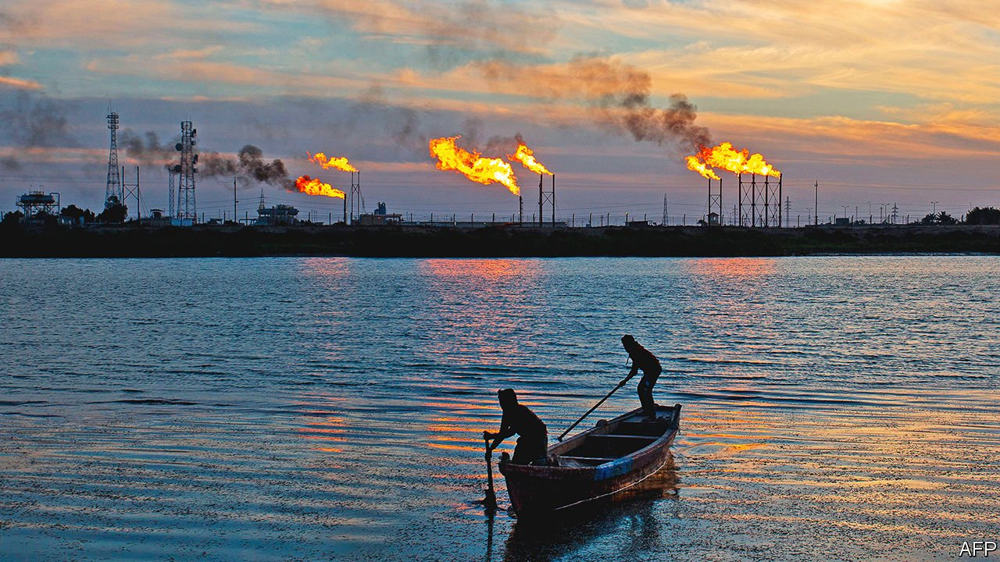

###### Baghdad pay dirt

# TotalEnergies and Iraq agree to a $27bn deal 

##### It is another foray by the French oil supermajor into dicey countries 

 

> Sep 11th 2021 

BEING AN OIL-INDUSTRY boss is an exercise in displeasing all sides. Pumping hydrocarbons out of the ground is lucrative, but angers environmentalists—including those sitting in boardrooms and governments. Renewables and other green projects are more palatable, but often fail to woo investors. TotalEnergies this week showed one way to straddle the divide.

On September 5th the French oil major signed an agreement with the government of Iraq to invest $27bn there over 25 years. The money will go to projects from the virtuous (a big solar farm) to the carbon-spewing (expanding an existing oilfield). One scheme will capture natural gas burned off as a by-product of oil extraction and use it to make less grubby electricity.


The deal is a boon for Iraq. It has struggled to lure investors to its energy sector. Corruption and political instability have pushed many of Total’s rivals, such as BP, Shell and ExxonMobil, to exit Iraqi projects or consider doing so. The solar plant and rescued gas will reduce reliance on gas imports and electricity from Iran, an old foe, which has cut Iraq off before owing to unpaid bills. Regular blackouts in an oil-soaked country look awkward for politicians ahead of elections next month.

Total, for its part, has buttressed its reputation, tinging its carbon-belching operations with a green touch. A rebrand to TotalEnergies earlier this year is part of a push away from the black stuff and a commitment to “net zero” carbon emissions by 2050. The plan is backed by lots of climate-friendlier spending pledges.

In seeking greener pastures the firm has waded into places others avoid. Patrick Pouyanné, Total’s pugnacious boss, has made clear that only old-fashioned oil profits can fund a shift to clean energy. He is avidly chasing the world’s most cheaply extractable hydrocarbons, often in the Middle East and Africa. While rivals have poured money into American shale, Total is investing in countries that grace the bottom rungs of ease-of-doing-business rankings (think Libya and Venezuela). If things go well, Total can expect a gusher of rewards—profits of $95bn may flow to it over the life of the Iraqi contract.

Often they do not. Total’s big gas projects in Mozambique and Yemen have been disrupted by war and terrorism. This summer it lost $1.4bn as it wrote off some assets in Venezuela. In Iraq, too, Total has its work cut out. It will have to sink perhaps $5bn before seeing returns. It can at least expect help from high places as it seeks to manage political risk. The deal was signed in the wake of President Emmanuel Macron’s visit to the country in late August—his second in less than a year. ■


