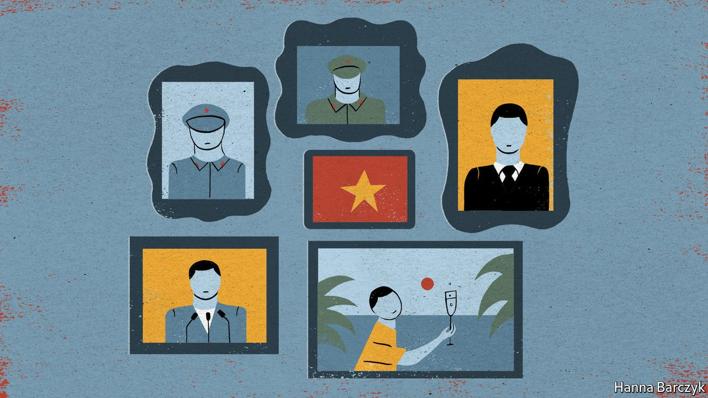

###### Chaguan

# A new book looks behind Xi Jinping’s anti-corruption campaign 

##### And shows that princelings are still exempt 

 

> Sep 11th 2021 

THE CALL from China came in the early morning. Desmond Shum, a former tycoon now living in the West, heard the voice of his ex-wife, Duan Weihong, for the first time in four years. Ms Duan vanished in Beijing in September 2017, shortly after Communist Party anti-corruption investigators came for a patron of hers, a young member of the Politburo once seen as a successor to the supreme leader, President Xi Jinping.

The call from Ms Duan, who also used the English name Whitney, was followed quickly by a second. Both contained a warning. She urged her ex-husband to halt the publication, on September 7th, of a book he has written about their joint career as entrepreneurs in the 1990s and 2000s. That was a gilded age of breakneck growth and influence-peddling that, Mr Shum alleges, vastly enriched both the couple and their business partners, including family members of senior leaders within the Communist Party. “No good comes to those who oppose the state,” Ms Duan told her ex-husband, saying that she was on a provisional form of release but faced renewed detention at any time. She begged him to consider the welfare of their 12-year-old son, who lives with Mr Shum.


He published anyway. “I don’t know whether I was talking to her, or to her handlers,” Mr Shum says in a telephone interview. “She told me herself that she has had no contact with the outside world for the past four years.” Weighing this attempt at intimidation, he is unsure whether the party knew what was in his book, or simply feared “who I am and what I know”.

The machine was right to be worried. Large scandals of the recent past are revisited in “Red Roulette: An Insider’s Story of Wealth, Power, Corruption and Vengeance in Today’s China”, including allegations that the family of Wen Jiabao, then the prime minister, amassed vast fortunes by facilitating business deals and taking stakes in state-owned firms on strikingly generous terms. Some of those deals were brokered by Mr Shum and his ex-wife, though he denies law-breaking. Small, grubby details of elite life in the book are just as revealing, for they challenge one of the party’s main claims to legitimacy, namely that its monopoly on power helps to explain China’s modern-day rise.

In the party’s telling, its autocracy is a merit-based system run by technocrats who are free to take the long view and act for the common good, rather than worrying about the next election. Mr Shum describes the reality. To build a new airport cargo terminal, he spent three years collecting 150 official seals from sundry agencies and ministries, many of them locked in paralysing competition with one another. That quest involved, at various points, arranging heart-bypass surgery for a local official who collapsed during a junket to Las Vegas and California, and building airport-customs officers a new complex, complete with tennis courts and a 200-seat theatre.

Mr Shum names the hotel in Beijing where, on any given night, three or four government ministers were hosted by entrepreneurs eager to buy their favour, in a labyrinth of private dining rooms designed to keep different groups from spotting each other. His book turns a jaundiced, insider’s eye on claims that, in the absence of a free press, independent judiciary and other checks and balances, officials are held to account by internal targets. Explaining the purging of a big airports boss, Mr Shum concedes that the official’s gambling habit made him vulnerable, but insists that his cardinal error was to exceed revenue targets by such a margin that rival bureaucrats craved his job.

In some aspects, Mr Shum’s book supports Mr Xi’s diagnosis of China’s ills. It describes sleaze that largely predates Mr Xi’s elevation as party chief in 2012. Since then, the Xi era has witnessed an anti-corruption drive that has seen more than 1.5m officials punished. Mr Xi himself grumbles about foot-dragging officials who put parochial interests first.

Still, leaders have grounds to dislike the book. It argues that Mr Xi’s anti-corruption drive is as much a campaign to consolidate power as a sincere attempt to reform a rotten system. The campaign has spared some notoriously corrupt princelings, the children or grandchildren of high officials. A self-made man, Mr Shum calls red aristocrats a “separate species”, reared in high-walled compounds, sent to special schools and fattened on food supplies reserved for senior leaders.

They even enjoy special forms of corruption, he notes. Rather than hustle to build real businesses, he describes princelings seeking lucrative monopoly contracts from the state. Most damningly, he charges that the well-born are shielded during anti-corruption probes, in part because they know to obey what he calls the party’s Mafia-like code of silence. He asserts that Li Peiying, the airports boss, was executed after talking too much about high-level corruption, while in the same year a party elder’s son was only jailed for taking larger bribes. “Red aristocrats got a prison sentence; commoners got a bullet in the head,” he writes.

Now you’ve crossed the line

With that charge, the book challenges a second form of legitimacy that is dear to Mr Xi, himself the son of a high-ranking official. Mr Xi asks the masses to have faith in the party, not just because China is more prosperous, but because it carries “red genes” inherited from revolutionary pioneers and martyrs, and has always put the people first. In a speech on July 1st Mr Xi declared: “The party has no special interests of its own—it has never represented any individual interest group, power group, or privileged stratum.”

“Red Roulette” undercuts that claim. It describes red aristocrats demanding 30% stakes in business deals merely for being seen to be supportive. It details an elite China built on secrets and fear, in which family ties are one of the only reliable bonds of trust. Mr Xi would have people believe that corruption is an external infection. Insiders know that it is in the party’s blood. ■

