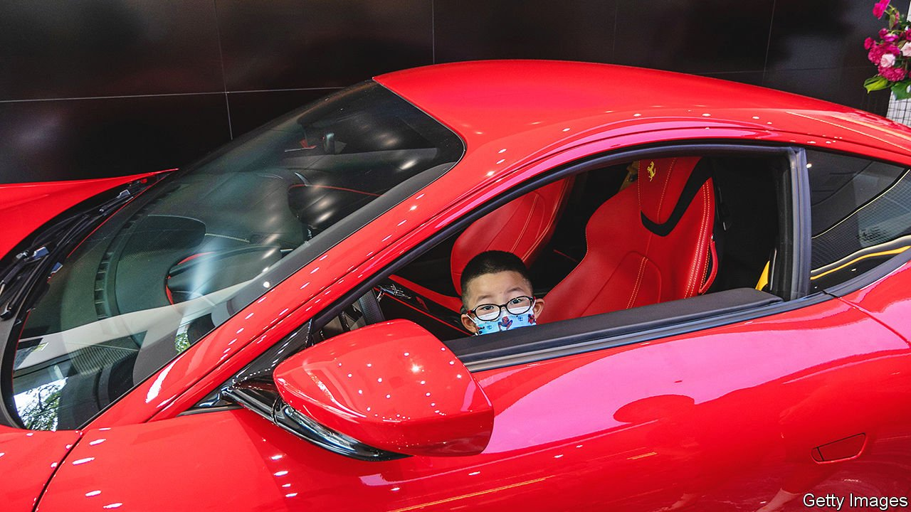

###### Talkin’ ‘bout a revolution

# A provocative blog post stirs up a firestorm in China 

##### No one knows how far Xi Jinping’s campaign against inequality will go 

 

> Sep 11th 2021 

UNTIL RECENTLY Li Guangman, the retired editor of an obscure state-owned newspaper who writes leftist screeds online for a few fellow travellers, was unknown to the general public. That changed on August 29th, when the country’s biggest state and party media outlets circulated an incendiary blog post by Mr Li to their huge audiences, causing many to assume his views had official support. This prompted such a stir that a prominent state-media figure—Hu Xijin, editor of Global Times, a jingoistic party tabloid—felt compelled to post a scathing rebuttal.

The episode may have offered a rare glimpse of uncertainty in elite party circles about what exactly President Xi Jinping wants. A year before he is expected to claim a third five-year term as party secretary, Mr Xi is undertaking a populist campaign against inequality, under the slogan “common prosperity for all”. It is unclear how far he intends to take it.


Mr Li hopes very far. Writing under the title “Everyone can feel that a profound change is taking place!”, his article relished recent crackdowns on big business, celebrities and the super-rich. He suggested it was only the beginning of an anti-capitalist, anti-Western campaign that would bring the Communist Party back to its socialist roots. The country was experiencing a moment of “profound revolution”, he wrote. The “red” would soon return and China would no longer be “a paradise for capitalists to get rich overnight” nor “a paradise for effeminate men”.

But Mr Li’s views were too radical even for an establishment populist firebrand like Mr Hu. On September 2nd he wrote a blog post disputing that a “revolution” is at hand, and, in a veiled reference to the excesses of the disastrous Cultural Revolution of 1966-76, called the rhetoric inflammatory. “I am worried that such language will stir up some historical memories,” triggering “confusion and panic”, he wrote. Both posts are still accessible online.

It is highly unusual for state media to promote the rants of obscure bloggers. “He’s a nobody,” says Jude Blanchette of CSIS, a think-tank, and author of “China’s New Red Guards”, a book about neo-Maoists. And Mr Hu’s rebuke of an officially blessed essay was no less rare. What does it all mean?

One commentator with a large following among government officials argues it does not mean much. Ren Yi, whose pen name is Chairman Rabbit, says he believes the initial promotion of Mr Li’s post was “an accident”, and that no senior leaders were pushing it. “Now you are seeing officials doing a lot to calm people down,” says Mr Ren, adding that he was “disgusted” by the piece’s anti-capitalist language. On September 2nd Mr Xi gave a speech announcing a  to support small business. Four days later Liu He, an economic adviser to Mr Xi, said the private sector was an essential part of the economy and should be given “vigorous” support.

The targets of Mr Xi’s crackdowns might not be so easily comforted. Consider what happened in August. A party commission meditated on Mr Xi’s desire to achieve shared prosperity for all, and resolved that the rich would have to pay more. Tencent, a tech giant, promptly pledged $7.7bn to social programmes. Zheng Shuang, a famous actress, was fined $46m for tax evasion. The Supreme People’s Court declared illegal the 72-hour work week, a fixture in China’s gig economy.

Mr Xi is walking a fine line, needing to show he understands popular anger about inequality without scaring the horses in the new economy. Mr Blanchette sees the debate as a reflection of uncertainty within the establishment about the intensity of Mr Xi’s campaign.

State interventions are immensely popular with leftists like Mr Li, and he has received plenty of online support. One blogger, writing under the pen name “Little Z, a citizen observer”, concluded that Mr Li was “too radical” and Mr Hu “too conservative”. But Little Z mostly supported Mr Li. The “thunderbolt” of recent regulatory actions was an “exciting” harbinger of further coercive measures to reduce the wealth gap, he wrote. “This is only the prologue.” ■

