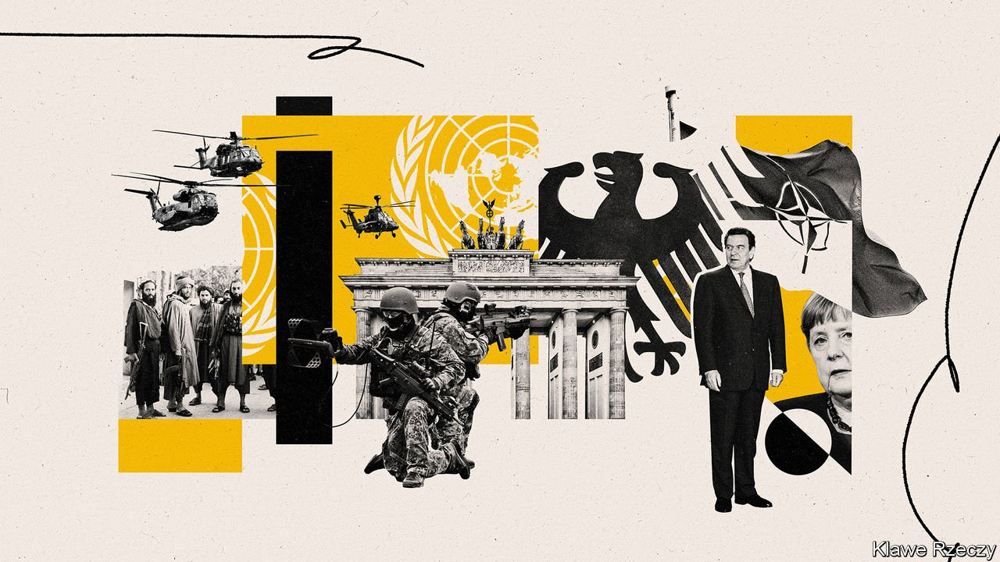
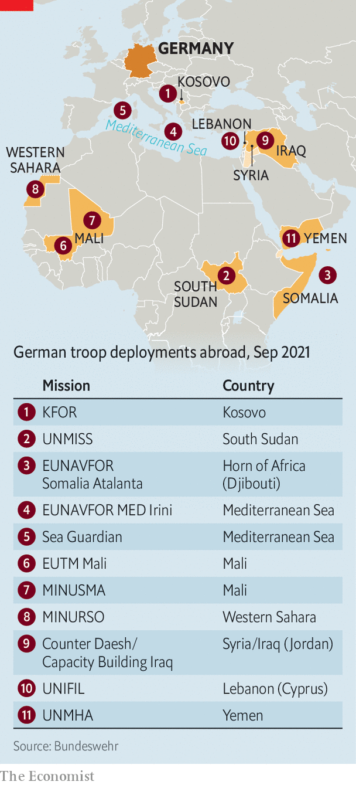

###### Still searching

# After Afghanistan Germans rethink their country’s foreign policy 

##### But this month’s election is unlikely to change it much 

 

> Sep 11th 2021 

AMERICA’S DEBACLE in Kabul has caused especially deep concern in Germany. Two decades ago, after rancorous parliamentary debate, Germany approved its first military deployment outside Europe since 1945, to Afghanistan. The vision was of a Bundeswehr (the armed forces) acting in the service of noble goals: state-building, humanitarianism and diplomacy. “It sounds like a joke today, but read the debates and it really seems like the plan was to turn Afghanistan into Sweden,” says Peter Neumann, a security expert and adviser to Armin Laschet, the conservative candidate for chancellor in this month’s election. The fact that Joe Biden’s administration now claims these goals were delusional has left a bitter taste in Germans’ mouths as they head to the polls.

Initially divided about the wisdom of the mission, Germany’s policymakers found a rationale for what was to become its largest post-war deployment: some 150,000 troops had passed through Afghanistan by the time the last ones left in June. Throughout the 2000s Germany ratcheted up its police-training and civil-reconstruction efforts there. Yet at the same time polls revealed growing public scepticism. Later, in the 2010s, Afghanistan slowly slipped from voters’ minds. Of the main parties standing in the election, only the Greens find space to mention the Afghan mission in their manifesto.


Germany’s allies have long urged it to play a more assertive role abroad. Critics gripe that those pleas have gone unheeded. But that is unfair. Jolted by Russia’s adventurism in Ukraine, Germany’s defence budget, though still short of NATO’s target of 2% of GDP, has grown by almost half since 2014. Annegret Kramp-Karrenbauer, who as defence minister has tried to get her compatriots to think seriously about security, has explicitly linked Germany’s security policy to its trade—and earlier this year dispatched a frigate to the South China Sea to emphasise the point. More than 80% of voters say they support the Bundeswehr; over 40% want more defence spending.

 


But they also know precious little about the dozen or so missions in which German troops serve, from Atalanta, an anti-piracy naval effort off the Horn of Africa, to stabilisation forces in Kosovo. Polls also show that Germans are persistently reluctant to throw their military weight around. There is a yawning gap between the views of voters and the security establishment. This finds expression in the mandates that parliament gives the army, which can scale absurd heights. At one point German troops in Afghanistan carried cards bearing instructions on what to say to enemies in the field: “United Nations—Stop, or I will fire!” A Pushtu translation was also provided.

Unsurprisingly, then, Afghanistan has failed to turn Germany’s election campaign upside down. There have been ritualistic expressions of support for the EU to do more for its own security amid a dawning awareness that, as an official puts it, Mr Biden’s administration is about “Americans first”. But the only substantial idea in the air is to set up a national security council to weave a coherent policy from the competing strands of Germany’s foreign-policy machinery. Opinions vary on whether such bureaucratic answers match up to Germany’s strategic challenges.

There are nuances in the parties’ foreign-policy platforms. In government the Greens would inject a degree of hawkishness towards authoritarian states; the Social Democratic Party (SPD) has a contingent of Russia doves. But whichever of the possible coalitions emerges is unlikely to have a decisive impact on Germany’s foreign-policy outlook, says Fritz Felgentreu, an outgoing SPD MP. None of the four parties in contention for government questions Germany’s transatlantic bond, its European vocation or its position in NATO. All accept the need to recalibrate the relationship with China. The foreign-policy chapter of the next coalition agreement will be the product less of considered reflection on Germany’s place in the world than of hard-fought compromise between several parties that must find a way to govern together.

Yet there is still scope for wrangling. The next parliament must resolve a long-running debate over giving the Bundeswehr armed drones; it must boost Germany’s cyber-resilience; and it must consider its role in NATO’s nuclear-sharing. The overstretched armed forces need stable funding increases, even as Germany confronts its debt overhang from covid-19. It must also articulate a new China policy that takes into account American pressure and growing Sino-scepticism among German businesses. Meanwhile its EU partners will expect it to lead the response to the next crisis, be it a fresh Russian military challenge or another flow of refugees.

Fresh thought also needs to be given to the Bundeswehr’s outstanding deployments. This applies especially to the Sahel, which now that the Afghanistan mission has ended is the largest: around 1,200 German troops take part in EU and UN missions. Parallels with the Afghan effort are obvious. A German force dispatched initially to support an ally battling terrorism (America in Afghanistan; France in Mali), with a limited mandate, uncertain prospects for success and growing questions over its purpose. French troops do the serious fighting, but German soldiers are exposed: a dozen were hurt in a suicide attack in June. “We need a serious discussion about the conditions under which we deploy,” says Carlo Masala at the Bundeswehr University in Munich. “If we do things like Afghanistan and Mali in future, we have to go fully in: meaning doing the dirty stuff.”

Yet a “grave rethinking” of public life would be needed to make Germany a truly autonomous power, argues Cathryn Clüver Ashbrook, director of the German Council on Foreign Relations. Better to carve out a role as a “hinge” power, conducting shrewd diplomacy in those areas where America or other allies struggle, including with China. But even that will require a hard-headed assessment of Germany’s interests, ambitions and limitations. If the election campaign is any guide, the country is far from ready for one. ■

For more coverage of the German elections, visit our dedicated 

