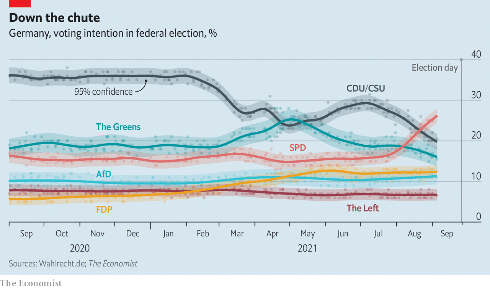

###### Gloom and grumbling

# Germany’s Christian Democrats contemplate defeat 

##### And recriminations are already flying 

 

> Sep 11th 2021 

LAST MONTH the Christian Democratic Union (CDU) in Spandau, a borough in Berlin, stuck a campaign placard for local candidates over one of Armin Laschet, the main standard-bearer of the CDU and the Christian Social Union (CSU), its Bavarian sister party, in the federal election on September 26th. It was a mistake, says a local politician, but stories abound about CDU chapters across Germany declining to put up Laschet placards. On a two-hour walk through Charlottenburg and Mitte, two other boroughs in Berlin, your correspondent did not spot a single one (though there were several with the grinning face of Olaf Scholz, the Social Democratic Party’s candidate).

Some in the CDU are still defiant in public, but the mood is defeatist. The conservative party is used to success: it has occupied the chancellor’s office for 52 of the 72 years of the republic’s existence. It has never polled lower than the 31% it won in the first post-war vote. But it is now facing the real prospect of being booted out of power. A new poll by Forsa put the SPD at 25%, the CDU/CSU at just 19% and the Greens at 17%. In 2013 the CDU/CSU got 41.5% and at the most recent election, in 2017, they got 32.9%.


What happened? Many believe that the CDU/CSU committed a cardinal error when it picked Mr Laschet, the wishy-washy state premier of North-Rhine Westphalia, as its candidate for chancellor, instead of Markus Söder, the forceful boss of Bavaria. “The party had the choice between winning with Söder and losing with Laschet,” says Manfred Güllner, head of Forsa. He blames CDU apparatchiks, who feared a takeover of their party by Bavarians.

 


Another view, propagated by members of the Berliner Kreis, a network of conservative CDU and CSU politicians, is that the CDU is leaking voters because it lost its conservative identity under Mrs Merkel. “That’s absolute nonsense,” says Manuel Hagel, a CDU politician in Baden-Württemberg, who argues that Mrs Merkel’s success in four successive elections speaks for itself.

Julius van de Laar, a political strategist, thinks the troubles stem from a poorly planned campaign that started only in April; an emphasis on change when many voters want continuity; and Mr Laschet’s inept handling of the floods in July that devastated his state. All this played into the hands of Mr Scholz, who presents himself as a clone of the competent Mrs Merkel, copying even her hand gestures.

In a speech on September 7th Mrs Merkel strongly endorsed Mr Laschet and lambasted Mr Scholz for not ruling out a coalition with the polarising Left party. There is still a chance that the CDU will catch up with the SPD: the polls have been extremely volatile in recent months. But it is small. Forsa’s Mr Güllner thinks the party will stick to its choice and probably lose. Even a (highly unlikely) last-minute switch to Mr Söder may not help the CDU very much. Postal voting has already begun.

For more coverage of the German elections, visit our dedicated 

