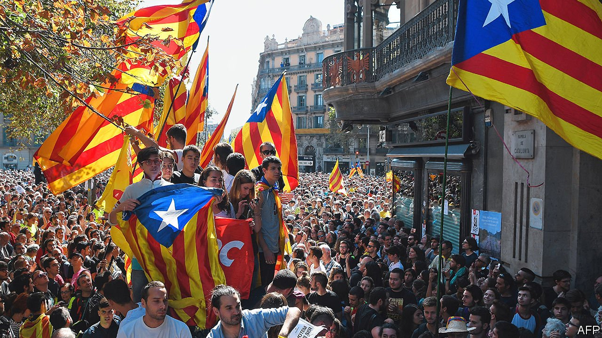

###### Grappling with a Rubik’s cube

# Talks about the Catalan conflict are about to start 

##### They highlight unresolved tensions over how to organise a diverse country 

 

> Sep 11th 2021 

THERE ARE far fewer esteladas, the red, yellow and blue independence flags that only a couple of years ago draped the balconies of Barcelona. The atmosphere in Spain’s second city is more relaxed than at any time since Catalonia’s nationalist politicians began a drive for independence for one of the country’s biggest and richest regions a decade ago. This culminated in a referendum in defiance of the constitution and a unilateral declaration of independence in 2017, the temporary imposition of direct rule from Madrid and then long jail sentences for nine separatist leaders. But with the pandemic having intensified a sense of exhaustion, confrontation is at last giving way to detente.

In June Pedro Sánchez, Spain’s Socialist prime minister, pardoned the prisoners in an effort to calm emotions. At a regional election in Catalonia in February the separatist coalition retained power but Esquerra, the most pragmatic of its three parties, came out on top. Mr Sánchez and Pere Aragonès, the new Catalan president, are to start talks on Catalonia’s future next week.


The more realistic among the separatists know that they overplayed their hand in a region that is deeply divided and where independence has never commanded a clear majority. “Since 2017 Catalonia has been digesting a political failure,” says Salvador Illa, the leader of the Catalan affiliate of the Socialist Party.

The talks will be neither quick nor easy. Mr Aragonès has two demands. He wants a full amnesty: half a dozen other leaders, including Carles Puigdemont, the Catalan president in 2017, are fugitives, subject to trial if they return; and the audit tribunal is seeking to recover from former Catalan officials some €5.4m, misspent—it says—on promoting independence abroad.

Second, Mr Aragonès wants to hold another referendum, with the national government’s agreement this time. Most scholars say the constitution prevents that. Both these demands are politically impossible for Mr Sánchez. The question is whether a compromise is possible and what it might look like.

This matters for Spain as a whole. Jordi Pujol, the founder of modern Catalan nationalism, recently told an interviewer that the separatist movement “isn’t strong enough to achieve independence, but it is to create a very serious problem for Spain.” The country stands out in western Europe for the strength of its peripheral nationalisms, not just among Catalans but also Basques and to an extent Galicians, who all retain distinct languages. The reasons lie mainly in history. In the 19th century, when Romantic philosophers invented modern nationalism, the Spanish state was too weak to impose a uniform language and culture, as happened in France. Centrifugal forces were brutally suppressed during the long dictatorship of Francisco Franco. But Spain’s democratic constitution of 1978 appeared to have settled the issue for good, with sweeping administrative decentralisation to 19 regions.

The framers of the constitution opted for a de facto, open-ended, asymmetric federalism. In need of extra votes in the national parliament, Socialist and conservative governments alike handed over more and more powers to Basque and Catalan nationalists who wanted recognition of their regions’ long history, rather than to be treated the same as new administrative units such as La Rioja or Murcia.

Messy though it is, the system worked well as long as there was money and political goodwill. Since the financial crisis of 2007-09, both have dried up. Politics has been riled by three successive populist movements. There is identitarian populism in Catalan nationalism’s embrace of separatism. Podemos, on the far left, rejects parts of the constitution; it is now the junior partner in Mr Sánchez’s coalition and favours a confederal Spain. Vox has arisen on the hard right. It wants recentralisation. The mainstream conservative People’s Party (PP) will almost certainly have to ally with Vox if it is to win power.

Juan José López Burniol, a lawyer close to Catalan business leaders, believes that a compromise would include recognition of Catalonia as a nation in cultural but not political terms; a ceiling on fiscal transfers to the common pool; a shared tax agency; and reinforcing the powers of the regional government over education, language policies and culture, including Catalan-language public media. This package should then be put to the voters in a referendum.

Mr Pujol has spoken of “a fudge” along similar lines. Mr Illa and the Catalan Socialists are far more cautious, at least in their opening bid. He thinks the talks should focus on reform of fiscal arrangements. “We should use well the powers we already have,” he says. The Spanish state should be more, rather than less, present in Catalonia, especially in cultural policy.

There are three obstacles. To last, any agreement needs the acquiescence of the PP, which wins few votes in Catalonia but benefits from anti-separatist feeling elsewhere and wants to dilute the use of Catalan in schools. Second, it will take years for Esquerra and separatist voters to accept a compromise. Third, the rest of Spain is not a passive spectator. “We can’t allow the dialogue on Catalonia to organise the regional question in Spain,” says Ximo Puig, the Socialist president of Valencia, which is especially short-changed by the current financial settlement.

But in other respects there is consensus among peripheral regions, including Catalonia, that the status quo benefits Madrid above all. In some ways Catalan separatism is a response to relative decline. When Franco died in 1975, Catalonia’s economy was 25% bigger than that of the Madrid region. By 2018 Madrid’s GDP had overtaken Catalonia’s. The PP, which has governed there since 1995, attributes this to its business-friendly policies. The regional government has delivered tax cuts totalling €53bn ($63bn) since 2004, says Javier Fernández-Lasquetty, Madrid’s economic head. “We think there is a direct correlation between the lowering of the tax burden and economic growth,” he says. Others say Madrid, which houses almost all state agencies and is Spain’s transport hub, has benefited disproportionally from globalisation. Public policies could change that.

If Spain were starting from scratch, the best answer to its regional conundrums would be German-style federalism. But there is little chance of that. The conflict which splits Catalonia in two has no definitive solution. But an imaginative compromise ought to be possible. Spain’s future success may well depend on it. ■

