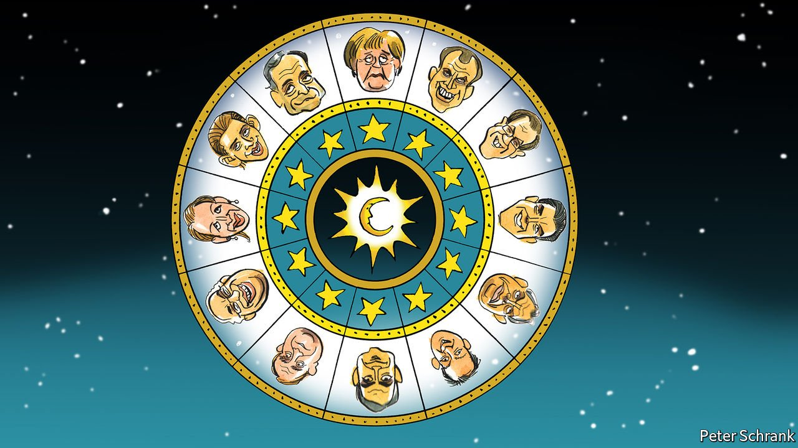

###### Charlemagne

# Why EU-watching is like astrology 

##### So many experts, so few accurate predictions 

 

> Sep 11th 2021 

THE GAP between astrology and European politics is alarmingly narrow. Both are more art than science, to put it charitably. Both involve professed experts making wildly inaccurate predictions, with metrics that turn out to be nonsense. Because of the peculiarly nocturnal habits of EU leaders, both require work at night.

What astrology and EU-watching most have in common is the need to wait for mysterious bodies about which they know little to align. Where astrologers look to the heavens, Eurologers consult electoral calendars to see their prospects. Just as a person’s future is written in the stars, so the EU’s destiny is shaped by the order of its national votes.


Elections provide the political constellations from which EU officials divine their future, with as much say over the outcome as a pensioner reading a horoscope. Germany, the club’s most important member, heads to the polls on September 26th. Coalition negotiations are predicted to drag on for months, perhaps until January or even spring. At that point, the French presidential election hoves into view with the first round in April 2022, throwing the European zodiac into flux once more.

The EU is often criticised for having a democratic deficit. At the moment it has a democracy surplus. If Brussels truly were a bureaucratic bulldozer, smashing through the wishes of national capitals, officials would not be twiddling their thumbs waiting for a new German government to be formed. Progress on the EU’s most substantial legislation, such as its spending rules, has paused while Germans vote. National politics and European politics may appear far apart, yet they are linked to each other, just as the Moon pulls the oceans’ tides.

But a Copernican revolution is under way in European politics. The EU’s centre of gravity is shifting. For the past 16 years the EU’s grandees have revolved around Angela Merkel. The chancellor, for all her faults, leaves office a remarkably popular politician at home and the dominant force on the continent. Whoever replaces her will not be either. Mrs Merkel’s party won 33% of the vote in 2017. Her successor, whether a Social or Christian Democrat, will be lucky this time to hit 25%. That successor will be so much less experienced than the battle-hardened Mrs Merkel that a vacuum could open up in European politics.

Jupiter is rising to fill it. Emmanuel Macron once promised a “Jupiterian” presidency, resembling not just any god, but the king of the gods. Events dragged him back to Earth. Still, if Mr Macron wins, he becomes the most powerful leader in the club. He would be the first second-term French president in almost 20 years. Jacques Chirac was re-elected mainly due to French disgust at the idea of electing the far-right Jean-Marie Le Pen, who sneaked into the final round of voting. This disgust has since waned, but not to a point where it would trouble Mr Macron.

The more optimistic Eurologers see a perfect alignment. Mr Macron is the most ambitious leader when it comes to European reform. If re-elected, his clout may match that ambition. The most likely successor to Mrs Merkel now appears to be Olaf Scholz, a Social Democrat who is receptive to the idea of more spending, in coalition with a Green party set on further European integration. In Italy Mario Draghi, the former boss of the European Central Bank, runs a government wedded to overhauling the country’s economy in exchange for some €190bn ($225bn) of EU funds. For the first time in years, governments in the EU’s three biggest countries would see the continent’s future in a similar way.

Much depends on whether Mr Draghi will stay in office long enough. Mr Draghi and Mr Macron are natural allies. A recent one-on-one dinner in Marseilles dragged on well past midnight, with the pair discussing European policy and a Franco-Italian treaty, along the lines of similar agreements between Paris and Berlin. An Italian prime minister with the ear of governments in Germany and France is a rare thing.

Some forecasters are glum. Nationality trumps politics when it comes to finance, warns one commission official. A German Social Democrat may have more in common with his Christian Democrat counterpart than with, say, a centre-left Italian MP. After all, Mr Scholz is campaigning as “continuity Merkel” in a bout of political cross-dressing. Circumstances of birth count for a lot in both European politics and the zodiac.

When you wish upon 12 stars

With so many moving bodies in the political firmament, it is little wonder that Eurocrats wait for a crisis to pursue bold reform. Rather than wait for the perfect moment when action is easy, wait for a terrible moment of dark and deadly portents, when action is necessary. The impression it leaves—that the EU is a body that springs to life only when things go wrong, rather than another level of everyday politics—is an unhealthy one.

But the idea that the EU can be bold only in crisis is a myth. It is sometimes so when the stars are peaceably positioned. During the 1990s and 2000s, when things were comparatively benign both economically and politically, the EU went through a bout of revolutions. It expanded east, introduced the euro and ripped up and rewrote its treaties every few years. It was only in the wake of the financial and covid-19 crises, when panicked constitutional reforms were shunted through by exhausted leaders before markets opened, that the crisis model truly came to the fore.

A political conjunction between Paris, Rome and Berlin is a rare thing. It may not come again soon. Indeed, it may not come at all. Italian politics may revert to its volatile mean. More than 40% of Italian voters look set to back hard-right parties at the next election, due no later than 2023. Mr Macron could bungle the French election, while anything could now happen in Germany. But another asteroid will be along soon enough. Astrologers and Eurologers alike rarely see them coming. ■

