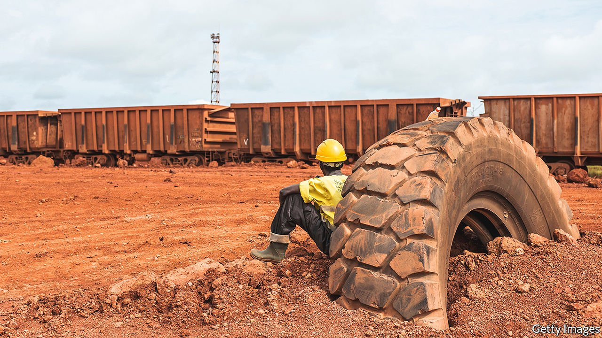
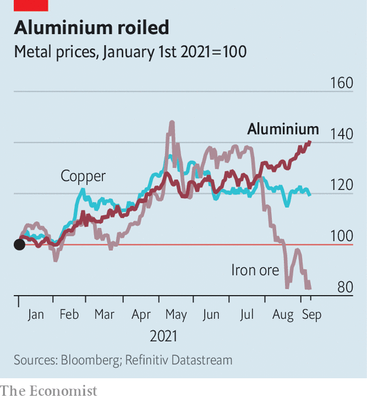

###### On the up

# A coup in Guinea adds fuel to aluminium’s red-hot rally 

##### But developments in China, not Africa, could matter more for the metal’s price 

 

> Sep 7th 2021 

FEW MIGHT have guessed that Guinea, a west African country of 13m people, played a big role in global commodity markets. In recent years the country has ramped up its production of bauxite, a dirty-red ore that is processed to make aluminium, thanks to hefty investment from China. In 2020 Guinea produced around 90m tonnes of the stuff, about a quarter of the global total, up from 21m in 2015. It now supplies more than half the bauxite used in Chinese refineries. And those refineries, in turn, produce more than half the world’s aluminium.

Small wonder then that the military coup that threw Guinea into turmoil on September 5th was felt in commodity markets. Events in the country helped push the price of aluminium, already on a tear, to its highest level in ten years. (Guinea is also home to Simandou, one of the world’s richest untapped deposits of iron ore. Share prices in China Hongqiao and Rio Tinto, two investors in Simandou, briefly dipped when news of the coup broke.)


Guinea is only the latest factor behind the surging aluminium price. So far this year it has shot up by around 40% (see chart), faster than that of any other highly traded metal. One reason for the rally is growing demand. Locked-down consumers drank more at home, boosting demand for aluminium cans. As economies have recovered from the deep covid-induced downturns of 2020, demand for aluminium for construction has picked up; plans to spend generously on infrastructure in America, China and Europe should further bolster that demand. And sales of electric vehicles, which tend to contain a bit more aluminium than conventional cars, have pushed up demand for the metal, too.

 


Supply constraints, however, have been more important. In August a fire put a large refinery in Jamaica out of action. Rio Tinto is trying to resolve a workers’ strike at a smelter in Canada. Other disruptions stem from China. Making aluminium uses a huge amount of energy (some traders refer to the metal as “congealed electricity”). New energy-consumption targets have led some provincial authorities, such as those in Inner Mongolia and Xinjiang, to scale back production. A drought in Yunnan, meanwhile, has hit the supply of hydropower. Together these could lower Chinese annualised aluminium output by about 5%, estimates Gregory Shearer of JPMorgan Chase, a bank.

Whether the coup in Guinea will limit supply further is unclear. So far, mines in the country are still running, ships are still being loaded with bauxite and warehouses in Chinese ports are well stocked. But some analysts worry that other countries will impose sanctions on the new government, or that the new regime itself will tax miners. Either would disrupt the flow of bauxite out of Guinea.

Even then, however, bauxite is abundant enough for Chinese refineries to have other options. This suggests that a bigger concern for the aluminium market is where Chinese regulations go next. Authorities are already worried about soaring metals prices hurting Chinese manufacturers. They have released some aluminium, along with other metals, from their strategic reserves to try to curb inflation.

This objective bumps up against others. One is the energy-consumption targets. Another is a limit on China’s aluminium output, set in 2017, when authorities thought the country was producing too much. If Chinese refineries start to restrict production as they approach the threshold, prices may rise until new capacity is built elsewhere.

One possibility is that China starts to move aluminium production abroad, to places where labour is cheap—Indonesia, for instance. Some nickel production has already shifted to the country and China Hongqiao, which is also the world’s largest aluminium producer, recently said it would expand its refinery operations there. Guinea’s new rulers may end up selling their bauxite to Indonesian firms—with China’s help, of course. ■

For more expert analysis of the biggest stories in economics, business and markets, , our weekly newsletter.

