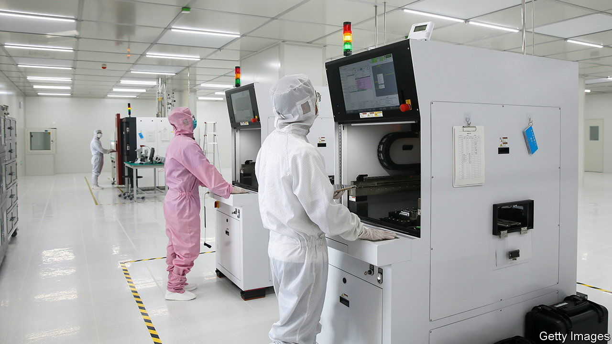

###### Home comforts

# China turns to new stock exchanges to channel finance to innovative firms 

##### As foreign listings become harder to pull off, Xi Jinping hopes to make domestic ones easier 

 

> Sep 11th 2021 

CHINA’S ECONOMIC planners want more home-made semiconductors, but they are not satisfied with more chips simply being produced at home. They want to bring the entire supply chain—from raw materials and chip grinders to labour and capital—onshore. Tens of thousands of companies have established microchip businesses over the past year. Now the state is rushing to ensure such cash-hungry firms can raise capital at home, too.

On September 2nd Xi Jinping, China’s president, announced that a new stock exchange will be launched in Beijing, joining existing markets in Shanghai and Shenzhen. It is hoped that the bourse, a revamp of an over-the-counter exchange called the New Third Board, will channel capital from professional investors to fast-growing small and mid-sized firms.


This is not the first time Mr Xi has backed a new stock exchange aimed at innovative companies: Shanghai’s STAR market opened in 2019, advertising relaxed rules that help accelerate fundraising for smaller firms. Domestic listings appear to be thriving. Shanghai will bag two of the world’s largest initial public offerings (IPOs) of the year, those of China Telecom, a state-owned communications company, and Syngenta, a state agrochemical giant. Funds raised through such offerings in the city are set to reach their highest level in a decade this year, according to Bloomberg.

The emphasis on domestic fundraising fits snugly into China’s strategy of “dual circulation”, the cornerstone of the country’s latest five-year plan, which aims to bolster domestic markets and reduce reliance on foreign ones, often on national-security grounds. It also offsets the worsening environment for overseas listings. New domestic regulations make it harder for Chinese firms to list abroad: internet companies with more than 1m users, for example, must now apply to the cyberspace regulator for permission. In America, the securities watchdog has halted Chinese IPOs following several disastrous listings. Congress plans to force many Chinese groups to delist if they do not share certain auditing documents—ones that the Chinese state forbids them to reveal.

On the face of it, the roles of offshore and onshore IPOs seem to have reversed. An IPO in Hong Kong or New York was once seen as further removed from Beijing’s reach and less sensitive to policy surprises. The latest policy and geopolitical turmoil, however, has rocked overseas listings while making Chinese-traded securities “a route to counter geopolitical risks stemming from US sanctions”, say analysts at Natixis, a bank.

Neither Hong Kong nor New York can offer such a defence. The Hang Seng Tech Index and Nasdaq Golden Dragon Index, both of which track some of China’s biggest listed tech groups, tumbled by 28% and 33%, respectively, between the end of June and late August, according to Natixis. By contrast, the STAR 50 index rose by 1.4% over the same period.

Channelling capital at the snap of a finger might be harder than regulators think, however. Many tech groups raise funds privately through offshore structures not recognised by China’s regulators. Part of the reason why Chinese tech companies listed abroad in the first place was because the foreign investments they took on made cashing out through an onshore IPO a regulatory minefield.

Mr Xi might launch all the new exchanges he wants, but he has neglected deeper reforms to their governance. The STAR market uses a “registration system” for IPOs whereby, in theory, companies need only meet a number of clear requirements to go public. In practice, however, the China Securities Regulatory Commission (CSRC) retains control over who goes public and when. A number of listings have been put on hold this year. The CSRC has a “civil-servant mentality” towards keeping markets orderly and avoiding unwanted social disturbances, says a manager at a global investment group. Regulators will be reluctant to shed that mindset, be they in Shenzhen, Shanghai or Beijing. ■


