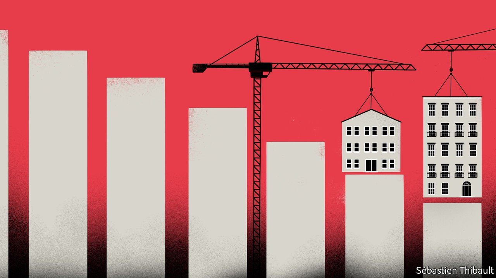

###### Free exchange

# How to turn NIMBYs into YIMBYs 

##### Tweaking economic incentives might help boost housing supply 

 

> Sep 11th 2021 

ECONOMISTS DO NOT agree on much, but they do almost all think that a shortage of housing is a big drag on the economy. Zoning laws and conservation rules have proliferated since the 1960s, with diktats on everything from the number of car-parking spaces to how pitched a roof must be. These have made it harder to get projects off the ground: house-building in the rich world, relative to population, has fallen by 50% since 1964. Low housing supply means higher prices, constraining cities’ growth and reducing productivity. One estimate suggests that restrictions lowered American output growth by a third between the 1960s and 2009.

Although most housing experts want more building, few spend much time thinking about how to make this happen. Some pin their hopes on the “YIMBY” movement—enthusiastic nerds who turn up to planning meetings and shout “yes” not “no” to having more houses “in my back yard”. But YIMBYs are few and their power limited. More encouragingly, politicians are waking up to the damage caused by distorted housing markets. In Britain the Conservative government talks a good game on boosting housebuilding. On September 1st America’s White House decried “exclusionary zoning laws and practices” and promised to raise the supply of affordable housing. Yet its talk of “relaunching partnerships” and “leveraging existing federal funds” hardly inspires confidence. Better solutions are needed.


One option is for the state to build houses itself. Singapore has taken this route since the 1960s. The government nationalised most land supply and built vast numbers of flats. Today 80% of Singaporeans live in these buildings and housing costs are low. In Russia the state has played a more Singaporean role in housing since 2000. Annual construction of new homes has tripled.

But is more public housing enough? Few people, including well-off Singaporeans, dream of living in a government-built house. The post-war push in the West to build huge housing projects, meanwhile, ended in failure—when money was tight it was always easy to slash maintenance budgets. The bigger question, then, is what needs to happen to boost private housebuilding.

Happily, there are precedents. In the decade to 2013, for instance, Tokyo boosted its overall housing stock by over 1m, more than double the increase in the 1980s. Sydney has boosted annual completions by 50% since the early 2000s. Such reforms can quickly have positive effects. A new paper on São Paulo, which enacted zoning reforms in 2016, finds that the policy boosted housing supply by 1.4%, leading to a 0.4-1% reduction in prices.

Reforms are sometimes the outcome of crisis. In normal times homeowners fiercely resist new developments because they worry that property prices will fall. This was less of a concern for Tokyoites after Japan’s property bubble burst in 1992. In other cities the housing market is so dysfunctional that even NIMBYs recognise something must be done. In San Francisco, where the average house price is 2.4 times New York’s and rough sleeping is rife, there is talk of a more pro-development approach.

Yet waiting until a city is at risk of turning into San Francisco is hardly a viable strategy. A more durable one involves recognising that the housing shortage is the result of skewed incentives, and then correcting them. That in turn means focusing on two groups: planners and homeowners.

Take planners first. In many countries local governments assume this responsibility. They must deal with the downsides of extra houses—the need to provide more school places, for instance. Yet they do not often reap the gains in the form of a bigger tax base, since the majority of taxes in rich countries accrue at the national level. In England, councils that raise extra revenue often see it vanish into the central-government pot. This creates large disincentives to allow housing development.

One solution is to take power from local bureaucrats. This was what São Paulo did. Another involves incentivising local authorities to become more development-friendly. Switzerland has gone furthest. The cantonal system means that a high share of taxes raised locally stays there, so for local governments more houses means more tax revenues. Switzerland builds three times as many homes per person as Britain, and construction continues to rise.

Tweaking the incentives facing individuals may prove even more powerful. The main reason for the long-run decline in housebuilding relates to rising homeownership. More people on the property ladder means more voters with an interest in rising prices and so a political system that becomes hostile to development. Yet it is possible to find solutions that allow homeowners to behave selfishly while still encouraging more building—relying on the same instinct that drives NIMBYism, but for YIMBY ends.

Building a coalition

One intriguing idea floated in a recent paper by Policy Exchange, a British think-tank, involves existing residents sharing the benefits of more building. A street would vote to put extra floors on its houses or even rebuild with more homes, and would keep the lion’s share of the profits accruing from the value of existing houses rising or from the sale of the new properties. A similar scheme already exists in Israel, where homeowners are granted development rights on their house, which they can then sell to builders. The programme has “played a huge role in supplying additional housing in recent years, especially in high-demand areas”, says Tal Alster of the Hebrew University of Jerusalem.

More creative ideas could be considered. William Fischel of Dartmouth College has suggested that homeowners could take out “home-equity insurance”, which would pay out in the event of falling house prices. Others simply want to compensate NIMBYs in exchange for more building. What is clear, though, is that no one needs any more papers showing that stringent zoning regulations raise housing costs. It is time for solutions. ■


