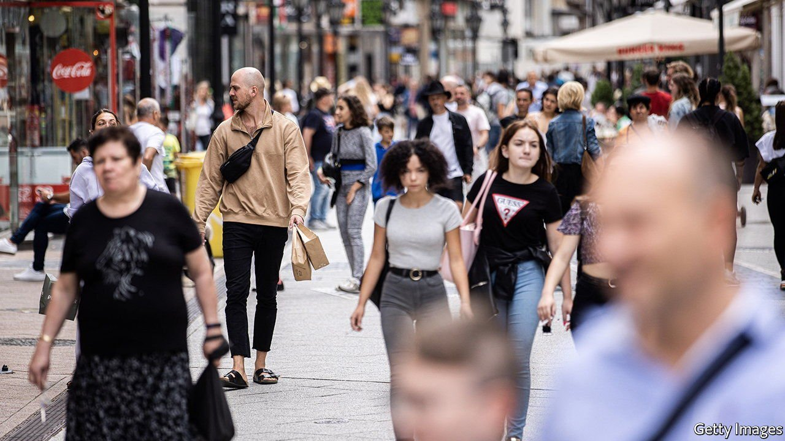
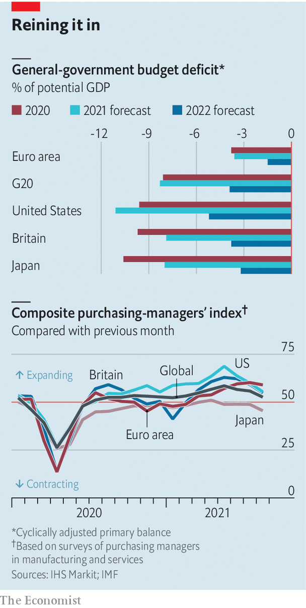
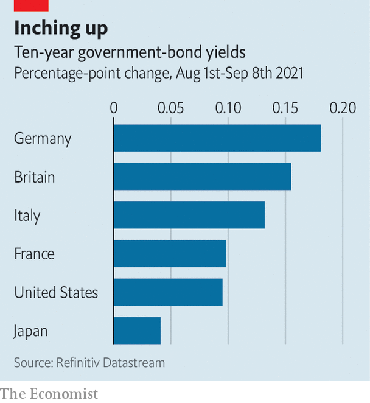

###### High-wire act

# In much of the world, economic policy is becoming tighter 

##### Can the recovery bear it? 

 

> Sep 8th 2021 

INFLATION, IT IS often said, is a matter of too much money chasing too few goods. In many places that has been 2021 in a nutshell. Resurgent demand collided with insufficient supply, yielding inflation of 3% in the euro area, more than 4% in America and over 9% in Brazil. Such price pressures, together with early signs that economies would take off as lockdowns ended and more people were jabbed, led policymakers to set the course for scaling back emergency stimulus. In many places fiscal support is being withdrawn and central banks are either tightening policy or considering doing so. But fortunes can change quickly in the pandemic. As the Delta variant of the coronavirus spreads, the risk now is that policy normalises just as economic growth loses momentum.

Governments are pulling away the generous support they provided earlier in the pandemic. A turn towards austerity is not on the cards; indeed, in the European Union spending out of the €750bn ($886bn) recovery fund agreed in 2020 is only now beginning. Yet fiscal policy is becoming much less accommodative. Across the G20 group of economies, fiscal deficits, net of interest payments and adjusted for business-cycle conditions, are expected to shrink in half next year compared with 2021 (see chart, top panel).


In America, emergency unemployment benefits lapsed on September 6th. A measure of the government’s contribution to GDP growth produced by the Brookings Institution, a think-tank, showed a staggering 7.8 percentage-point boost to the annualised growth rate in the first quarter of 2021, but a drag of 2.1 percentage points in the third. Britain’s costly furlough scheme, meanwhile, is due to end later this month. Although governments in both countries plan to increase spending, they intend to fund this by raising taxes, neutralising the boost to demand.

 


Monetary policy is pulling in the same direction. That is most evident in some emerging markets, such as Brazil and Russia, where central banks have raised interest rates several times this year as food and energy costs have soared. Richer countries are joining their ranks. On August 25th South Korea put interest rates up for the first time since 2018. Norway is likely to follow suit. The Reserve Bank of New Zealand had been expected to raise rates in August, but delayed because of a covid-19 outbreak in the country. Nonetheless, analysts expect it to increase rates twice before the year ends.

Interest-rate increases in large advanced economies are not on the cards until late next year at the earliest. But the flow of asset purchases is slowly being turned off. The Reserve Bank of Australia began tapering its monthly asset purchases after its meeting on September 7th, and the Bank of England will soon reach its bond-purchase target of £875bn ($1.2trn).

 


At its meeting on September 9th the European Central Bank announced a "modest" reduction in the pace of asset purchases made through its emergency bond-buying scheme. In America, surprisingly weak jobs figures for August may put off a tapering announcement by the Federal Reserve later in September, but only for a couple of months at most. Although central bankers often insist that a slower pace of asset purchases does not amount to policy tightening, markets are already pushing bond yields higher.

Earlier in the year an economic rebound seemed baked in. But growth concerns are now multiplying as the Delta variant spreads. South-East Asia has suffered a brutal summer, and the idling of factories there has interrupted the flow of components to other countries, depressing activity more widely. America’s economy, too, looks wobbly given a wave of covid-19 infections. Forecasts for GDP growth in the third quarter have sunk from an annualised rate of more than 6% to below 4%.

With luck and a reprieve from Delta’s spread, the turn towards tightening will bring a gentle decline in inflation and continued recovery in output. The alternative is that the global economy must deal with the Delta variant and the withdrawal of stimulus at the same time. ■

Editor's update (September 9th 2021): This story was updated to include details from the European Central Bank’s meeting


