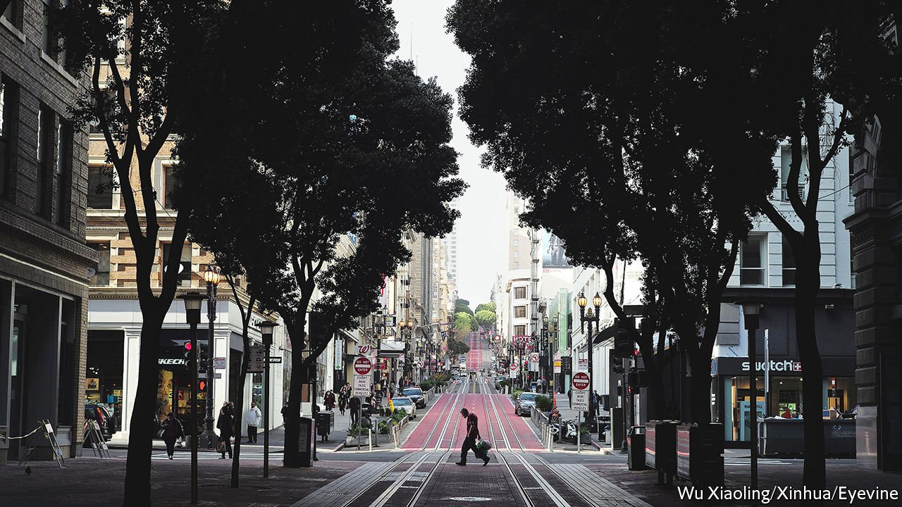
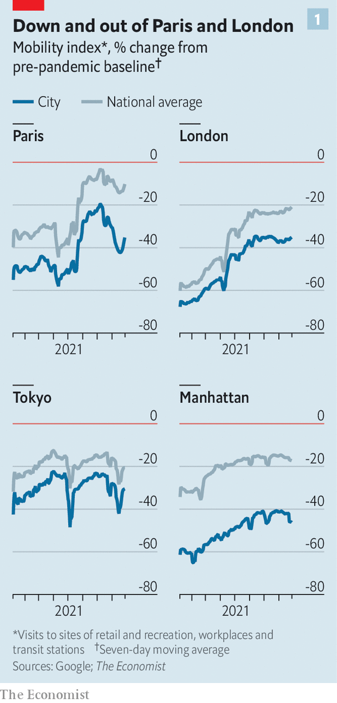
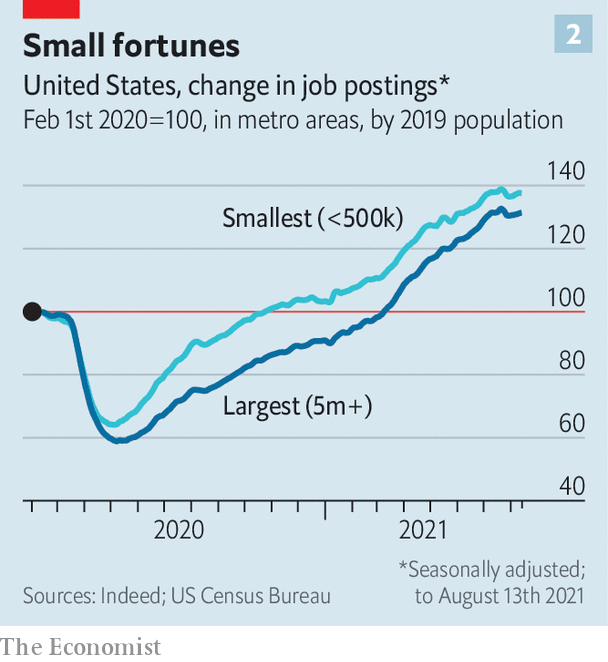

###### The cracked egg

# The new economics of global cities 

##### As economies reopen, activity is spreading outward from city centres 

 

> Sep 9th 2021 

THE ECONOMIC recovery from the covid-19 pandemic is lopsided in many ways. Vaccinations have allowed some countries to bounce back rapidly, even as others struggle. Demand is surging in some sectors but still looks weak in others. Another big source of unevenness is slowly becoming clear. As national economies come back to life, cities are lagging seriously behind.

Before the pandemic cities seemed invincible, with economic and cultural power becoming ever more concentrated in tiny geographical areas. In 2000 the total daily salary bill for everyone working in inner London was twice what it was in the outer boroughs; by 2019 it was three times as high. Over the same period job growth in Sydney’s inner districts was 40% faster than elsewhere in its metropolitan area. “Triumph of the City”, a book published in 2011 by Edward Glaeser of Harvard University, summed up the urban-centric mood.


The fact that Mr Glaeser has chosen to call his latest book (written with David Cutler) “Survival of the City” shows how much has changed. The  at the start of the pandemic, which was motivated by fear of catching the virus and which many assumed would be temporary, now looks more permanent and indicative of a deeper shift in preferences. The big question is whether this is something to worry about.

One way to take the pulse of global cities is to use real-time mobility indicators. The Economist has constructed an “exodus index” using Google data on visits to sites of retail and recreation, public transport and workplaces. This compares mobility in large cities with that in their respective countries. In America, Britain, France and Japan activity remains substantially lower in cities than it does nationally (see chart). According to OpenTable, a booking platform, restaurant reservations in cities are low compared with elsewhere. Bookings in Canada are 8% above their pre-pandemic level but 9% lower in Toronto. Only a fifth of San Franciscan office workers are in the building, suggest data from Kastle Systems, a technology firm. Some parts of San Francisco feel more like an abandoned rustbelt city than a tech hub.

 


Rural areas are not the prime beneficiaries of this shakeout. In the early part of this year sparsely populated American counties were a lot busier than dense ones, compared with their pre-pandemic levels. But in most places their advantage has faded (though activity in Japan may still be shifting slightly into the most sparsely populated areas).

The data point more clearly to a different sort of reallocation. Like an egg broken onto a pan, economic activity is gradually seeping outward from the centre. What were once the liveliest urban areas are becoming less so. The less glamorous ones are taking more of the spoils.

Our mobility index hints at this trend. Central Paris is still much less lively than the rest of Île-de-France, for instance. In America rents in the 300 densest postcodes have fallen by 5% since the pandemic began, but are unchanged in the 300 next-densest areas.

Large companies report similar trends. “Suburban-type stores have done better than the urban stores,” said Peter Nordstrom, the president of his family’s department-store chain, on an earnings call; Starbucks’ chief executive said that “transactions in the current environment have migrated from dense metro centres to suburbs and from cafés to drive-throughs”.

Opinion is divided on whether the spreading out of economic activity is welcome. Certainly if you own commercial property downtown you might be facing losses. But economists have two longer-term concerns. The first relates to employment. As a new paper by Lukas Althoff of Princeton University and colleagues describes, emptier offices and fewer tourists in cities could mean less employment for low-wage workers such as baristas and taxi drivers. The second worry is productivity. A core insight of urban economists is that cities, by cramming lots of different people into a small space, help foster new ideas and technologies. Messrs Glaeser and Cutler worry that a world of remote work, and thus of less vibrant cities, could be one in which people find it harder to make personal bonds and soak up knowledge from others. That would hit living standards.

Are the concerns valid? On employment, there is reason for optimism. It is certainly true, as Mr Althoff and colleagues show, that low-skilled service workers in cities bore much of the brunt of the downturn, as well-paid folk retreated to their home offices. In January this year lower-skilled workers in America’s densest commuting zones, making up 40% of all workers in them, accounted for almost 60% of working hours lost since the start of 2020.

 


Yet economies have been extraordinarily quick to reallocate jobs away from struggling city centres to places with more demand, raising overall employment. On a recent earnings call the CEO of Shake Shack, a purveyor of sugar and fat, said that its focus in the coming year would be “predominantly suburban Shacks”. The nearest Pret A Manger to The Economist’s office in London has closed; but one is opening next to the Underground station near your correspondent’s house a few miles out. Employment in Britain’s suburbs is up by 2% compared with a year ago, even as nationwide employment is down. In America, too, labour demand is shifting away from big cities (see chart 2). There is, however, less evidence of egg-cracking in Australia, which until recently had largely escaped the ravages of covid-19. Employment in Sydney continues to be concentrated in dense areas.


It is harder to know whether the shift from city centres will harm productivity. Were people stuck at home all the time, making new connections and discovering new ideas would be difficult. However, even spending just 30% of working time at the office—the current average across American cities—might not hit innovation all that much. At home white-collar workers can complete taxing tasks in peace, giving them time to collaborate when in the office. That is the message from recent research by Humu, a software firm, which analysed call-centre employees at a large company before the pandemic. One or two work-from-home days a week may make people more productive on both their at-home and in-office days. By contrast with past recessions, productivity growth in America has speeded up during the pandemic, instead of slowing down.

Cities could yet snap back to their pre-pandemic state: tourism could recover and bosses could insist that people . But even if that does not happen, cities will not be finished.

Mayors are shifting their focus from attracting firms to attracting residents, and thus the property and consumption taxes they bring, by improving quality of life. Edinburgh’s George Street and London’s Oxford Circus are likely soon to be pedestrianised; San Francisco plans to make it permanently easier to set up outdoor dining. Some California state senators also want to help turn underused retail property into the badly needed residential sort, part of a wider push to . The pandemic will not destroy cities—but it will change them. ■

All our stories relating to the pandemic and the vaccines can be found on our . You can also find trackers showing ,  and the virus’s spread across .

