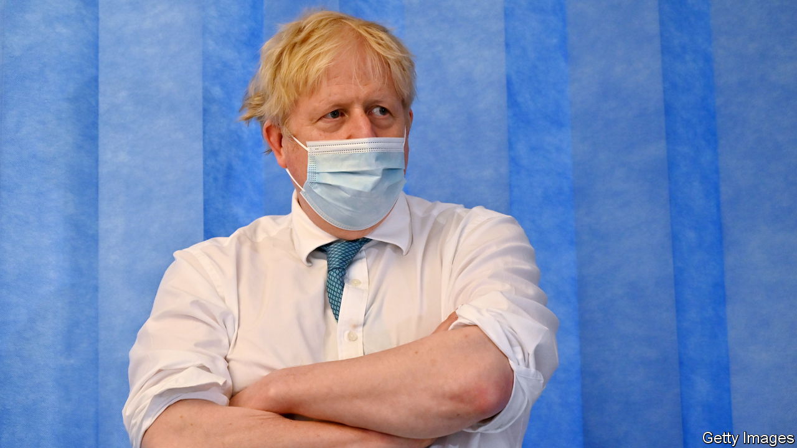
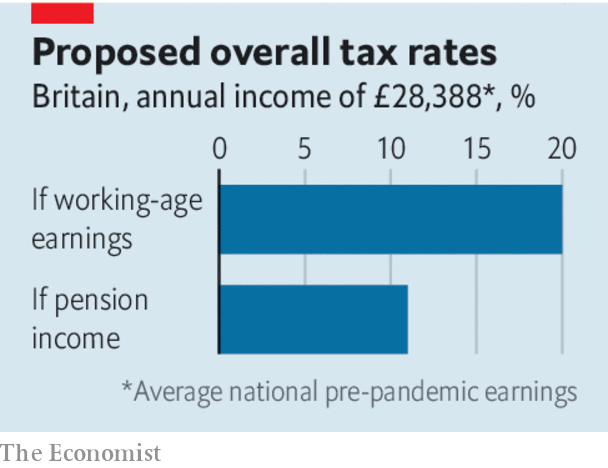

###### Age and enlightenment

# Boris Johnson deserves credit for reforming Britain’s social care 

##### But national insurance is the wrong way to pay for it 

 

> Sep 8th 2021 

NEITHER POPULISTS in general, nor Boris Johnson in particular, are known for tackling difficult problems if they can be left to future governments. Yet Britain’s prime minister did just that on September 7th when he unveiled a plan to break an election promise and raise taxes by an annual £12bn ($17bn), or 0.5% of GDP. The money will go to the National Health Service (NHS) and social care, including residential care for the elderly. Taxes could be raised more fairly. The government nonetheless deserves praise for taking on an issue that had seemed intractable.

Britain, like many rich countries, is ageing. In 2011 there were four 15- to 64-year-olds for every person aged 65 or over; by 2028 there will be fewer than three. The consequences include a strained NHS and more households discovering the inadequacies of the existing social-care system, which exposes the elderly and their heirs to huge financial risks. Today the government helps to pay for care only for those with assets worth less than about £23,000. But around one person in seven will spend more than £100,000—sometimes much more—on care during their lifetime. The result, which is not unique to Britain, is a lottery in which unlucky households must liquidate most or all of their assets.


—and also to help the NHS clear the massive queue of patients that has accumulated while it has fought the pandemic—is welcome. To reform care, he will cap care costs per person at £86,000, beyond which the state will foot the bill. The main beneficiaries will be elderly homeowners and their heirs. Although they may not seem like the most deserving beneficiaries, helping people share uninsurable risks is a worthy goal for governments. The NHS is not means-tested, and it is reasonable to move social care in this direction, too.

 


But this necessary expansion of the welfare state is being paid for in the wrong way. A measure that insures the estates of the elderly against catastrophe should have been funded by levying an insurance premium on older people in the form of higher taxes on property or inheritance. The government instead decided to raise all the new money by lifting national insurance (a payroll tax) and taxes on dividends. Outrageously, income from pensions and property will escape higher levies, meaning many well-off elderly voters will be spared from paying anything for a reform of which they are major beneficiaries.

Had the government raised income tax instead, every generation would have contributed. Mr Johnson says that national insurance is preferable, because firms pay part of the cost. This is a fiction. In the long run the burden of payroll taxes, even those paid by companies, falls on workers, whose wages fall as their employers’ tax bills rise.

The reform is not Mr Johnson’s only breach of an election pledge. His government also announced on September 7th that it would temporarily suspend the “triple lock”, which has ensured since 2010 that the state pension rises by the minimum of earnings, inflation or 2.5%. The pandemic has distorted the official measure of earnings growth, partly because employment has fallen in the lowest-paying industries. Maintaining the triple lock, as the Conservatives had promised, could have pushed the increase in the state pension above 8%. Instead, this year it will be set with reference only to inflation and the 2.5% floor.

The government should go further and abandon the triple lock. The savings should go on working-age people, thus helping to offset the unfairness of higher payroll taxes. Mr Johnson’s reinvention as a politician willing to take an unpopular but necessary decision is welcome. Many more will be needed. ■

