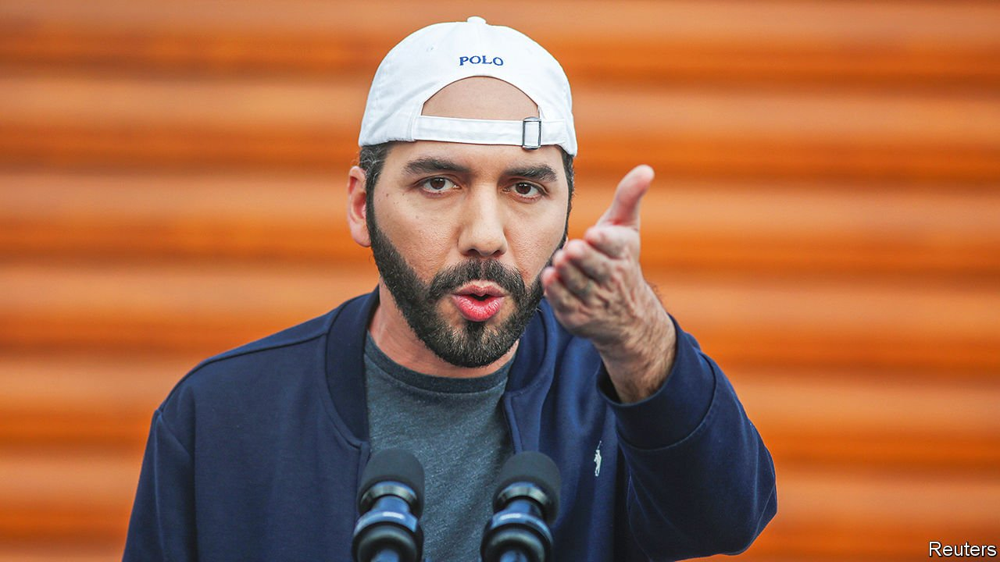

###### New ideas, old tricks

# Nayib Bukele is wrecking democracy in El Salvador 

##### Beyond the bitcoin tech-bro hype is an old-fashioned caudillo 

 

> Sep 11th 2021 

NAYIB BUKELE presents himself as a thoroughly modern leader. A year before running to be president of El Salvador in 2019, the former mayor and law-school dropout founded a party called New Ideas. He said that the party would shake up a country plagued by corruption and crime, which has been dominated by a political duopoly since the end of the civil war in 1992.

In the same vein, Mr Bukele likes to emphasise his youth. At 40 he is a millennial—just. He eschews ties and wears a baseball cap backwards, as if it were still the 1990s. He tweets constantly and often furiously, sometimes pinging out pronouncements over a hundred times a day. On September 7th, after weeks of Mr Bukele’s hype, bitcoin, a cryptocurrency, was made legal tender in the country of 6.5m people. This has made him an unlikely hero to some tech bros in Silicon Valley. But look beyond his nerdy puffery and there lies an old-fashioned autocrat.


Even before New Ideas won a landslide victory in February’s legislative elections, giving Mr Bukele and his chums a two-thirds majority in the Legislative Assembly, he had started the process of undermining the rule of law. In 2020 he used gun-toting soldiers to bully opposition lawmakers into voting for the budget for his crime-fighting programme. In May this year the assembly, now controlled by New Ideas, sacked five of the country’s 15 top judges and the attorney-general, replacing them with yes-men. In June Mr Bukele disbanded an anti-corruption body. He expelled from the country a journalist from El Faro, a newspaper which has investigated his government’s shady deals with three different gangs in prison.

Over the past week the . On August 31st the assembly passed a series of bills, including one to sack all judges over the age of 60. This affects around a third of them, though there are woolly provisos in place to ensure that the term limits can be waived “due to reasons of necessity or speciality”. In other words, loyalty to Mr Bukele will be rewarded. Three days later the top court announced that, contrary to the constitution, a sitting president can run for re-election. Mr Bukele will now be free to run again in 2024—and perhaps, like Hugo Chávez stay in power for life.

Blockchain bully

Even his boosterism for bitcoin is tinged with demagoguery. The law Mr Bukele passed making it legal tender, along with the US dollar, is domineering. It will force businesses to accept bitcoin, though few want to do so. Indeed, the initial roll-out of a new digital wallet, called “Chivo” (cool), was a shambles. It had to be taken offline for hours after servers were overwhelmed. The price of bitcoin slumped by 10% on September 7th, a day after Mr Bukele spent millions of dollars of public funds buying 400 of the tokens.

Central America is not short of autocrats. In Nicaragua Daniel Ortega, the president, has detained most of his rivals ahead of elections in November. Juan Orlando Hernández, the president of Honduras, has been named in connection with three drug-trafficking cases in America. In Guatemala hopes of tackling graft vanished in 2019 when a UN-backed watchdog was disbanded.

El Salvador, however, is particularly worrying, as Mr Bukele is wildly popular, with approval ratings hovering at around 90%. Ordinary folk are fed up with gang violence and corruption and see him as the answer. President Joe Biden has snubbed the millennial caudillo, refusing to meet him and applying visa bans to his cronies. This probably will not make him change course. But given where the road he is on usually leads, Salvadorean voters should be wary.■

