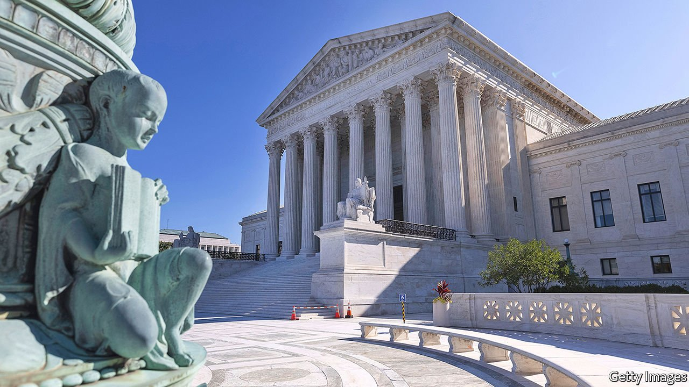

###### Courting trouble

# Texas’s bounty-hunting abortion law could remain on the books for a long time 

##### This is bad for women, the Supreme Court and the rule of law 

 

> Sep 11th 2021 

WHEN THE Texas legislature passed a law trying to ban abortion after about six weeks of pregnancy, many Supreme Court-watchers expected it to be put on hold because it contradicted a right to abortion, enshrined in Roe v Wade, that the court has recognised for nearly 50 years. Instead the Supreme Court, in a 5-4 vote, declined to do this on procedural grounds. The law has gone into effect which is, most obviously, bad for women in Texas. But it is also bad for the court itself and for the rule of law because, through their inaction, the justices in the majority have permitted America’s legal system to be hacked.

The Texas law is ingeniously awful. Its novel enforcement mechanism was designed by a former clerk to the late Antonin Scalia, a justice who died in 2016, to evade scrutiny by the court. Challenges to a state law’s constitutionality usually require someone to bring a case against the state officials. The Texas law makes that tricky, by explicitly preventing public officials in Texas from enforcing it. Instead, anyone based anywhere in the country can sue a Texan who assists in the provision of an abortion after about six weeks, from the taxi driver or relative who drove a woman to a clinic to the receptionists or nurses working there. As an encouragement to do so, successful plaintiffs will have their legal costs paid and receive a $10,000 reward, levied as a fine against the target of the lawsuit. Thus abortion is banned without a single Texas Ranger getting involved.


The law does not allow plaintiffs to sue women who have abortions, perhaps because targeting pregnant women directly is unpopular. But the effect is the same. While nobody has yet taken advantage of the law to sue and claim their reward, the fear of being sued means that abortion clinics in Texas have been turning women away. One probable consequence is that more women will end up seeking later, more traumatic abortions in other states. Abortion pills, sent by post, could in theory offer one way around the law. But Texas is one of 19 states that require a doctor to be present when these drugs, which can be taken safely at home, are ingested. And any doctor who abetted an abortion in this way could now be sued.

One principle of good lawmaking is that rules should be both simple and enforceable. This is neither. Conservative lawyers used to favour tort reform to make America less litigious. That principle turns out to be dispensable, too. As John Roberts, the chief justice, said in his dissent, it would have been better for the court to temporarily block the Texas law because it is so unusual.

The decision not to damages the Supreme Court. It is hard to imagine the majority being so relaxed had the Texas law offered prizes to people who sue gun shops and their employees after school shootings. The five justices in the majority are therefore open to charges of motivated reasoning, which is particularly troubling given that in its upcoming term (which begins next month) the court is scheduled to rule on a direct challenge to Roe —a ban on abortion after 15 weeks that has been passed by Mississippi’s state legislature.

It is still possible that the court could . The most straightforward way would be for someone to sue successfully, then for the target of that lawsuit to appeal. A lower court could take up the case and, eventually, it might make it all the way to the Supreme Court. But that could take a year or longer. The Department of Justice is planning to sue Texas, though it is not clear that will work either. In the meantime, a law which takes a fundamental choice away from women, will stay.

This is a bad outcome. A clear majority of Americans want abortion to be legal in the first trimester of a pregnancy and illegal in the third, with exceptions for when carrying the fetus to term would endanger a woman’s life. The country’s long-running abortion wars cannot possibly be solved by giving people $10,000 for suing a nurse.■

