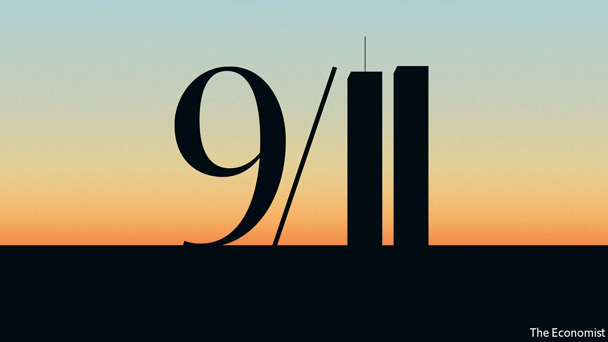

###### America and the world

# The real lessons from 9/11 

##### America risks swinging from hubris to muddle 

 

> Sep 11th 2021 

TWENTY YEARS ago America set out to reshape the world order after the attacks of September 11th. Today it is easy to conclude that its foreign policy has been abandoned on a runway at Kabul airport. President Joe Biden says the exit from Afghanistan was about “ending an era” of distant wars, but it has left America’s allies distraught and its enemies gleeful. Most Americans are tired of it all: roughly two-thirds say the war wasn’t worth it. Yet the national mood of fatigue and apathy is a poor guide to America’s future role in the world. Its capabilities remain formidable and its strategy can be retooled for the 21st century, provided the right lessons are drawn from the post-9/11 era.

The murder of 3,000 people on American soil provoked a reaction that highlighted America’s “”. For a while, it appeared to have uncontested power. President George W. Bush declared that the world was either with America or against it. NATO said the assault on the twin towers was an attack on all its members. Vladimir Putin pledged Russian military co-operation; Condoleezza Rice, then the national security adviser, called this the real end of the cold war. The ease with which American-led forces routed the Taliban seemed to augur a new kind of light-touch warfare: 63 days after September 11th, Kabul fell. There have been enduring achievements since then. Counter-terrorism efforts have improved: Osama bin Laden is dead and no remotely comparable attack on America has succeeded. .


But for the most part the legacy of the response to September 11th has been a bitter one. The mission to crush al-Qaeda morphed into a desire for regime change and nation-building that delivered unconvincing results in Afghanistan and Iraq, at a huge human and fiscal cost. Iraq’s weapons of mass destruction were a mirage. America broke its taboo on torture and lost the moral high ground. The initial, illusory, sense of clarity about when it should intervene militarily faded into indecision, for example over Syria’s use of chemical weapons in 2013. At home the spirit of unity quickly evaporated and America’s toxic divisions mocked its claim to have a superior form of government. The mire in the Middle East has been a distraction from the real story of the early 21st century, the rise of China.

Mr Biden’s debacle in Kabul makes a grim epilogue. Some will see in it proof not only of American incompetence, but also of decline. That is going too far. The fall of Saigon did not lead to the West losing the cold war. And for all America’s flaws—its divisions, debts and decrepit infrastructure—many facets of its power are intact. Its share of global GDP, at 25%, is roughly what it was in the 1990s. It is still technologically and militarily pre-eminent. Although public opinion has turned inwards, America’s interests are far more global than during its isolationist phase in the 1930s. With 9m citizens abroad, 39m jobs supported by trade and $33trn of foreign assets, it has a strong interest in an open world.

Its foreign policy shifted under Barack Obama, who tried a “pivot” to Asia and to scale back the wars in Iraq and Afghanistan. Donald Trump’s detour into bombast and transactional dealmaking was a disaster, though he helped end America’s illusions about China. Mr Biden is well qualified to pick up the pieces, with long experience in foreign affairs and advisers who are crafting a Biden doctrine. Its goals are to end the forever wars, complete the pivot to Asia, tackle new spheres such as cyber-security and rebuild global alliances.

The Economist supports much of this agenda, not least the emphasis on 21st-century priorities such as climate change. The  is better than its predecessor’s, and that could affect geopolitics more than most people realise. But important elements of the Biden doctrine are worryingly fuzzy. The abandoning of Afghanistan has angered allies, who were barely consulted. A confrontational approach to China may blur the focus on climate change.

Overarching the doctrine is an insistence that foreign policy must serve America’s middle class. “Every action we take in our conduct abroad, we must take with American working families in mind,” he has said. Trade, climate and China are simultaneously domestic and foreign concerns. In one sense this is obvious: all countries act in their long-run self-interest, and strength at home is a prerequisite of strength abroad. However, the impulse to make decisions about the world to please a domestic audience is already causing problems.

In Afghanistan an artificial deadline for withdrawal (by September 11th) was fixed to please voters at home, and a decision to remove all troops ignored the reality that a modest American garrison could have stopped the Taliban from taking over. On covid-19, America has missed the chance to lead a global vaccination campaign that would have won it gratitude and goodwill and demonstrated American prowess.

The risk is that Mr Biden’s domestic bias could make his foreign policy less effective. America needs to find a new way to co-exist with China, with rivalry and co-operation in different areas. Yet Mr Biden’s China policy is remarkably like Mr Trump’s, with an ad-hoc array of tariffs in place and rhetoric about a zero-sum contest. He knows that hostility to China is one of the few things that unites Congress and the public: 45% of Americans view China as America’s greatest enemy, up from 14% in 2001.

America still needs to be prepared to use military power to protect human rights abroad. Mr Biden has come close to ruling this out. The world’s despots may have noticed. Mr Biden rightly aims to revive America’s alliances, which multiply its influence. Yet his protectionism hurts allies, from America-first public contracts to . His administration shows little interest in a comprehensive Asian trade deal that would counter China.

Foreign policy is guided by events as much as by strategy: Mr Bush ran on a platform of compassionate conservatism, not a war on terror. Mr Biden must improvise in response to an unruly age. But he should not imagine that a foreign policy subordinate to fraught domestic politics will revitalise America’s claim to lead the world.■

