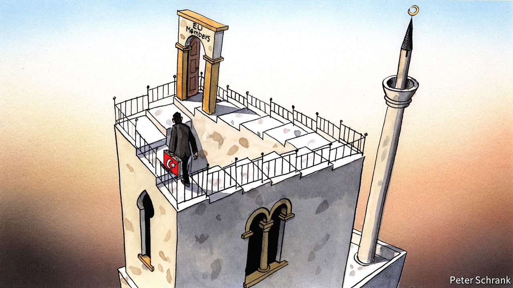
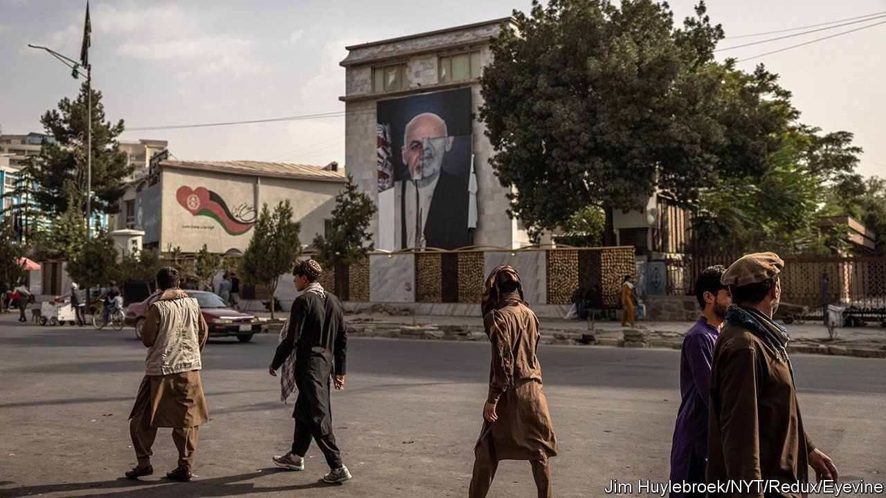
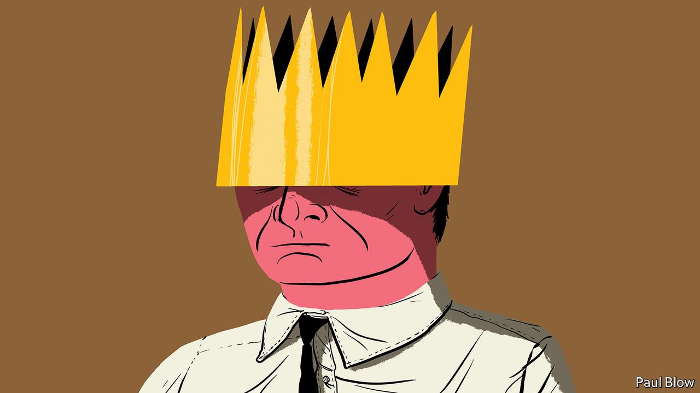

###### On Turkey and the EU, Afghanistan, Kazakhstanis, executives, dudes

# Letters to the editor 

##### A selection of correspondence 

 

> Sep 11th 2021 


Turkey and the EU

Turkey’s accession to the European Union is not a fiction (, August 28th). Instead, it is a difficult and at the same time strategic and invaluable vision that neither side can give up, despite the ups and downs. Reforms under the government of Recep Tayyip Erdogan, who is now the president, led the EU to open accession negotiations in 2005. Thus the argument that “the EU will not accept Turkey whatever its democratic credentials” is not only baseless but also unacceptable for both sides.


It is also disappointing to see the cliché that Turkey is too big and Muslim to join the EU. Turkey’s accession will be the most useful of all since no other candidate can contribute to the EU more than a secular and vibrant Turkey in various areas, from the economy to security. Contrary to what your column claims, the 18th March Agreement in 2016 between Turkey and the EU is not limited to migration co-operation, but also includes re-energising the accession process, (which is not “dead”), updating a customs union, regular high-level dialogues, visa liberalisation and counter-terrorism.

Considering the current challenges, renewing the 2016 agreement in its entirety will be in the best interest of not only Turkey and the EU but also the wider region. The emergence of a geostrategic EU, especially after Brexit, does not have the luxury of refusing a more-democratic Turkey, which would fulfil all its objective membership criteria. This would be a win-win-win situation.

FARUK KAYMAKCI

Deputy foreign minister and director for EU affairs

Ankara

Charlemagne is undoubtedly right that there is now no prospect of Turkey joining the EU. But that does not mean that efforts made since the 1960s to entertain the possibility of membership have been in vain. As someone who, as a member of the European Parliament, was closely involved in matters Turkish, I saw at first hand how the engagement of the parliament and the European Commission with counterparts in Turkey helped both to widen our own perspectives about the value of human rights and to deepen our understanding of the Muslim world and the geopolitics of European integration.

For those many Turks who campaigned for secular liberal democracy and against military dictatorship, the aspiration of EU membership was a lodestar. The EU is not able to enlarge further not only because of the ineligibility of Turkey and other candidate states but also because of its internal weaknesses.

NATO’s retreat from Afghanistan strengthens the case for a radical overhaul of Western thinking and institutions. A European security council involving all EU countries plus all NATO members, including America, would be a good place to start. It would enhance Turkey’s European orientation and be a viable alternative to the fiction of EU accession.

ANDREW DUFF

Cambridge

 


Corruption in Afghanistan

The cardinal problem with Afghanistan is not the Taliban (“”, August 28th). It is corruption. Over the past two decades, Afghanistan received huge amounts of money, equipment, training, mentoring and support in many areas beyond security. The collapse of the Afghan national army (whose bravery is not in dispute when well led on the ground) was blamed on the withdrawal of primarily American contractors who were running the Afghan defence forces’ logistics. American contractors were still being used because whenever Afghans were entrusted to run logistics they sold the spares, fuel and supplies on the black market.

I served in Afghanistan with the American marines in 2014. In plain sight you could see swathes of the Afghan national-army base littered with broken vehicles and equipment forever awaiting parts that had disappeared on a massive scale. That approach was blithely tolerated and endemic at all levels, both official and unofficial and across all sectors. It was often just shrugged off as “the Afghan way”, but really it is the root cause of what truly cripples the country, leaving it so vulnerable to the Taliban.

We must be careful to separate out those who have illicitly profited in governance positions (it was not just the elite) from the rest of the Afghan population, for whom the human tragedy of our withdrawal must not be dismissed. But notwithstanding that, Afghanistan had a once-in-several generations opportunity to pull itself up by its bootstraps and, hugely regrettably and tragically, it blew it. The Afghans say they feel let down by the West, but I do think it is fair to counter that the West can feel let down by the Afghans.

AIDAN TALBOTT

Captain, Royal Navy, retired

St Helens, Isle of Wight

You assert that one reason the United States failed to learn from its mistakes in Vietnam was that “political thinkers are only now” taking corruption seriously. Baloney. Your newspaper itself reported in 2006 that the American military had disseminated “FM 3-24 Counterinsurgency”, a book that instructed soldiers to, among other things, support building good governance in Afghanistan (“”, December 23rd 2006).

As early as 1940, the marines published the “Small Wars Manual”, based on the Philippine-American War, which stated that soldiers fighting counterinsurgencies must “maintain law and order” in order to win over a population. Likewise, results-based aid is not enough, but must be paired with dedicated soldiers who build legitimacy by providing justice and immediate protection.

The question is not whether the United States had a sufficient intellectual framework to understand the threat of corruption and how to deal with it. It is why, after 80 years, America keeps claiming to have learned from its mistakes after it has repeated them for the umpteenth time.

CHARLES HAWKINGS

Point Pleasant, New Jersey

Correct demonyms

A letter () tried to make a point that the inhabitants of Kazakhstan should be called Kazakhs, “rather than the clunky Kazakhstanis”. In fact, Kazakhstani is the correct term. “Kazakh” refers to the ethnicity; “Kazakhstani” is an overarching term pertaining to the nationality. In other words, a Kazakh in Kazakhstan is also a Kazakhstani, but a Kazakhstani is not necessarily a Kazakh. Dispensing with the term “Kazakhstani”, however clunky this may sound to some people, would mean negating the multicultural and multi-ethnic nature of the country, which includes more than one hundred different communities. Not paying attention to these important terminological differences somehow feeds into a larger attitude towards Central Asian countries, often lumped together as “the stans” and considered marginal players in international politics at best.

FILIPPO COSTA BURANELLI

Senior lecturer in international relations

University of St Andrews

St Andrews, Fife

 


Royal executives

Peter Drucker was the first to point out that senior managers are the new monarchs in society (, August 7th). As early as 1950, in “The New Society”, Drucker drew parallels between the development of the French court and Henry Ford’s motor company. He explained that managers had emerged to become a new and powerful social class. For a democratic society to function properly they would need to have legitimate authority and be made accountable for their actions. Unfortunately, Bartleby’s column shows that most managers today have yet to study the discipline of modern management.

SEBASTIAN WOLLER

Zurich

On forcing people back to the office, Jamie Dimon has said, “people don’t like to commute, but so what?” His view towards workers’ difficulties is not unique on Wall Street. Seriously, who wants to work for that kind of boss? The mantra holds true: people don’t quit jobs, they quit bad managers.

ETHAN FARRINGTON

DeLand, Florida

 


This aggression will not stand

Anthony Powell would take you to task for the phrase “mysteries abide” (“”, August 21st). The dude abides, but the point here is surely that those mysteries abound?

DAVE MORRISLondon

