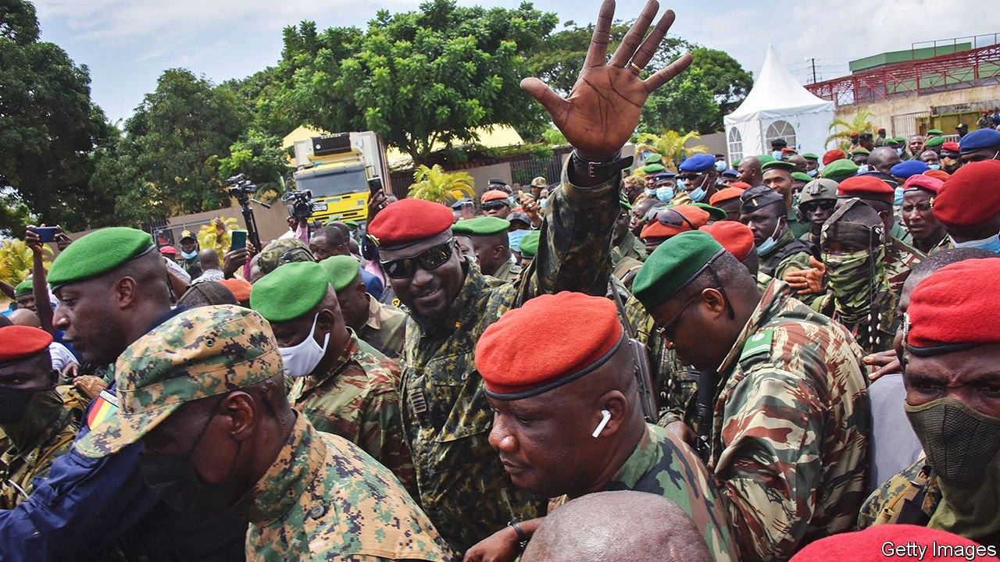
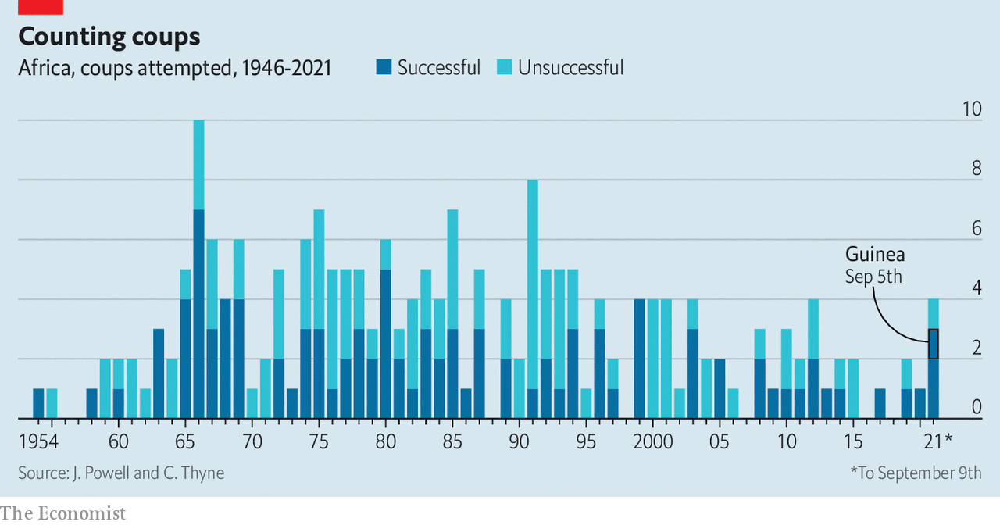
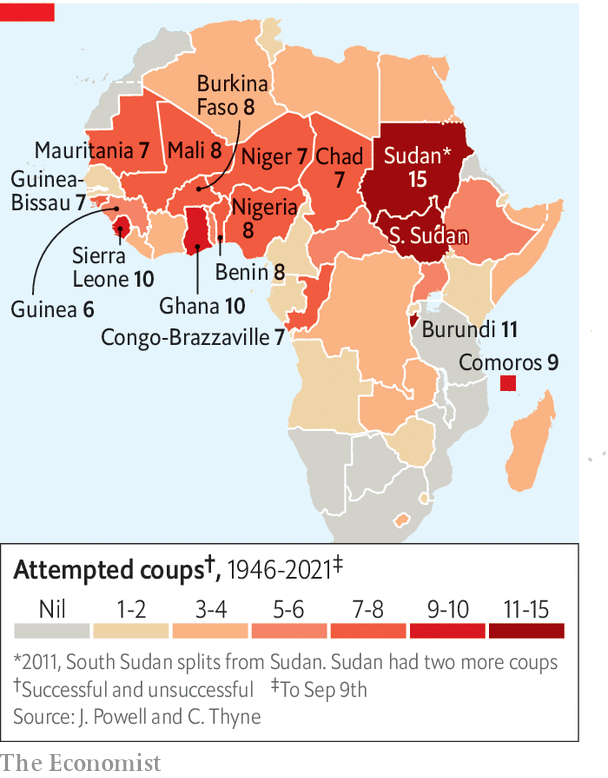

###### Another one bites the dust

# Alpha Condé, the president of Guinea, is ousted in a coup 

##### It is the latest in a disturbing trend 

 

> Sep 9th 2021 

THE FIRST sign was gunfire on the streets of Conakry, Guinea’s capital, on the morning of September 5th. Soon after, unauthenticated videos spread on social media showing President Alpha Condé, looking stunned and dishevelled, surrounded by masked soldiers. “Have we touched a single hair on your head?” demands one soldier of the 83-year-old. Before the day was out, soldiers draped in Guinean flags appeared on television. “The personalisation of political life is over. We will no longer entrust politics to one man, we will entrust it to the people,” said Lieutenant Colonel Mamady Doumbouya (pictured, waving), the head of Guinea’s special forces and leader of the coup, as he declared the constitution and government dissolved. “Look at the state of our roads, of our hospitals,” he said. “It’s time for us to wake up.”

Mr Condé’s overthrow marks a sorry finale to a presidency that once promised much but has long disappointed. It is a dangerous moment for this suffering country of 13m people. The coup is also the latest lurch in an accelerating decline of democracy across much of Africa. The trend has raised fears of a return to the bad old days of plentiful putsches, especially in the west of the continent.


When Mr Condé, a veteran opposition leader, took office in 2010, he became Guinea’s first democratically elected president. He declared he would try to be “Guinea’s Mandela”. Yet his commitment to democracy proved fickle. In March last year, after two terms in office, he  that permitted him to run for another two six-year terms. Angry Guineans took to the streets but were clobbered by security forces, who killed dozens of them. After an election in October 2020, the electoral commission .

This was angrily disputed by his main rival, Cellou Dalein Diallo, and questioned by outsiders. Mr Condé responded by sending in the troops to surround Mr Diallo’s house for days and by locking up hundreds of opposition members and activists. Once again the security forces put down protests, killing dozens.

Many Guineans have celebrated the coup in the streets. Mr Condé’s authoritarian ways were not the only thing that had been frustrating them. The country boasts the world’s largest reserves of bauxite, used to make aluminium, and for the past five years economic growth has topped 5% a year. Yet more than 70% of the population eke out a living on less than the equivalent of $3.20 a day.

 


Guineans tell pollsters that corruption has been getting worse. In recent weeks the government has also raised taxes. The price of fuel has jumped by 20%. For those celebrating, even change through the barrel of a gun represents hope. “We cannot help but feel relieved,” Mr Diallo tells The Economist. The coup leaders have freed about 80 political prisoners and promise a government of “national unity” and an “inclusive and peaceful transition”.

Yet things could easily get worse. Mr Diallo, whose opposition alliance released a statement in support of the junta, admits he has received no specific assurances as to when elections will happen or whether civilians will be included in the transitional government. Lieut-Colonel Doumbouya, who served in the French Foreign Legion, has already installed army officers as heads of every region in the country.

 


Soldiers making vague promises of democracy to fob off regional and Western powers, while doing nothing to bring it about, sounds horribly familiar. In next-door , soldiers have recently staged two coups. In , they staged one in April. The meek international reaction to those putsches may have emboldened Guinea’s special forces. As soldiers were taking over in Guinea, a delegation from the Economic Community of West African States (ECOWAS), the 15-country regional bloc, was in Mali trying to persuade the junta there to keep its promise to hold elections in February. Yet preparations for those polls are badly off track. The delegation said it was “concerned”—but merely asked everyone to “work together” to prepare. Lieut-Colonel Doumbouya, who is thought to know Mali’s coup leader personally, may take note.

Democratic institutions are hard to build but easy to undermine—and across much of the region they are being dismantled. The dismal trend began before this year’s slew of coups. Mr Condé’s constitutional mangling met little international or regional resistance. Neighbours kept quieter still when President Alassane Ouattara repeated the trick in the Ivory Coast. In Chad, in the name of regional security, France and America have long turned a blind eye to rigged elections and violence against the opposition. In Benin few noticed when President Patrice Talon blocked, exiled and arrested members of the opposition. If a country’s leaders do not care enough about democratic institutions to play by the rules—and if outsiders ignore the steady undermining of institutions—it is hardly surprising that men with guns have no qualms about smashing those institutions altogether.

For the moment, ECOWAS has suspended Guinea from the bloc and threatened sanctions, but it may struggle to respond effectively. Unlike Mali and many of its neighbours, which share a currency, Guinea has its own money. After Mali’s coup, the bloc got the regional central bank to shut down all operations in that country, though in due course it relented. That will not be possible in Guinea. Shutting land borders, another common way to apply pressure, will not rattle Guinea, a coastal country. Western governments have condemned the coup and called for Mr Condé's release. But their leverage is limited.

Russia was conspicuous in providing Guinea with its first covid-19 vaccines this year. China is influential, too; more than half of its imported bauxite comes from Guinea (see Finance section). Both have condemned the coup but are unlikely to do much more, especially as Lieut-Colonel Doumbouya was quick to emphasise that mining can continue as normal.

Guinea’s recent history is not reassuring. The leader of a coup in 2008 broke his promise not to stand in the subsequent elections. When tens of thousands gathered in a stadium in Conakry to protest, soldiers opened fire, killing at least 150. They raped dozens of women in the stadium, too. Today things are different, insists Lieut-Colonel Doumbouya: “We no longer need to rape Guinea. We just need to make love to her.” ■

