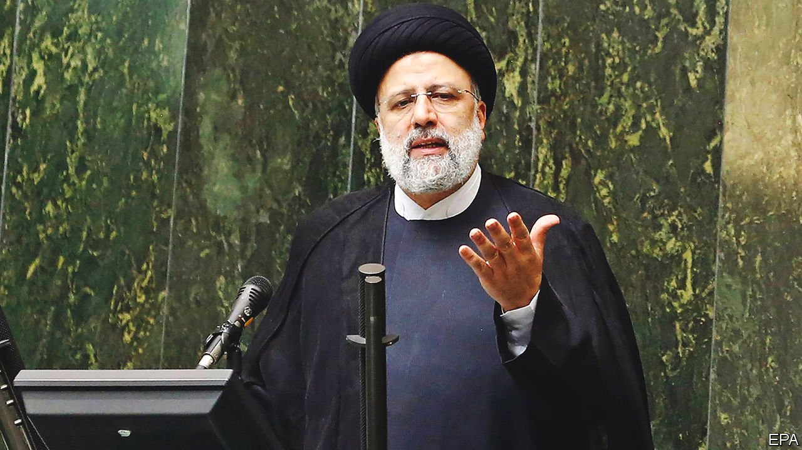

###### Not management material

# Iranians worry that their new government is inept 

##### One minister is wanted for bombing Jews; another wants to kidnap Western soldiers 

 

> Sep 11th 2021 

IT WAS FITTING that Ebrahim Raisi, Iran’s new president, spent the first working day of his government visiting a cemetery, since he had helped orchestrate the mass execution of political prisoners in the 1980s. The setting also fitted the country’s glum mood. Since Mr Raisi’s victory in a rigged election on June 18th, cases of covid-19 in Iran have spiked. The daily death toll is among the highest in the world.

Most Iranians blame the country’s (unelected) clerical regime. In January the supreme leader, Ayatollah Ali Khamenei, banned the import of Western vaccines because America is “untrustworthy”. He later backtracked, but the roll-out has been too slow to help stem the Delta variant.


It now falls to Mr Raisi (pictured) to deal with the health crisis, as well as a sinking economy. His relatively moderate predecessor, Hassan Rouhani, struggled in the face of hardline opposition. Some think the election of Mr Raisi, a protégé of the supreme leader, will at least make the government more coherent.

The new cabinet is certainly more hardline than Mr Rouhani’s. It includes no women, but plenty of men under sanctions by Western countries, including the president himself. Seven of the 19 seats went to people associated with the Islamic Revolutionary Guard Corps (IRGC), Iran’s strongest military force, including four former commanders. Five cabinet members come from Astan-e Quds-e Razavi, the largest bonyad, or clerical conglomerate, which Mr Raisi used to run. Six more are from the judiciary, another conservative bastion formerly headed by Mr Raisi.

Mr Khamenei will have more of a hold over this administration. Not only did he choose Mr Raisi, he probably steered him towards Muhammad Mokhber, the new senior vice-president and manager of one of Mr Khamenei’s largest economic holdings. Mr Mokhber is one of many cabinet officials to have worked under the supreme leader. Mohammad Esmaili headed a supervisory body of Iran's state broadcaster controlled by Mr Khamenei. Now he is the culture minister, lashing out at the “the deviation and secularism” of Iran’s cinema, theatre and music.

But the new cabinet is not as coherent as it might appear. It includes free-marketeers and socialists, populists, realists and ideologues. With Mr Khamenei ailing, Mr Raisi may be trying to woo a broad range of those who would determine the future supreme leader. Iranians, though, fear that the ministers will battle over the spoils of power, awarding themselves and their allies the best jobs and perks. They have already grabbed scarce Pfizer and AstraZeneca jabs, say critics, leaving a home-grown (and unproven) vaccine for the masses.

GDP per person has dropped by about 15% since 2018. The government seems to have no convincing answers. “They hint at having a plan, but there’s no substance to it,” says Sanam Vakil of Chatham House, a think-tank in London. “The conservatives are not unified on economic issues, so you get a mix of populism and neoliberalism.” Mr Raisi and his ministers have promised to produce 1m affordable homes a year. How they will pay for them is unclear. Earlier this year the new vice-president for economic affairs, Mohsen Rezaei, suggested a novel way to boost Iran’s hard-currency reserves: by seizing Western soldiers and demanding ransoms.

The best way to help the economy would be to revive the deal signed in 2015 by Iran and six world powers. It required Iran to curb its nuclear programme in return for the lifting of international sanctions. Donald Trump pulled America out of the deal in 2018 and cut Iran off from the world economy. But President Joe Biden wants to renew it. Mr Raisi, for his part, says he supports the resumption of indirect talks between America and Iran.

In any new negotiations, though, Mr Raisi is likely to rely on his foreign minister, Hossein Amirabdollahian, who is close to Hizbullah, a Lebanese party-cum-militia, and to the IRGC, both deemed terrorist groups by America. Mr Raisi’s new interior minister, Ahmad Vahidi, is wanted by Interpol for his alleged role in bombing a Jewish cultural centre in Buenos Aires in 1994. These appointments hardly signal a desire to re-engage with the world. ■

