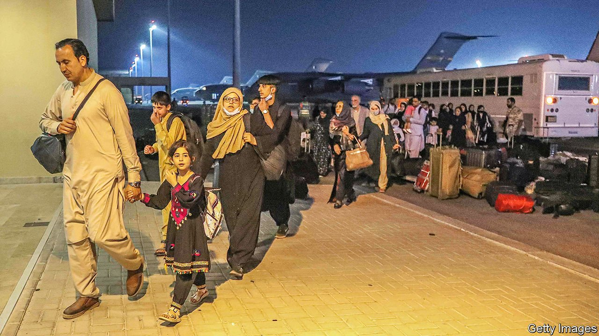

###### The Taliban-whisperers

# Qatar’s unique role in Afghanistan 

##### America’s ignominious exit from Kabul has been a diplomatic boon for tiny Qatar 

 

> Sep 11th 2021 

IT TAKES AN hour to drive to the shimmering towers of Doha from the sun-baked tarmac of Al-Udeid air base. For America, though, the journey took eight years. In 2013 the Taliban set up a diplomatic mission in the Qatari capital. Opened with America’s consent, the office was meant to launch a peace process that would end the American war in Afghanistan.

The ending, of course, was not as America hoped. Like the talks that preceded it, last month’s frantic airlift out of Kabul relied heavily on Qatar. Of the 120,000 people America flew out of Afghanistan, almost half passed through Al-Udeid (pictured). The tiny emirate, home to just 3m people (only 20% of them citizens), thus played a central role in the beginning of the end, and the end itself. Now it has a vital role as an interlocutor between Afghanistan’s new rulers and the West—but it may struggle to deliver much for either side.


Before the Arab spring in 2011, Qatar built a reputation as a mediator in regional disputes. It juggled all sorts of contradictory relationships: on pleasant terms with Iran, for example, but also host to American soldiers. It welcomed feuding factions from Yemen, Sudan and Lebanon for negotiations. Visitors to the Ritz-Carlton would bump into camouflage-clad rebels drinking tea in the lobby between meetings.

Unlike its neighbours in the Gulf, Qatar is also sympathetic to political Islam. No surprise, then, that it wound up facilitating talks between America and the Taliban. It was able to win trust on both sides. The United Arab Emirates (UAE) also sought to host the Taliban, but was rebuffed.

Like other Gulf states, Qatar sees America as its main guarantor of security. For at least a decade, though, the Gulf has harboured growing doubts about America’s reliability. Both Barack Obama and Donald Trump came to view the Gulf states as free-riders, an image they have spent millions of dollars on lobbyists to try to dispel.

Qatar’s fears grew acute in 2017, when Bahrain, Egypt, Saudi Arabia and the UAE imposed a travel and trade embargo on it. They wanted Qatar to cut ties with Islamists and shut Al Jazeera, a satellite broadcaster, among other demands. Mr Trump initially backed the blockade, before changing his position. Qatar’s role as intermediary with the Taliban was one argument for continued American support. (The embargo was lifted in January.)

The Afghan airlift was another chance for Gulf states to prove their worth. The UAE flew out thousands of Afghans on its own planes and was a staging ground for France’s evacuation effort. Bahrain’s national carrier shuttled Afghan evacuees to Washington. Again, though, it was Qatar that took centre stage, with its ambassador in Kabul personally escorting convoys to the airport to ensure safe passage. Its efforts brought praise from President Joe Biden. On August 20th he called Qatar’s emir, Tamim bin Hamad Al Thani, to thank him. “No country has done more than Qatar,” said Mr Biden’s secretary of state, Antony Blinken—better publicity than any pricey lobbying contract could buy.

On September 6th Mr Blinken and Lloyd Austin, America’s defence secretary, arrived in Doha for talks with Qatar. Dominic Raab, Britain’s foreign secretary, made his own trip four days earlier. The question, however, is how long Qatar’s influence will endure. Much of it came from its role as mediator and host. With the Americans gone and the old Afghan government defunct, there are no talks left to mediate. The Taliban are free to govern as they wish and to seek new diplomatic relationships. While they  and to avoid reprisals, their early actions have not been encouraging.

The hope in Qatar is that economics will provide continued leverage. The Taliban need to keep the country afloat amid what looks like a looming balance-of-payments crisis. How much Qatar invests in Afghanistan, though, will depend on how the Taliban govern: brutal regimes are bad for your reputation, erratic ones bad for your money. If Mr Biden chooses to maintain strict sanctions on the Taliban, Qatar will need to keep its distance.

Qatar’s neighbours are playing a waiting game. The last time the Taliban took power, in the 1990s, Saudi Arabia and the UAE were two of only three states to recognise their rule (Pakistan was the third). Both have been more circumspect this time. Saudi Arabia has changed in the intervening years. The young crown prince, Muhammad bin Salman, is keen to project a more liberal image of his kingdom, part of a push to attract investors and tourists and to diversify the oil-bound economy. Embracing the Taliban would fit uncomfortably with that goal.

The UAE, as usual, is hedging its bets. It granted asylum to Ashraf Ghani, the deposed Afghan president, and its leadership is bitterly hostile to political Islam. Yet it has made common cause with Islamists where needed (in Yemen, for example). If the reputational costs are not high, it may seek its own modus vivendi with the Taliban, if only to compete with its rivals, Qatar and Turkey.

All this feels reminiscent of Qatar’s last big push in regional politics. In the early days of the Arab spring, its gamble on Islamists seemed to pay off. They took power in elections in Tunisia and Egypt, and formed powerful militias in Libya and Syria. Within a few years, though, Qatar’s assets had mostly become liabilities. Its Islamist allies proved incompetent and divisive; its neighbours used them as a cudgel to damage Qatar’s reputation. Its bet on the Taliban may go the same way. ■

