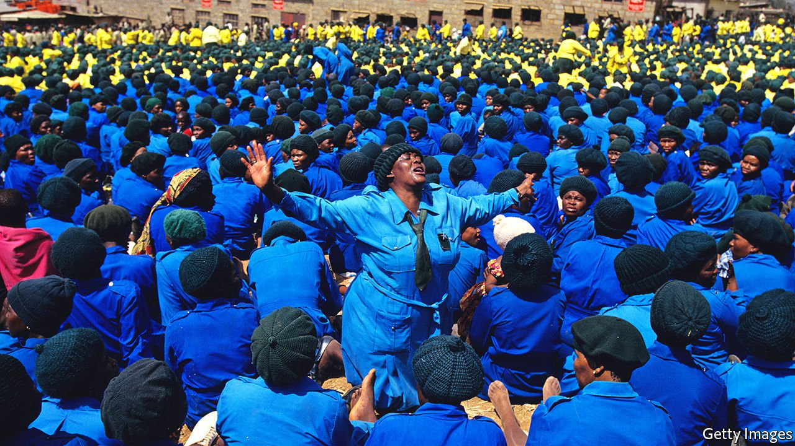

###### Roots and all

# Zionism, southern Africa’s most popular religious movement, is evolving 

##### No, not that Zionism 

 

> Sep 11th 2021 

IN 1892 A captivating Scottish preacher arrived in Chicago. John Alexander Dowie’s church, known as the Christian Catholic Apostolic Church in Zion, proved popular. By 1900 Dowie had enough money to set up a dedicated community, known as Zion City, on the shore of Lake Michigan.

Dowie wanted missionaries to go forth across the world. In most places they failed to find many converts but Zionism did take off in another newly seething metropolis: Johannesburg. In “The People’s Zion”, a book published in 2018, Joel Cabrita of Stanford University offers several explanations, such as its appeal to the poor, its disavowal of racial and ethnic differences, and its use of faith healing at a time of scepticism towards mainstream medicine. It also helped that black mine workers spread the gospel on visits home to rural areas.


Today Zionism is the largest religious movement in southern Africa. There are an estimated 15m followers in the region, versus just a few hundred heirs of the Illinois church in America. On Sundays in Johannesburg parks athleisure-clad suburbanites jog past prophets in white robes leading small groups of Zionists in the siguco, a rhythmic prayer circle, the sound of hymn-singing floating over jacaranda trees.

Its ability to reform, as well as its egalitarianism and cosmopolitanism, is the reason for Zionism’s endurance, notes Ms Cabrita. A lack of hierarchy and doctrine made it easier, for instance, to blend Christian teachings with African traditions like ancestor worship. “We wanted Christianity but we didn’t want it to take away who we are,” explains Siphiso Dlamini, one of the 30-40% of Swazis who are Zionist.

Some American evangelicals are, however, concerned about the happy syncretism of their long-lost religious cousins. Behind a tyre shop in Manzini is Zion Bible College, run by Brett Miller, who moved from Wyoming to the commercial capital of eSwatini in 2014. The missionary-funded college wants to encourage Swazis to embrace Biblical literalism and denounce practices such as witchcraft and convening with dead relatives. “We are unpopular in some quarters,” Mr Miller admits, recalling times when he has been chased out of villages by traditional healers.

But the biggest challenge to Zionism is from Pentecostalism, perhaps the fastest-growing religion in southern Africa. Though it shares many characteristics with Zionism, its extra razzmatazz and its promises of prosperity have huge appeal. In response, some Zionists are changing their ways by playing amplified music and ditching the reference to Zion in their church names, lest the brand appear tired. In a bustling religious marketplace it can be hard to keep up, concedes Dumisani Dlamini, a Zionist radio presenter in eSwatini. “We say that you are not promised prosperity; we teach suffering.”

