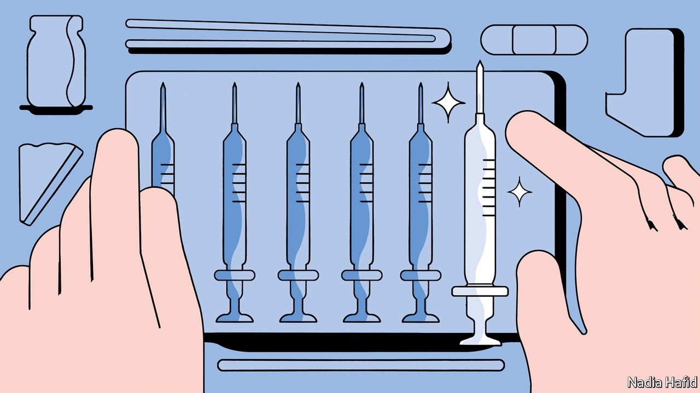

###### The other pandemic

# A new AIDS vaccine heads to clinical trials 

##### It uses the same mRNA technology as some covid jabs 

 

> Sep 8th 2021 

ONE SILVER lining to the covid-19 pandemic has been the speed with which effective vaccines have been developed. Victims of other pandemics have not been so lucky. Three decades of attempts to create a vaccine against HIV, the virus that causes AIDS, have proved fruitless. The latest setback came on August 31st, when an experimental vaccine produced by Johnson &amp; Johnson, an American pharmaceutical firm, flunked a clinical trial. One obstacle is HIV’s genetic slipperiness. The virus has a high mutation rate, which helps it adapt to evade both natural immune systems and artificial vaccines.

Undaunted, Moderna, a firm based in Massachusetts that has recently found fame by quickly coming up with a viable covid-19 jab, is planning to start human trials of a novel vaccine against HIV. Its researchers hope that the mRNA technology used to produce its covid-19 jab will succeed against HIV too, by creating a vaccine which the virus cannot easily dodge.


Moderna’s approach is based in part on work by the International AIDS Vaccine Initiative (IAVI), a charity, and Scripps Research, a not-for-profit institute in San Diego. A joint study published in February showed, for the first time in humans, that it is possible to stimulate activity in immune cells called germline B-cells, which can produce things called broadly neutralising antibodies (bnAbs) against HIV.

Antibodies are proteins produced by the immune system in response to infection. Through a process of quick-fire trial and error in response to particular pathogen molecules, known as antigens, the body creates specialised molecules designed either to gum up the workings of pathogens, or to flag them for destruction by other parts of the immune system. But most antibodies turned out in response to HIV fail to stem the infection for the same reason vaccines do—the virus’s rapid mutation rate allows it to evolve to avoid them.

As their name suggests, bnAbs are less susceptible to such countermeasures. In the case of HIV, the antigen they recognise is part of a viral protein called gp120. This is the means by which HIV particles “dock” with their target cells prior to infecting them. The part of the protein that does the docking is so well tailored that almost any mutation will make it less effective. Since gp120 is trapped in an evolutionary corner, it is a desirable target for a vaccine.

Germline B-cells are diverse but rare. Each carries the blueprint of an antibody, and stands ready to do two things when alerted to the presence of a pathogen. The first is a process called somatic hypermutation, which generates daughter cells capable of producing many slightly different versions of that antibody. The second is clonal expansion, in which cells carrying the most successful of these variants multiply to deal with the infection.

The study conducted by IAVI and Scripps used a small engineered protein called eOD-GT8 60mer as an antigen. This protein resembles the cell-docking part of gp120. Crucially, empirical work in both mice and humans has shown that it also stimulates somatic hypermutation in germline B-cells carrying a broadly neutralising antibody called VRC01. That makes it a promising basis for a vaccine.

The problem with this approach is that eOD-GT8 60mer is slow and expensive to make. Which is where Moderna’s technology comes in. mRNA is the messenger molecule that carries, from a cell’s chromosomes, instructions which tell that cell how to make particular proteins. Instead of carrying eOD-GT8 60mer itself, Moderna’s vaccine contains the mRNA instructions on how to make it, and leaves the job of production to the body’s own cells. Once the molecule enters the bloodstream, it should stimulate the VRC01-carrying germline B-cells to do their stuff. After that, booster shots employing mRNAs for other small antigenic proteins will be used to guide the process of hypermutation in the right direction.

The trial is an early one, designed to test safety and prove the principle. It is testing two approaches. One uses only the mRNA for eOD-GT8 60mer. The other adds mRNA for one of the small, guiding antigens to the shot. It will begin in America later this month, with 56 people. Trials in Rwanda and South Africa should follow shortly after. (UNAIDS, the body charged by the United Nations with combating HIV, estimates that two-thirds of the 38m people infected with the virus by the end of 2020 were in Africa.)

The results from the American trial are expected in 2023. Beyond that, the timeline is less clear. Mark Feinberg, IAVI’s boss, citing how difficult HIV vaccine development still is, does not want people thinking that “just because the covid vaccines were developed using RNA technology in less than a year we’re going to have an HIV vaccine in less than a year”. After three decades of waiting, though, a little more patience is not too much to ask. ■

