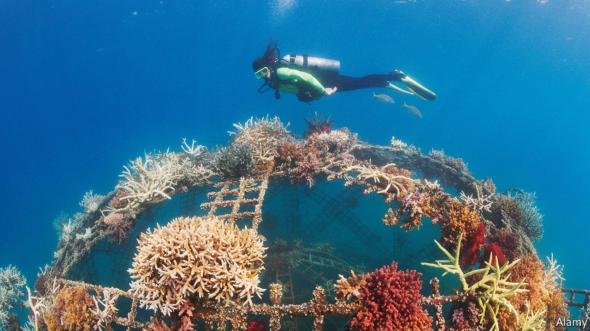

###### Hybrid vigour

# A new form of sea defence is part natural, part artificial 

##### Both companies and armed forces are interested 

 

> Sep 8th 2021 

IF THE CORAL reef pictured below looks odd, that’s because it is. It is artificial, but co-opts the local ecology to help out. Fully grown, it will be a defence against erosion and wave damage—and a tourist attraction for divers. Such “hybrid” reefs have been around for a while. But they are now being deployed by commercial developers, and gaining military attention.

Rather than blocking waves, as a sea wall does, a reef slows them, dissipating their energy before they reach land. One estimate, from the University of California, Santa Cruz and the Pacific Coastal and Marine Science Centre, suggests natural reefs prevent $1.8bn a year of flood damage in America alone. Rising sea levels and increased risk of storm surges will require better sea defences in the future. But while natural reefs take centuries to grow, hybrid versions can be conjured up in months.


The idea began with Wolf Hilbertz, an architect with an interest in marine biology. In the 1970s Hilbertz developed a technique that uses submerged electrodes to run electrical currents through seawater. This precipitates calcium carbonate and magnesium hydroxide out of the seawater, forming limestone similar to that of natural reefs. The artificial reef can become the substrate upon which a natural coral ecosystem develops.

Hilbertz’s original idea was to stop at the limestone stage, growing structures underwater, some of which would be used in situ as things like port facilities, while others would be hoisted ashore as buildings. It looked like a simple, low-cost alternative to making things out of concrete. Later work with Thomas Goreau, a marine biologist, produced both a catchy name—“Biorock”—and the idea of using the stuff as the basis of coral reefs, and, in particular, for repairing damaged reefs.

In 1996 the Global Coral Reef Alliance, a charity, began using Biorock for reef repairs by growing a six-metre structure in the Maldives. Other repairs have followed in Indonesia, Jamaica and Mexico. The Pemuteran Coral Reef Restoration Project, in Bali, is more than 300 metres long and includes dozens of “nurseries” in which Biorock acts as nuclei for the natural extension of the reef.

These are all charitable or public-sector efforts. But some think there is money to be made. One is William Bateman, founder of a British firm called CCell. Mr Bateman believes reefs are better than breakwaters and far better than “beach nourishment”, a multibillion-dollar industry that involves adding sand repeatedly to beaches to combat erosion. CCell’s first big contract is for a reef at Telchac Puerto, a Mexican resort. This summer the firm’s operatives laid a 110-metre section of artificial reef using lightweight two-metre sections put into place without heavy machinery.

While some adjacent beaches have carried in thousands of tonnes of rock to build breakwaters, Telchac Puerto’s new reef draws most of its building material from the seawater. This means less environmental disruption, less labour and lower costs. Mr Batemen says locals claim the beach has already been improved, but another few months will be needed to confirm the reef’s effectiveness. Success will pave the way for the roll-out of commercial hybrid reefs elsewhere.

DARPA, a research agency run by America’s Department of Defence, also sees hybrid reefs as a means of coastal defence—in this case protecting the country’s seaside military installations. Lori Adornato, head of DARPA’s “Reefense” project, says the goal is a hybrid reef-type system which will be maintenance-free and self-repairing. Reefense therefore involves not only creating reefs and measuring their effectiveness, but also attracting and fostering appropriate organisms to sustain the reefs’ health, ensuring they can survive even when natural reefs are suffering.

Though coral reefs thrive in warmer waters, oyster beds are likely to form the best basis for reefs in cooler areas, reckons Dr Adornato. Oyster reefs form when layers of old oyster shells fuse together under the weight of their successors above, producing large, solid structures. Such reefs were abundant in the waters off north-east America until overfishing and environmental degradation destroyed them. But they can be built on the same artificial foundations as hybrid coral reefs, and should provide similar protection.

Whichever reef-building organism is involved, though, a thriving hybrid reef needs to attract the right additional inhabitants. Dr Adornato says algae can compete for space with the reef-building anthozoans, and that some types of fish will nibble at the reef itself. But other fish eat algae and drive off predators. She says that a variety of techniques might be employed to attract beneficial species. Researchers at the University of Exeter, in Britain, among others, have shown that broadcasting sounds recorded on healthy reefs can attract fish. CCell is working with Cornell University to use such acoustic cues.

Perhaps the biggest challenge is to ensure that hybrid reefs survive climate change, which is making seawater both warmer and more acidic. Both trends can damage corals. In practice, that could mean working out in advance which mixture of coral species will be most robust for future rather than current conditions, and then seeding a reef with these varieties.

DARPA is currently assessing proposals from contractors interested in Reefense. The plan is to make awards and move into the next phase of the project by the end of the year. The aim, says Dr Adornato, is to be able to create hybrid reefs cheaply, wherever needed, and that once in place they will maintain themselves with no further costs. In a warming world with rising sea levels, this type of defence is likely to have widespread appeal. ■

