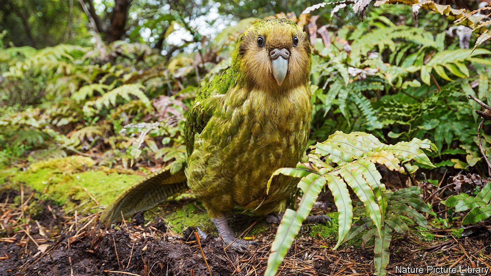

###### Two close shaves

# How the kakapo beat the genetic odds 

##### A previous brush with extinction may help protect the birds today 

 

> Sep 8th 2021 

ISLAND-DWELLING flightless birds suffer when they meet humans. After arriving on New Zealand around 700 years ago, the Maori quickly discovered that the kakapo—a type of flightless parrot—was delicious and easy to catch. Things got worse once Europeans came. By 1995 there was just one kakapo left on the mainland, and 50 on Stewart Island, off New Zealand’s South Island.

But things may be looking up. Conservation efforts have seen numbers rise to 204. And a paper in Cell Genomics, by a team led by Nicolas Dussex at the Centre for Palaeogenetics in Stockholm, suggests the kakapo may have dodged a “mutational meltdown”, a genetic phenomenon that can doom species with small populations.


Mutations—unintended changes to an animal’s genetic code—are common. But since animals are already well-tuned by evolution, most are harmful. In a large population natural selection can weed out bad mutations while spreading the useful few. In a small species, the effects of random chance on survival and reproduction matter more, and that process breaks down. Harmful mutations accumulate, the population falls and the process accelerates towards extinction.

Dr Dussex wondered why this seems not to have happened to the kakapo. He and his collaborators collected DNA from birds both living (via blood samples) and dead (from museum specimens). They found that the birds on Stewart Island have around half as many harmful mutations as those that lived on the mainland over a hundred years ago. That is good news, for it leaves them less vulnerable to a meltdown. But it is also puzzling. Since mainland birds had been part of a much larger population than those on Stewart Island until quite recently, the team had expected to see the islanders carrying a greater mutational load.

Love Dalén, one of Dr Dussex’s colleagues, thinks the island birds may have been toughened up by a previous brush with extinction, when Stewart Island split from the mainland around 10,000 years ago. The relatively small number of birds left stranded would have been at risk of a mutational meltdown then, too.

But small populations are not always doomed. Depending on their exact size, they can benefit from a countervailing process called “purifying selection,” in which harmful mutations are removed rapidly from the gene pool, aided by the inbreeding that is inevitable when few individuals remain. If the island population was big enough for purifying selection to dominate, the result may have been a set of kakapos with very few harmful mutations left to cause trouble.

Whether a population melts down or is purified depends on the particular situation of a given species. But if the kakapo has already dodged one genetic bullet, that may have left it better positioned to dodge a second one, too.

