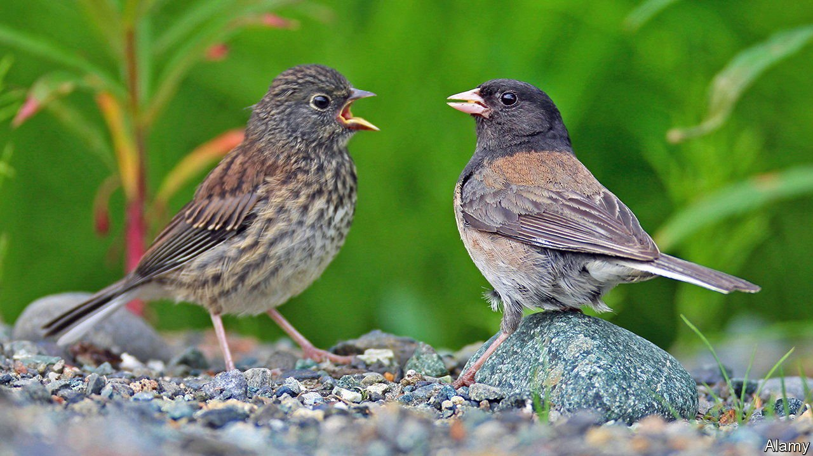

###### Climate change and evolution

# The effects of a warmer world are visible in animals’ bodies 

##### Hundreds of species show signs of adapting to a warming climate 

 

> Sep 11th 2021 

FOR HUMANS, adapting to climate change will mostly be a matter of technology. More air conditioning, better-designed houses and bigger flood defences may help ameliorate the effects of a warmer world. Animals will have to rely on changing their bodies or their behaviour. In a paper published in Trends in Ecology &amp; Evolution, a team led by Sara Ryding, a PhD candidate at Deakin University, in Australia, shows that is already happening. Climate change is already altering the bodies of many animal species, giving them bigger beaks, limbs and ears.

In some species of Australian parrot, for instance, beak size has increased by between 4% and 10% since 1871. Another study, this time in North American dark-eyed juncos, another bird, found the same pattern. Similar trends are seen in mammals, with species of mice, shrews and bats evolving bigger ears, tails, legs and wings.


All that dovetails nicely with evolutionary theory. “Allen’s rule”, named for Joel Asaph Allen, who suggested it in 1877, holds that warm-blooded animals in hot places tend to have larger appendages than those in temperate regions. Such adaptations boost an animal’s surface area relative to its body volume, helping it to shed excess heat. Being richly endowed with blood vessels, and not covered by insulating feathers, beaks make an ideal place for birds to dispose of heat. Fennec foxes, meanwhile, which are native to the Sahara desert, have strikingly large ears, especially compared with their Arctic cousins.

Ms Ryding examined museum specimens, comparing their bodies to those of their modern counterparts. She is not the first researcher to take that approach. But it is hard, when dealing with individual species, to prove that climate change was the cause of an anatomical alteration. All sorts of other factors, from changes in prey to the evolving reproductive preferences of males or females, might conceivably have been driving the changes.

Looking at the bigger picture makes the pattern clearer, says Ms Ryding. Her team combined data from different species in different places. Since they have little in common apart from living on a warming planet, she says, climate change is the most plausible explanation.

For now, at least, the increase is small, never much more than 10%. That may change as warming accelerates. Since any evolutionary adaptation comes with trade-offs, it is unclear how far the process might go. Bigger beaks might interfere with feeding, for instance. Larger wings are heavier, and bigger legs cost more energy to grow.

And there are other ways to adapt, too. Researchers have already seen changes in the geographical range of many species, from insects to fish. Another evolutionary rule-of-thumb, Bergmann’s rule, holds that animals in hotter places tend to have smaller bodies, another way to boost the ratio between surface area and volume. Other animals may alter their behaviour as well as their bodies, such as by seeking shelter at hot times of the day.

Studying a broader range of animals will help firm up exactly what is happening. Much of Ms Ryding’s data concern birds, with less information available for other taxa. But it seems clear that the world of the future is not just going to be hotter than humans are used to. The animals living in it will look different, too. ■

