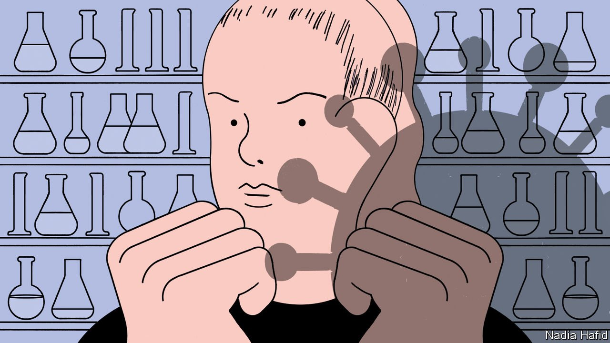

###### A calculated risk

# Why scientists are deliberately infecting volunteers with covid-19 

##### “Human challenge trials” may help answer important questions quickly 

 

> Sep 11th 2021 

IF YOU ARE going to catch covid-19, jokes Jacob Hopkins, a university student, the safest place to do it is in a hospital. So in March Mr Hopkins lay down on a bed in the Royal Free Hospital in London while doctors placed droplets of liquid carrying the SARS-CoV-2 virus into his nose. Mr Hopkins was one of 36 participants in the first “human challenge trial” (HCT) for covid-19.

Human trials are a valuable part of medical research. Studying sick people in the controlled environment of a lab allows scientists to collect valuable information about how diseases work much more quickly than relying on messy and uncertain data from the real world. Since the second world war, around 40,000 volunteers have allowed themselves to be infected with everything from malaria and typhoid to dengue fever and cholera.


But although the idea of doing HCTs for covid-19 has been discussed since the early days of the pandemic, it has proved controversial enough that only Britain has allowed them to go ahead. (A second HCT is under way at Oxford University.) The results from the Royal Free trial, conducted with help from Imperial College London and a firm called hVIVO, which specialises in HCTs, are expected in the coming weeks. They will include details on the natural course of infection of covid-19, how well different tests do in detecting infections, how much exposure to SARS-cov-2 is necessary to infect someone, and how useful masks are in preventing transmission.

Despite the safety worries, the trials have proceeded without incident, says Andrew Catchpole, hVIVO’s chief scientific officer. Volunteers in the trials had only mild symptoms. And the data generated look like being very useful. Dr Catchpole says he and his team were “stunned” by how consistent the course of the disease was in different volunteers. The shedding of viral particles, for instance—which can then go on to infect others—usually starts within a few days of infection, typically up to day four, after which it increases very quickly.

Another strand of the trial aims to nail down just how long it takes, after an individual is infected, for covid-19 to be detected, both by cheap, widely used lateral-flow tests, and by more expensive, more accurate PCR ones. During the trial, researchers conducted frequent swabs of the rooms that volunteers were confined to. That allowed them to figure out exactly when infectious viral particles—as opposed to just passive blobs of genetic material—were present in the room. There will also be more to say on covid-19’s neurological symptoms, and on the immune response of infected individuals.

Despite this promised bounty of data, HCTs for covid-19 remain controversial. Opponents point out that covid-19 is a potentially dangerous disease that is not well-understood or always treatable. “Long covid”, a mysterious condition in which symptoms persist for months, is a possibility, as is death. Jan Helge Solbakk, head of research at the Centre for Medical Ethics in Oslo, says there is no longer any good argument in favour of HCTs now that vaccines have been developed and tested.

Proponents counter that the safety record of previous HCTs is “outstanding”, and that risks can be minimised by giving young and healthy volunteers the smallest possible dose of the virus. Arthur Caplan, a professor of medical ethics at the Grossman School of Medicine at New York University, points out that drug trials also involve the risk of injury or death, yet are uncontroversial. He says opponents of HCTs are not focusing on the research that is still needed, including into new vaccines, or the time it will take to obtain such data without HCTs. He accuses them of “fuzzy moral thinking”.

The trial has infected participants with the original strain of SARS-CoV-2 that first emerged in China in 2019. That means not all the data will be generalisable to the Delta variant of the virus, which has become dominant in many countries. But Dr Catchpole says he expects at least some consistency in results concerning the minimum dose needed for infection.

And having conducted one set of HCTs safely, it should be easier to undertake more in future. Further trials could allow quicker tests of vaccines against new variants of SARS-CoV-2, for instance, or tightly controlled comparisons of different jabs to see which is the most effective. (Such questions could take years to answer with real-world data.) They could also help obtain swift answers on how well new or existing drugs work against covid-19.

Adrian Hill, the director of the Jenner Institute, a vaccine-research body based in Oxford, says the risks of conducting HCTs have been reduced by the availability of new treatments for covid-19, such as monoclonal antibodies. Yet even in gung-ho Britain, arguments about safety delayed the start of the trials by months. Covid-19 is unlikely to be the last novel disease the world faces, says Dr Hill. To help save lives in future, he would like to see the ethical questions around HCTs settled before the next pandemic arrives. ■

Dig deeper

All our stories relating to the pandemic and the vaccines can be found on our . You can also find trackers showing ,  and the virus’s spread across .

