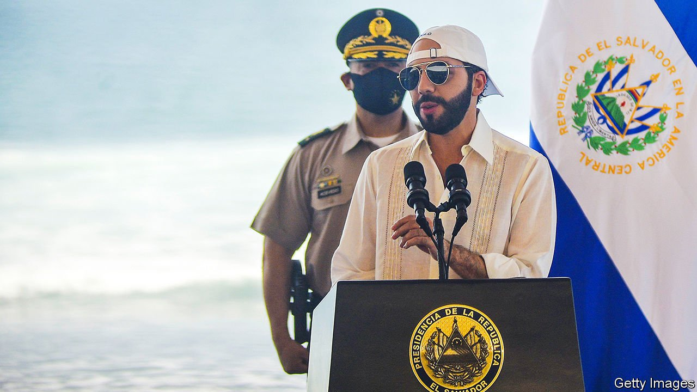
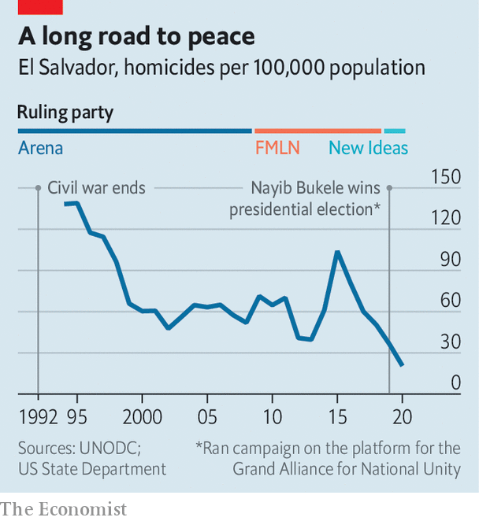

###### Crypto creep

# El Salvador’s bitcoin bro president is beloved and dangerous 

##### Nayib Bukele is exploiting popularity for authoritarian ends 

 

> Sep 11th 2021 

ON SUNDAY September 5th a couple of hundred protesters huddled beneath the Monument to the Constitution in San Salvador, the capital of El Salvador, holding hand-made signs. Most were in their mid-twenties. Taking turns to use a microphone they condemned Nayib Bukele, the 40-year-old president. Nearly all of them covered their faces, less for fear of catching covid-19 than of being identified by the police who took photographs of the event.

They were out on the streets to decry a ruling by the Supreme Court two days earlier that presidents can run for a second consecutive term. That allows Mr Bukele to stand in 2024, and appears to go against the constitution. Daniel, a 28-year-old graphic designer, attended the protest with his mother, holding a sign that read “Bukele Fascista”. He had voted for Mr Bukele, but now feels that “the constitution is being trampled upon.”


The ruling is the latest power grab by Mr Bukele. In February New Ideas, his party, won a supermajority in legislative elections. Since then he has taken over the judiciary. Five judges from the Supreme Court’s constitutional chamber were sacked in May and replaced by sympathisers; they were the ones who ruled that he could run again. On August 31st the Legislative Assembly passed a series of bills, including one that boots out all judges over the age of 60 or with 30 years of service under their belts. Mr Bukele can now replace them—up to a third of the judiciary.

But on the other side of the city from the protest, in Plaza Morazán in downtown San Salvador, few were bothered by Mr Bukele’s undemocratic tendencies or the intricacies of the judicial system. When Mr Bukele was mayor of the capital, from 2015 to 2018, he cleaned up the plaza and the downtown area, which used to be controlled by gangs. Dorian Martínez, a waiter in a café there, feels that the president has been “successful in most things”, and is different from previous politicians. He praises his ability to get a hospital built during the pandemic. “I would vote for him a second time,” he says. “Imagine what he could achieve.”

More of Mr Martínez’s compatriots seem to agree with him than with the protesters, who turned out in slightly larger numbers on September 7th. The president’s approval rating has hovered at around 90% since he took power in 2019, by far the highest of any leader in Latin America, and possibly the world.

 


Many Salvadoreans say that Mr Bukele has made their lives better. They point to new roads, food handouts and safer neighbourhoods. Some credit him with bringing down murder rates, which started to fall well before he took over (see chart). Though many suspect Mr Bukele’s government of negotiating with gang members (as previous governments also did), he denies this. On August 23rd El Faro, a digital newspaper, revealed that officials had secretly met imprisoned gang members over the past year, allegedly to keep crime low in exchange for better prison conditions.

Mr Bukele’s popularity is not the only thing that has given him cover for his astonishingly quick takeover of the state. Salvadoreans lack faith in democracy, thanks in large part to the corruption and poor governance of the two parties that had alternated in power since the end of the civil war in 1992. Mr Bukele promised to shake up that duopoly with New Ideas, which was registered as a party only in 2018.

It also helps that the president is a masterful self-publicist. The Supreme Court judgment happened just a few days before El Salvador became the first country to make bitcoin legal tender, alongside US dollars. The move is not terribly popular—in one survey over two-thirds did not want to be paid in crypto. But it has attracted headlines around the world (although the rollout was a shambles). Mr Bukele has been frantically tweeting about the cryptocurrency, of which the country has bought hundreds of tokens (spending around $30m). By contrast he stayed silent about the Supreme Court’s decision.

Meanwhile Mr Bukele’s control of the judicial system means that it would be impossible to mount a legal challenge, says Ruth López, a lawyer at Cristosal, a human-rights organisation in El Salvador, even if the rulings and sackings are illegal. The electoral authority has said it will abide by the court’s decision to allow the president to run for a second consecutive term, although one of its officials expressed surprise at the decision.

Uncle Sam’s quandary

The United States appears to be hamstrung in how it deals with the president of a country of just 6.5m people. President Joe Biden’s administration has condemned Mr Bukele; the American ambassador to El Salvador likened him to Hugo Chávez, Venezuela’s late dictator. Officials in Washington may be able to exert some economic pressure, perhaps by pressing for conditions on an IMF loan worth $1bn that is in the works. The State Department stopped supporting the attorney-general’s office after the incumbent was ousted in May.

Yet the United States is battling a migrant crisis of Central Americans on its southern border. Over 2m Salvadoreans now live in the United States, up from 700,000 in 2000. Mr Biden’s team would rather not risk destabilising the country, causing more people to flee. On August 27th it donated equipment including eight helicopters to El Salvador’s armed forces, who are loyal to Mr Bukele.

Some may take comfort in a poll which showed Mr Bukele’s approval rating at 87%. Although still ridiculously high, that is the lowest it has been since he took office. But with the levers of power now under his control, and $30 of free bitcoin to any Salvadorean who signs up to the crypto service (the equivalent of about three days on minimum wages) the millennial caudillo can afford not to please everyone.■

