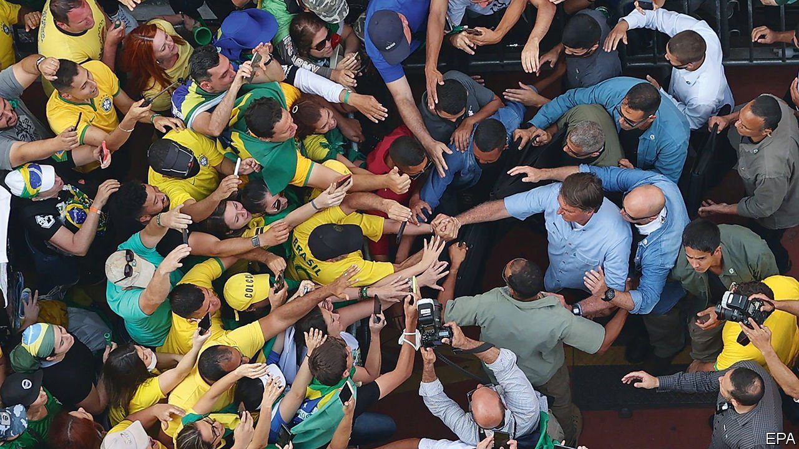

###### A populist pushes back

# Jair Bolsonaro fires up his fans by attacking judges 

##### A huge protest supporting the president could be a hint of what’s to come in 2022 

 

> Sep 11th 2021 

“ONLY GOD will remove me [from power],” yelled Jair Bolsonaro, Brazil’s president, from the top of a truck in São Paulo on September 7th. “I will never be imprisoned,” he added, as if his message was not clear enough. The protest, on Brazil’s independence day, had been called by the president himself (pictured, greeting the faithful). Striking messianic poses, he was surrounded by more than 120,000 of his core supporters—Evangelical Christians, farmers and lorry drivers, many of them bused in from cities across the country. He promised no longer to follow Supreme Court rulings and demanded “freedom of expression” after the court ordered the arrest of some of his allies who were inciting violence on social media.

Mr Bolsonaro’s hyperbole is an attempt to keep his noisy but dwindling group of fans riled up until a presidential election due in 2022. He is struggling with a worsening economic outlook. Less than 30% of Brazilians support him, the lowest poll rating since he took office in 2019. More than 14% of Brazilians are unemployed. Inflation is nearly 9%, and for staples such as rice and sugar it is 40% and 30%, respectively. More than 580,000 Brazilians have died of covid-19, most of them after Mr Bolsonaro spent months ignoring offers to buy vaccines. A Senate inquiry has exposed suspicions of corruption in one vaccine procurement deal, which the president allegedly knew about (he denies this).


In response he is turning to an old populist trick of blaming other branches of power when things go wrong. In 2019, when an unpopular pension reform was taking longer than he would have liked in Congress, he quarrelled with the then-speaker of the lower house. Over the past 18 months Mr Bolsonaro has taken part in protests that called for military intervention to defy lockdowns ordered by governors. Now he is attacking Supreme Court judges, who not only oversee the vote count but have also authorised probes against him.

Such antics suggest that, if Mr Bolsonaro loses the election next year, he is unlikely to go quietly. When the heads of the three armed forces resigned in March in solidarity with the defence minister who had been fired, reportedly for defending the army’s independence, fears grew that the president would use the armed forces to remain in office. That seems unlikely. But concerns that he will try to cling to power illegally have recently risen.

Fuelling the flames

In July Mr Bolsonaro threatened that next year’s elections would not be held until the voting system was changed from a fully electronic one to a paper-receipt system, citing conspiracy theories about electoral fraud. “Either we hold clean elections in Brazil or we don’t have elections,” he said. The protest on September 7th was partly in response to lawmakers rejecting his paper-voting bill.

Such tactics—which echo some of the things Donald Trump said to inspire his fans to storm the United States Congress in January—go down well with Mr Bolsonaro’s supporters. At the march in São Paulo, one of 19 across the country, there were signs calling for military intervention and the impeachment of all judges. “The Supreme Court must be declared the enemy of the homeland,” says José Silva, a 65-year-old retired bank clerk. He thinks the vote in 2018 was rigged, even though his hero won. (He thinks Mr Bolsonaro won even more votes than he did.) “We don’t want elections any more,” he adds. Instead, he says, the president should call in the armed forces for a “constitutional intervention”.

Alongside whipping up his base, Mr Bolsonaro has tried to bolster support among the police and the army. He is a fan of the military dictatorship that was in power from 1964 until 1985. Indeed, several of his supporters at the protest wore T-shirts evoking this period. Mr Bolsonaro, a former army captain, has stuffed his government with more than 6,000 soldiers, including some generals, although various military top brass have denounced his attempts to politicise the military.

Jair and the giant impeachment

On September 7th Mr Bolsonaro also said that he will call a meeting of the Council of the Republic, a body that deliberates on measures such as federal interventions and states of siege. (Lawmakers said they had not received an official invitation.) But after the protests, more politicians are discussing the possibility of impeaching the president. There are more than 130 motions against him waiting to be discussed in the lower house. However, as it is run by an ally of Mr Bolsonaro, they are unlikely to get very far.

Although the protests were not violent, as many feared they would be, the coming months are likely to be tense. On September 12th right-wing groups that once supported the president will take to the streets and join the chorus for his impeachment. That could lead to further clashes between bolsonaristas and their opponents.

By contrast, opposition parties have mostly stayed quiet, possibly betting that they have a better chance of winning next year’s election if Mr Bolsonaro remains a candidate. While the president is losing ground in polls, his biggest rival, the left-wing former president, Luiz Inácio Lula da Silva, has seen his popularity surge. Polls show Lula winning. The government’s hopes for a pre-election economic boost are quickly fading, too. Second-quarter GDP fell 0.1% compared with the previous quarter. A drought that affects two-fifths of the country is spoiling harvests and pushing up the price of electricity.

Most institutions in Brazil remain fairly robust. It is highly unlikely that Mr Bolsonaro could co-opt them. But if he loses in 2022, he has already laid the groundwork for questioning the results—potentially with angry mobs. The protests this week show that his supporters are organised, willing to take to the streets and cavalier about the rules of democracy. Márcio Fernandes of Ohmresearch, a Brasília-based consultancy, puts it starkly: “Brazil is now a room full of fuel and dynamite.”■

