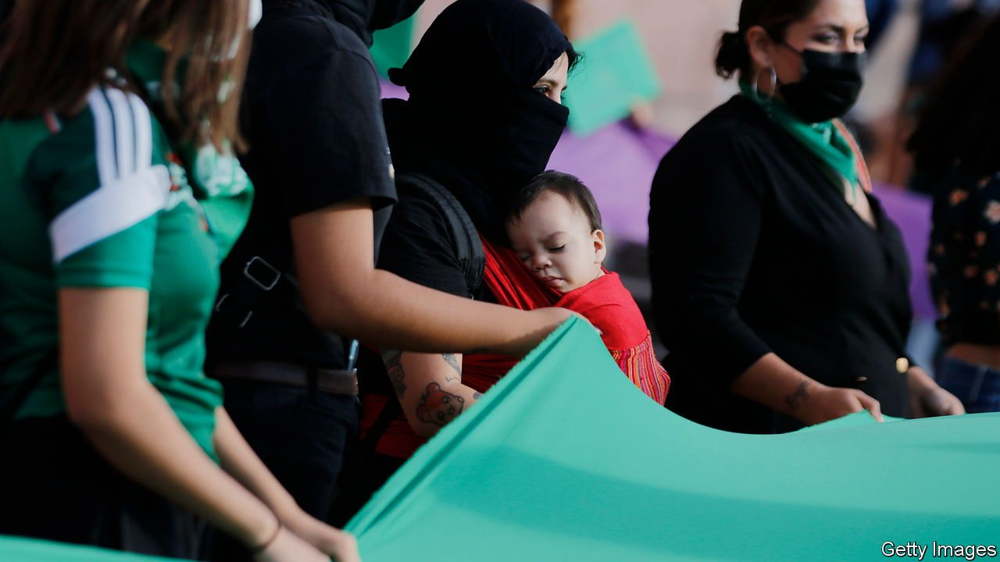

###### Judges for choice

# Mexico’s Supreme Court decriminalises abortion 

##### The ruling reflects changing mores in the world’s second-biggest Catholic country 

 

> Sep 8th 2021 

THE RULING was clear. On September 7th Mexico’s Supreme Court unanimously voted to decriminalise abortion. The ten judges declared unconstitutional a law in Coahuila, a northern state, that imposes up to three years behind bars on women who undergo an abortion and the doctors who perform it. The ruling applies across the country. “Here ends the unjust criminalisation of women,” declared Arturo Zaldívar, the chief justice.

The loosening of abortion restrictions is the culmination of a small but growing wave of piecemeal liberalisation in Mexico, where almost all of the 32 states have outright bans, with narrow exceptions such as rape, fetal malformation or risk to the mother’s health. In 2007 Mexico City, the capital, passed a law allowing women to terminate their pregnancies on any grounds during the first 12 weeks. Since 2019 three other states have followed suit.


Pro-choice campaigners are celebrating. Abortions will not immediately become available, but states can no longer prosecute women for having an abortion, and must release any women or doctors behind bars for terminating pregnancies (it is unclear how many there are). State congresses are not obliged to vote to change any relevant laws, but may do so, since they are now unconstitutional.

Decriminalising abortion in Mexico is significant—not least because it happened days after Texas introduced a law banning abortion after six weeks. The country of 126m is home to around 90m Catholics, the second-most in the world (after Brazil). But the church’s power has been waning. Estimates suggest around 1m clandestine abortions take place every year, with perhaps a third causing medical complications.

Women in Mexico have also become more vocal. Large protests have focused on the high incidence of violence, including record numbers of killings, suffered by Mexican women. (The court also struck down a provision in Coahuila providing lesser sentences for rape within marriage.) The judges’ reasoning was notable for its stress on women’s rights rather than technical legal questions as in some past cases. Leticia Bonifaz, an academic who formerly worked in the Supreme Court and helped draft Mexico City’s abortion legislation, says she expected the ruling given the discussions inside the court. But she was surprised by its unanimity.

The Mexican state, which is officially secular, is becoming somewhat friendlier to women in other ways, too. In 2019 it passed a constitutional amendment which requires federal and local governments eventually to have equal numbers of women and men in many jobs. Half of lawmakers are women, as is half of President Andrés Manuel López Obrador’s cabinet. But Mr López Obrador, who is devout, refused to get involved in the debate about abortion, saying it was up to the courts.

Mr López Obrador has also dismissed female protesters as puppets of his opponents. After he came to power in 2018 he cut funding for women’s shelters and for childcare. He got rid of a programme that gave cash to women as long as they sent their children to school and for regular medical check-ups. The president’s wariness of abortion is shared by many: a poll taken in August suggested that 53% of Mexicans disagreed with legalising it, against 45% in favour. The abortion ruling is a step forward for women’s rights, but there is still room for improvement.■

