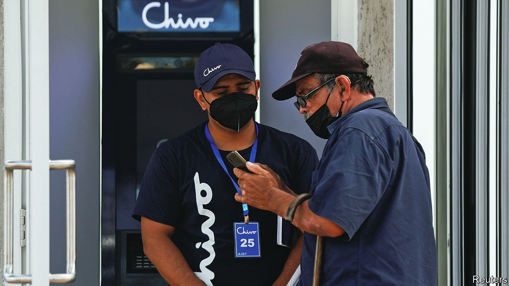

###### 

# Business this week 

#####  

 

> Sep 9th 2021 

’s roll-out of  bitcoin as legal tender got off to a shaky start. The Central American country is the first in the world to adopt the cryptocurrency as an official means of exchange; it now uses bitcoin alongside the American dollar. Systems were overwhelmed as people downloaded the government-backed Chivo, or “cool”, e-wallet, after the government offered $30-worth of free bitcoin as an incentive. The roll-out added to already volatile trading in bitcoin; at one point the price plunged so fast it was described as a “flash crash”.

The SEC plays catch-up


Coinbase, a cryptocurrency exchange, revealed that America’s Securities and Exchange Commission is threatening to sue it, if it brings a product to market that allows users to lend their cryptoassets and earn interest on the loan. The company suggested that this may be because the SEC classifies the product as a security (therefore falling outside existing lending regulations), but it had not been given an official explanation.

SoftBank’s stock surged after it announced a complex deal that gives it a 4.5% stake in Deutsche Telekom in return for a chunk of its shares in T-Mobile US, in which Deutsche Telekom is already the largest investor. The German telecoms company will then sell off T-Mobile Netherlands for $6.1bn and buy more shares in the American wireless business. SoftBank benefits through a strategic arrangement that gives it access to Deutsche Telekom’s European customer base.

Both  denied media reports that the city government is considering taking the ride-hailing company under state control and arranging this by directing state firms to invest in it. Didi is one of the targets of China’s crackdown on influential tech companies. In July it was ordered to pull its app from app stores after it completed a successful IPO in New York.

Trading in bonds issued on Chinese stock exchanges by Evergrande was suspended for a second time, after the property developer, one of China’s largest, warned that it was at risk of a default. The highly indebted company’s woes have sent shock waves through China’s property industry.

Brazil, the world’s biggest beef exporter, suspended shipments of the meat to China, its largest market, after two cases of mad-cow disease were detected in two states.

Janet Yellen, America’s treasury secretary, warned Congress that the government will run out of money in October unless the federal debt ceiling is raised. Lifting the debt limit is a perennial hot potato. A decade ago America was stripped of its S&amp;P AAA rating during a political row over the issue.

, a French company, signed contracts in Iraq worth $27bn to explore for oil and gas and develop solar energy. Three years ago Total, as it was known then, pulled out of Iran because of American sanctions on doing business in that country.

American employers created 235,000 jobs in August, the smallest number since January and far below most expectations. The news came shortly before millions of Americans saw their unemployment benefits end or become drastically reduced with the expiry of the covid-19 emergency relief programme.

Bowing to pressure from campaigners for data privacy, Apple delayed the introduction of a tool that would search for images of child pornography and sexual abuse on iPhones. Privacy groups, including the American Civil Liberties Union and the Electronic Frontier Foundation, have warned that the tool could be adapted by authoritarian governments to track opponents, but child-safety organisations are disappointed by the delay.

The takeover battle for Morrisons, Britain’s fourth-largest supermarket chain, looks set to be decided by an auction next month. The company is being pursued by two American private-equity groups, neither of which has declared its offer as final, sparking the auction process.

EasyJet, a low-cost airline based in Britain, said it had rejected a takeover approach. The carrier recorded its first annual loss last year because of travel restrictions; its stockmarket value has tumbled. After disclosing the aborted takeover bid easyJet said it would shore up its finances via a £1.2bn ($1.7bn) rights issue.

Urban planning for Utopia

American media pored over news that Marc Lore, an internet entrepreneur, wants to raise $400bn to create “Telosa”, a desert city housing 5m people that would use state-of-the-art technology to design eco-friendly buildings, sustainable-energy systems and a transport system that gives priority to cyclists. Politicians would be accountable to residents, diversity would rule and prosperity would be shared. Telosa’s detractors call it the world’s first woke city.

