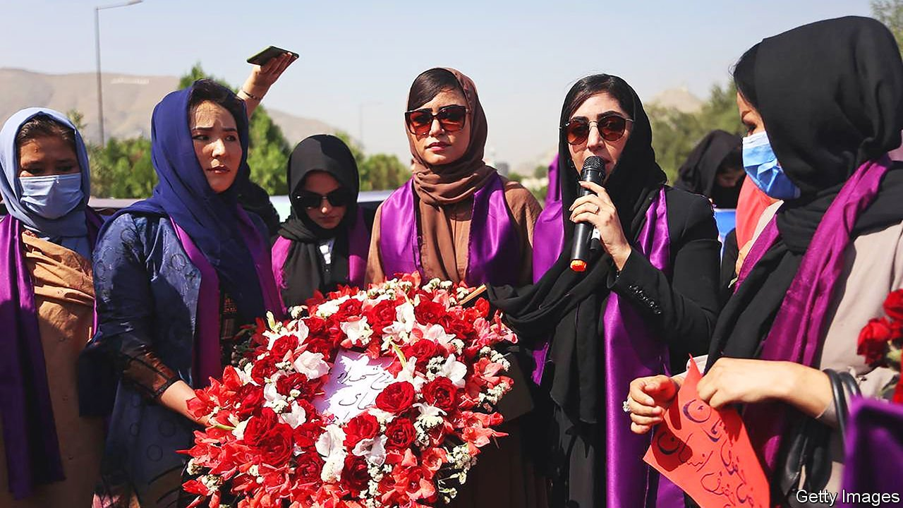
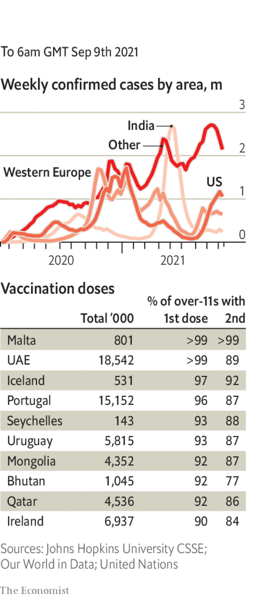

###### 

# Politics this week 

#####  

 

> Sep 9th 2021 

The Taliban announced an . The new cabinet included no women and few non-Pushtuns. Sirajuddin Haqqani, a man wanted for terrorism by America, is in charge of internal security. Mohammad Hassan Akhund, a former aide to the group’s founder, is acting prime minister. The jihadists seized Panjshir valley, the last pocket of resistance, and whipped female protesters in Kabul.

 abruptly resigned as Japan’s prime minister ahead of a leadership election in the ruling Liberal Democratic Party. The winner of that race will become prime minister and lead the party into lower-house elections.


Joe Biden surveyed the damage in New Jersey and New York from the remnants of Hurricane Ida, which killed 46 people in the area. The president said he would call for action on climate change at COP26, a UN conference to be held in November. Some greens want the summit postponed, fearing that covid-19 will stop many delegates from attending.

After , America’s attorney-general, Merrick Garland, said law-enforcement agencies would respond vigorously to any threat of violence against women seeking terminations. Joe Biden described the new law, which offers bounties to individuals to sue anyone who helps a woman get an abortion, as a vigilante system.

’s Supreme Court unanimously ruled to decriminalise abortion. Currently, 28 out of 32 federal entities in Mexico ban it, with only narrow exceptions. They will now have to allow it.

Dressed in green and yellow, hundreds of thousands of  of Brazil calling for “military intervention”, stoking rumours that the president is planning to hold on to power illegally. Facing Supreme Court investigations and declining popularity, Mr Bolsonaro gave speeches in Brasília and São Paulo, repeating his cry that “only God” can remove him from office.

 since 2010, was ousted in a coup. The putschists have released political prisoners and promised to install a transitional government. They did not say when.

Rebel forces from Ethiopia’s northern region of Tigray were accused of killing 119 civilians in the neighbouring region of Amhara. Ethiopian officials said they found the graves after pushing back rebel forces from a village. Meanwhile, further evidence emerged of Tigrayans being tortured and killed in towns controlled by government forces.

Jacob Zuma, South Africa’s former president, was released from prison on medical grounds. He had been jailed in July after refusing to comply with an order by the Constitutional Court to appear before a judge investigating massive corruption during his time in office from 2009-18.

Six Palestinian militants escaped from one of Israel’s most secure jails. The men are thought to have dug a hole in the floor of their cell using a spoon, then tunnelled beneath the prison wall.

Fourteen officers from the Palestinian security services were charged over the death of Nizar Banat, an activist who accused Palestinian leaders of corruption and criticised their co-operation with Israel. Banat died shortly after being beaten during his arrest in June.

Saudi Arabia said it intercepted three missiles and three drones launched by Houthi rebels from neighbouring Yemen. The missiles had targeted Saudi oil facilities.

Morocco’s ruling Islamist party fared badly in a parliamentary election, in which liberal parties did well. The real power in the country remains with the king.

The British government announced plans for a radical overhaul of how  are financed. It includes a new levy of 1.25% on both workers’ earnings and employers’ payroll taxes. Separately, the government was reportedly planning to turn back migrant boats in the English Channel, following a surge of crossings from France.

The Polish parliament imposed a state of emergency on the country’s border with Belarus to cope with migrants who are being directed towards Poland by Alexander Lukashenko, Belarus’s authoritarian leader.

Two leading figures within the Belarusian opposition were handed stiff prison sentences. They were accused of attempting to seize power illegally, a charge they would say applies more accurately to Mr Lukashenko, who is widely believed to have stolen an election last year.

Angela Merkel, who is standing down as Germany’s chancellor after a national election later this month, sought to rally support for her embattled would-be-successor, . But a poll gave her Christian Democrats just 19% support, suggesting they are about to suffer a drubbing.

A trial began in Paris of some of the men accused of plotting the attack on the city in 2015 that killed 130 people. The only surviving terrorist said he was a soldier of Islamic State.

Coronavirus briefs

 


COVAX, a programme backed by the World Health Organisation to speed the distribution of vaccines to developing countries, cut its forecast of deliveries of the doses by a quarter for this year because of numerous problems. The news puts more pressure on rich countries not to hoard vaccines for booster shots.

Scientists in South Africa said virus samples suggested that a worrying new variant of covid-19 first identified in the country was spreading at a slower rate than previous mutations.

The European Union reached an agreement with AstraZeneca to deliver the region’s remaining vaccines by the end of March 2022. The deal ends a bitter court dispute about what was promised, and for when.

In Vietnam a man was sent to prison for five years for spreading covid-19 by flouting local travel restrictions.

