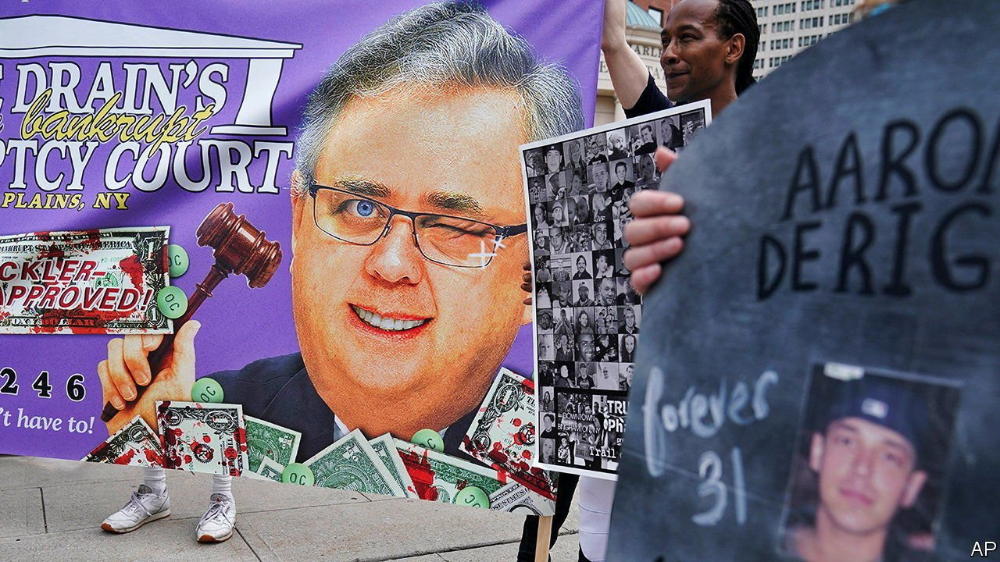

###### Released

# How asbestos saved the Sackler family from bankruptcy 

##### Why some Democratic senators want to end non-debtor release 

 

> Sep 11th 2021 

A LONG LEGAL chapter in America’s opioid epidemic, which continues to kill tens of thousands of people a year, at last came to an end on September 1st when a federal judge in New York approved the bankruptcy plan of Purdue Pharma, which developed and manufactured OxyContin, a highly addictive painkiller. The deal settled thousands of lawsuits against the firm filed by states, localities, tribes and individuals. Purdue will be reorganised as a public-benefit company called Knoa Pharma, and its future profits will go towards alleviating the damage done by opioid addiction. Members of the Sackler family, who own Purdue, will relinquish control of the firm and contribute $4.5bn to the settlement. But nine states and Washington, DC, opposed the final deal and some will appeal against it. Their objections stem from a legal arrangement shielding parties associated with bankrupt companies from liability. Many people want it changed.

Bankruptcy comes with costs and benefits. The debtor must disclose all assets, which are distributed to creditors. But in return the debtor—in this case Purdue—is freed of legal liability. As a condition of their participation in the deal, the Sacklers sought and won immunity from civil lawsuits related to the opioid epidemic, without declaring bankruptcy themselves. The arrangement is known as a non-debtor release from liability (or a third-party release). It originated in the 1980s to protect insurers in bankruptcies arising from asbestos liability, and was codified by Congress as a protection in those cases. As a result of the settlement, the Sacklers (not all of whom were involved in the management of the company) will not relinquish most of their fortune, estimated at $11bn. Richard Sackler, Purdue’s former president and chairman, last month told a court that neither he nor his family nor the company is responsible for America’s opioid crisis.


Last year five members of the family paid $225m to settle civil charges brought by the federal government that they sold OxyContin while knowing it to be “unsafe, ineffective and medically unnecessary”. Lots of states and individuals would probably file similar suits if they could. But non-debtor release means that will no longer be possible, since the terms apply to all parties with a claim against the Sacklers, even if they did not participate in the deal or assent to it. Only a fraction of those who used OxyContin have filed claims related to their use of the drug: about 130,000. But the number of OxyContin users—all of whom were potential claimants—is probably at least ten times that, estimates Adam Levitin of Georgetown University Law Centre. They will get no piece of the settlement and no opportunity to sue the Sacklers for opioid-related claims.

The use of a non-debtor release has also been mooted in the reorganisation of two groups that filed for bankruptcy amid child-abuse lawsuits, the Boy Scouts of America and USA Gymnastics. For defendants in sprawling litigation, moving to a bankruptcy court and securing a non-debtor release is appealing: it binds absent parties, foreclosing future claims from victims who have not yet come forward. Some Democrats want to ban the arrangement, which they say has been expanded beyond its original intent. In July a group of senators, including Elizabeth Warren of Massachusetts, introduced a bill to close what they call a loophole used by “bad actors”.

In the case of Purdue, the settlement does at least mean that money will be disbursed. But those who had hoped the family would have to pay more will be disappointed. “The Sacklers negotiated how much money they would turn over, and it’s as little as they thought they could get away with,” says Lindsey Simon of the University of Georgia. The settlement will probably survive an appeal, bringing an unsatisfying legal resolution to a long chapter of a painful public-health crisis. For many, alas, the pain continues. ■

