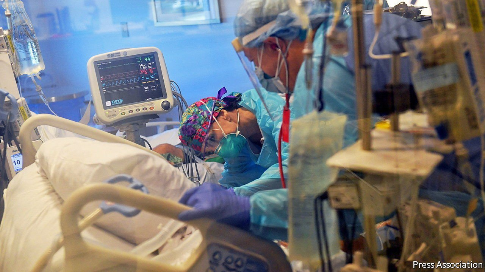
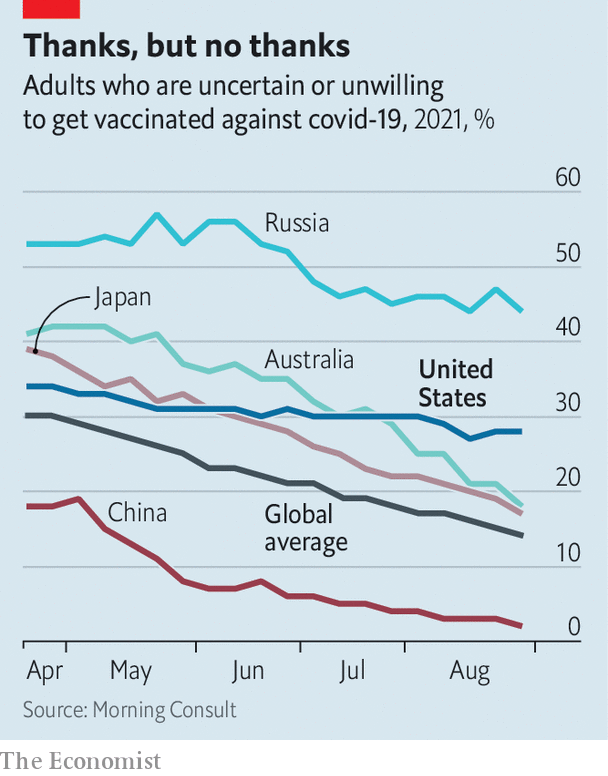

###### Not moving the needle

# In America, even full local hospitals do not dent vaccine scepticism 

##### Full hospital wards have little effect on vaccine take-up 

 

> Sep 11th 2021 

A GLANCE AT the chart of global vaccine scepticism shows an alarming trend for Americans: while other rich countries see a steadily downward slope, America is flatlining. The highly contagious Delta variant continues its march across the country, wreaking exceptional havoc on the South, one of the country’s least-vaccinated regions. Six states— Alabama, Arkansas, Florida, Georgia, Mississippi, and Texas—have more than 90% of intensive care unit (ICU) beds occupied. Deaths have risen to levels not seen since March, before the vaccine was widely available: numbers that recall the early months of the pandemic.

Some optimists had hoped that the spread of the Delta variant, though regrettable, might eventually persuade the naysayers to get vaccinated. Local news sites and stations have profiled people who had been sceptical and have now had their jabs. The Douglases in South Central Pennsylvania were vaccine-hesitant until “the Delta variant changed that”. The Columbus Dispatch wrote about a supervisor at a local plant who said: “The Delta variant was what really got me out.” In Oklahoma, Grace Zeiba, an emergency-room nurse, told her local station that because of Delta she decided “it's time to be vaccinated”. But these anecdotes are not representative of the overall picture.


One way of measuring whether people are more likely to get vaccinated when their neighbours are very ill with covid-19, is to compare county-level ICU capacities (which tell you whether a hospital is full of covid-19 patients) with the change in vaccination rates in the ensuing weeks. The Economist did this while controlling for potentially confounding variables, like state-level vaccination rates.

Our calculations show that full hospitals lead to only a slight increase in the number of people getting vaccinated. For every 10% decrease in available ICU beds, there were roughly 14 additional first doses administered per 100,000 people in a county the next week. For a median-sized American county with a population of 26,000, that translates to 3.5 additional first doses, or just half a dose per day.

 


Counties with ICUs that were 80% full or more saw only an additional 104 first doses administered per 100,000 people the next week, compared with counties where ICUs were 20% full or less. That is consistent with what happened this summer, when areas hit by the Delta variant saw only slight upticks in vaccination rates compared with other counties.

Polls paint the same picture. As many Americans have scrambled for futile cures like ivermectin, an anti-parasitic drug, interest in the most effective solution—the vaccine—is stuck. Polling from Morning Consult shows that the share of individuals who say they are unwilling to get the vaccine, or are uncertain if they will, has fallen only slightly—from 31% at the end of May (the month the World Health Organisation declared Delta to be a variant of concern) to 28% on August 30th. By contrast, the average share saying the same across the other 14 countries Morning Consult has surveyed fell from 25% to 14% (see chart).

The remaining Americans who have not had their jabs are not just hesitant but rather hardened—committed to shunning the vaccine despite its availability, safety and efficacy. If the Delta variant, and the wards full of patients suffering from it in local hospitals, cannot change their minds, then it is hard to see what will. ■

Dig deeper

All our stories relating to the pandemic and the vaccines can be found on our . You can also find trackers showing ,  and the virus’s spread across .

