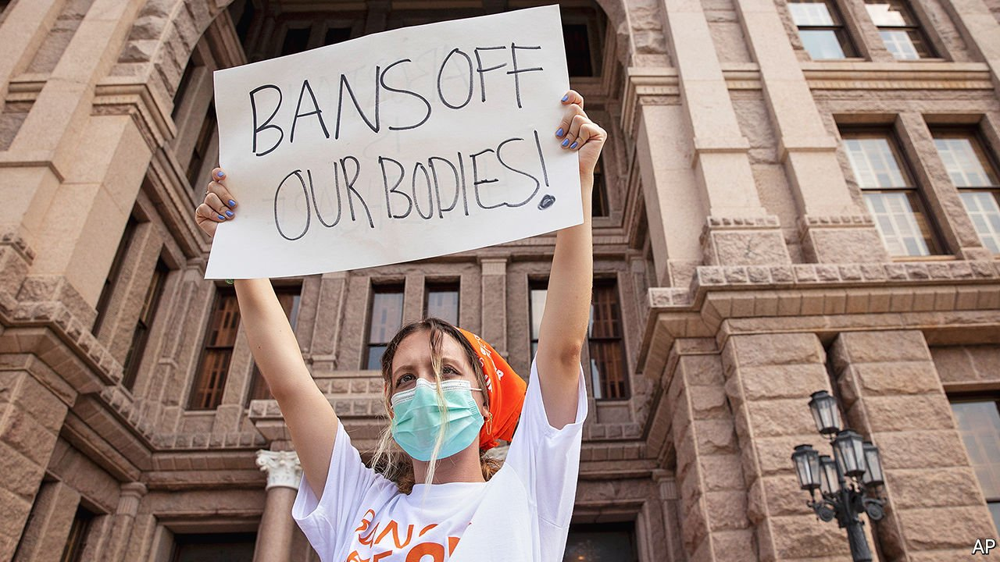

###### Roads back to Roe

# The fight for abortion rights in Texas is far from over 

##### Its restrictive law may not prove a model for other states 

 

> Sep 11th 2021 

ACTIVISTS HAVE long warned that the right to abortion, established by Roe v Wade in 1973, is in peril. Yet many Americans may not have realized quite how true this was until the ability to have even an early abortion was snatched away in Texas. Since September 1st clinics in the second most populous state have been unable to perform or assist in terminations from around the sixth week of pregnancy, the point after which the vast majority occur.

More than a week later, the legal path to restoring abortion access in Texas remains unclear. In other states courts have struck down “heartbeat” bans like Texas’s, which prohibit abortions after signs of cardiac activity, because they violate Supreme Court rulings allowing abortion on demand until a fetus is viable (around 23 weeks). But Texas’s law sidesteps a basic feature of America’s legal system: the requirement for state officials to defend themselves against challenges to laws they enforce. Instead it hands the enforcement power to ordinary citizens, inviting them to file civil lawsuits against any person who has “aided or abetted” an abortion (though not the woman herself) and, if successful, collect a $10,000 bounty.


So far this tactic has worked. Last week Texas’s law survived a trip to the Supreme Court, which refused an emergency request from clinic operators to block it. Since then, two small developments have cheered the abortion-rights side. On September 3rd, a judge in Texas issued a temporary restraining order preventing Texas Right to Life, an anti-abortion organisation, from suing affiliates of Planned Parenthood, which runs half of Texas’s 20 or so abortion clinics, until September 17th (more restraining orders may follow). And on September 6th, Merrick Garland, the attorney-general, said the Department of Justice would “provide support from federal law enforcement when an abortion clinic or reproductive-health center is under attack”. On September 9th the DOJ sued Texas, though the prospects of success are uncertain. Because lawsuits may not only target clinics, Lyft and Uber have said they will pay the legal fees of any driver accused of abetting an abortion.

Yet the challenge that fell one vote short of blocking the law at the Supreme Court could find new life once litigation resumes. The best option for restoring abortion rights in Texas appears to require a clinic to break the law, thus attracting a lawsuit. Once the law is used to punish a health-care provider for offering an abortion, the courts would then have to reckon with a technical question the justices raised last week but did not resolve: whether state clerks and judges involved in enforcing civil lawsuits represent a class of defendants who can be enjoined from enforcing the law altogether.

This process could take months. And in the meantime, abortion clinics are turning pregnant women away or seeing fewer come through their doors. A doctor at Planned Parenthood’s clinic in Houston reports that he used to see up to 30 patients seeking an abortion a day. On September 1st he saw only six, three of whom he was able to assist.

This represents a historic success for anti-abortionists and has prompted conservative lawmakers elsewhere to consider similar legislation. “This absolutely shows other states a potential path forward,” says John Seago, the legislative director of Texas Right to Life, which has helped draft legislation emulating Texas’s. Some ambitious governors with an eye on 2024, including in Florida and South Dakota, have suggested they are considering this “to rile-up primary voters,” says Mary Ziegler, a law professor at Florida State University.

Yet anti-abortion lawmakers in other states may wait to see what happens in Texas. Concerns include not just the legal obstacles it faces. Dreadful stories emerging from clinics highlight that abortion is a public-health issue as well as a moral one: the woman who found she was pregnant at five weeks but that she had covid-19, so was unable to have an abortion in time; the woman who tried to induce an abortion at home after following directions online. Abortion-clinic operators say they fear that not every pregnant woman will have the means to travel to a different state (or get hold of abortion pills). All this is likely to lead to more late abortions, which are more traumatic and carry higher risks. If there are also stories of bounty hunters profiting from the suffering of women Texas’s law will become harder yet to defend and promote. The law has no exception for pregnancies that result from rape.

This uncertainty about how the law will play out extends to politics. Republican lawmakers in Texas hope the law will help them in the mid-terms. Yet while many Texans say they are pro-life, polls tend not to ask about early abortion bans. In a recent poll by the University of Texas and the Texas Tribune, 33% of Texans said they wanted less strict abortion laws; 33% (and 55% of Republicans) wanted more restrictive laws. But a law can be more restrictive than Roe without being as harsh as Texas’s (which may be why the Supreme Court has agreed to look at Mississippi’s 15-week ban rather than one of the many heartbeat bills that have been blocked).

Even if the law benefits Republicans in Texas it is unlikely to do so in other competitive states. In Virginia’s governor race, Terry McAuliffe is running ads castigating Texas’s law; his Republican rival has been largely silent on the matter. Whether or not the law is eventually blocked, Democrats are likely to campaign on reminders of its vindictiveness.■


