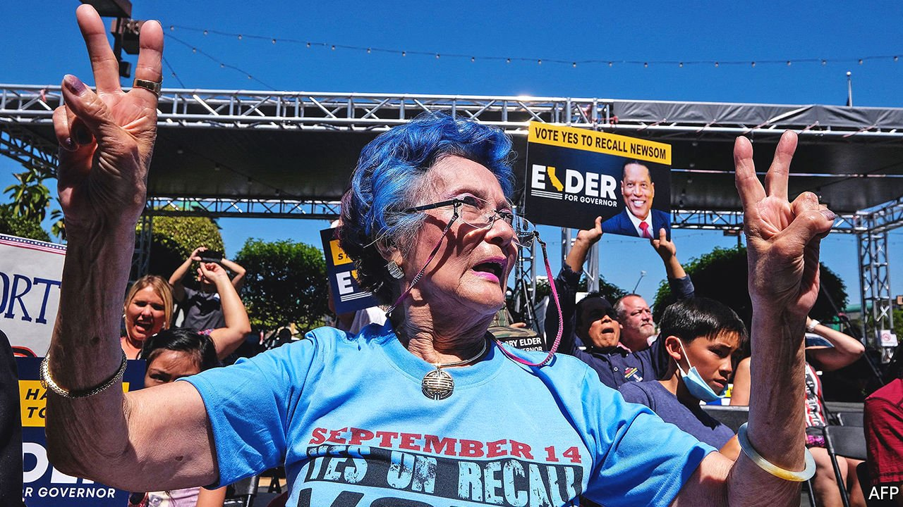

###### Imperfect recall

# The recall election in California 

##### A populist tool is being used for partisan ends 

 

> Sep 11th 2021 

IN 2020 CALIFORNIA’S population shrank for the first time, as people left for less expensive places. Recently, however, headlines have been focused on who is coming to the Golden State: a parade of Democratic luminaries, to drum up support for Gavin Newsom, California’s governor, as he fends off a “recall” election to remove him from office on September 14th.

The high-profile visitors demonstrate how much is at stake. If voters recall Mr Newsom and elect a Republican, it could flip the US Senate. (California’s governor will appoint the successor to 88-year-old Dianne Feinstein, should she retire.) A new governor could also appoint judges and the heads of departments, issue executive orders and veto line items on the budget. One legislator warned that replacing Mr Newsom with a Republican would produce a “lost year in California state government.”


Recent polls should give Mr Newsom some comfort: The Economist’s polling average shows he has the support of roughly 54% of voters But it is not just his record facing scrutiny. This election has called attention to the recall itself—a quirk that is being abused for partisan ends.

California is one of nineteen states that permits the removal of state-level officials through a vote. Only four gubernatorial recall elections have made it to the ballot in America; Mr Newsom’s will be California’s second. Voters removed California’s governor through a recall only once, in 2003, when the unpopular Gray Davis failed to manage an electricity crisis and was replaced with Arnold Schwarzenegger.

But Ken Miller, a professor at Claremont McKenna College, notes that this election differs from 2003. None of the more than 40 candidates running against Mr Newsom has Mr Schwarzenegger’s celebrity. The frontrunner, Larry Elder, is an African-American shock jock who dubs himself “the sage from South Central” and has a Trumpian predilection for provocation, including suggesting that the descendants of slave owners could be owed reparations. The electorate has also changed, notes Mr Miller: in 2003 35% of California voters were registered as Republican, versus only 24% today. Democrats now outnumber Republicans by nearly two to one.

Republicans have not won a state-level office in California since 2006, when Mr Schwarzenegger was re-elected as governor. Recall attempts have become the only way that Republicans have a chance of getting back into office, says Sherry Jeffe, a political analyst. The exercise is also eyebrow-raising because of its timing: if voters are so unhappy with Mr Newsom, they could vote him out of office when he runs for re-election next year.

Mr Newsom won election in 2018 with 62% of the vote (the greatest share of any Democratic candidate for governor in state history). Republicans had tried to recall him five times before the sixth attempt gathered enough signatures to qualify for the ballot. Two things helped Mr Newsom’s critics: a judge granting a four-month extension for signature gathering due to covid-19 and Mr Newsom’s idiotic decision last autumn to eat indoors with friends at a fancy restaurant while he was telling people to socially distance and not even see their own families for the holidays.

Judgment day

Whatever its outcome, the recall election has taken a toll on Mr Newsom. But the state is losing out too. The recall election will cost $276m in taxpayer money. Toni Atkins, president pro tempore of the California State Senate, says “having to deal with a recall takes away focus from critical issues that the governor should be spending his time on.” That includes fires, drought, the pandemic and affordable housing, among other issues.

Since the beginning, recalls have had their critics. In the 1780s, Alexander Hamilton decried the “state of vassalage and dependence” a senator would feel if a state’s legislature could recall him, as was being discussed. In 1911, President William Howard Taft vetoed Arizona’s statehood resolution partly because of a provision that would have let judges be recalled. In 1911 voters amended California’s constitution to allow for recalls, as a Progressive-era tool that would allow voters to bypass the influence big business exerted on the legislature. But since then “interest groups have learned how to game the system to subvert the democratic will” by making use of recalls and ballot initiatives, says Rick Rivas of Govern for California, a good-governance group.

Because of the way that California designs its recall process—with a majority needed for removal but just a plurality for the winner—Mr Newsom could win 49% of the vote but be replaced by someone with a much smaller share of support. “I have no doubt that next year we’re going to see a number of ideas on recall reform from the legislature,” says Ms Atkins. The legislature could tweak the recall process to dissuade partisan meddling by, for example, mandating that the lieutenant-governor automatically ascend if the governor were recalled. It could also establish a “malfeasance” standard, which would require that the governor commit an illegal act in order to be recalled, or raise the number of signatures required to put a recall on the ballot.

Any of those actions would require a Constitutional amendment, which a majority of the electorate would need to approve. In the end, the voters may decide on a total recall of the recall.■

For more coverage of Joe Biden’s presidency, visit our dedicated 

