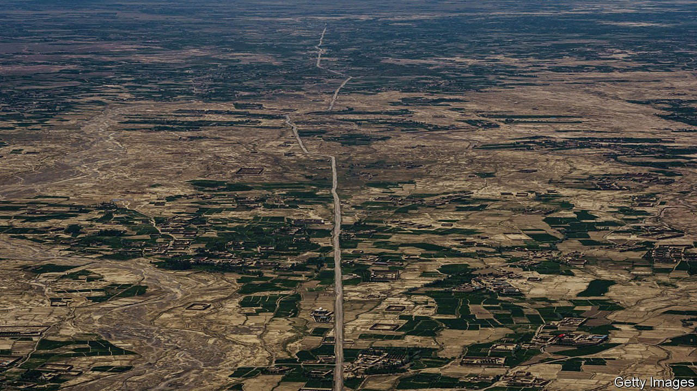
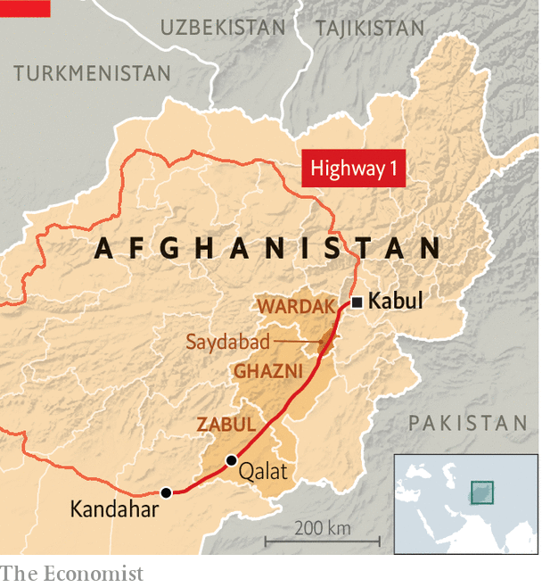

###### Highway 1 revisited

# A journey from Kabul to Kandahar 

##### Afghanistan’s old problems and new challenges, as explained by the road linking its biggest cities 

 

> Sep 14th 2021 

THE HIGHWAY nearly 500km long that links Afghanistan’s capital, Kabul, to its second city, Kandahar, was once hailed as a sign of great progress in America’s campaign to pacify Afghanistan. When Hamid Karzai, then president, inaugurated the first stretch in 2003, he said it was one of the best days of his life. Yet the road quickly became a troubling example of what was going wrong. A month after the Taliban took power, the journey from Kabul to Kandahar illustrates both how the country changed overnight and the failures that helped precipitate that shift.

Only weeks ago, driving down this stretch of Highway 1, a sort of national ring road, was unthinkable for many Afghans. Impromptu Taliban checkpoints stopped traffic and scoured buses and taxis for members of the armed forces to kidnap or kill. Military convoys were blown apart by bombs hidden under the road. Some districts, such as Saydabad in Wardak province, not far from Kabul (see map), became notorious as danger spots.

 


The biggest dangers have subsided now that the very fighters who once attacked the road are the ones guarding it. The Taliban’s checkpoints are still there, but now they are formal, waving traffic through. By contrast, the American-built security posts which lined the road in an unsuccessful effort to protect the route are already decaying. Some fly the white banner of the Taliban. Others are deserted. In the oldest, scrap merchants have removed the wire holding up the giant sandbags that ring the outposts. All that remains are sinking cubes of earth being reclaimed by the desert.


With the danger of attack gone, it is the quality of the road that is the biggest ordeal. When the resurfaced road was first opened, it could convey drivers from city to city in six hours. The same journey now takes nearly twice as long. Bombs have destroyed some stretches; overladen lorries have carved deep ruts into others.

Road-building was once the second-biggest beneficiary of international aid. NATO generals saw it as a way to win hearts and minds. But the deluge of cash, more than $4bn, attracted the sort of corruption that undermined most development schemes. Road-builders subcontracted their work and skimmed off as much as they could. The resulting highways were of poor quality and quickly fell apart, owing not just to explosions but also to more mundane and predictable problems such as flooding and heavy traffic. Other failed development projects line the road, including several electricity substations, complete with pylons but no power cables.

For the residents of rural Wardak, Ghazni and Zabul provinces, the foreigners’ efforts were of questionable value, says a journalist in the city of Qalat, in Zabul. “The whole focus was on the centres and I could not see any development in rural areas,” he says. “That’s why people started rising against the government.” The war over the road also brought night raids, air strikes and disappearances to the districts. Both sides were ruthless.

The Taliban, too, see the road as important. Just like the previous Afghan government and its foreign backers, they boast of road-building. On September 10th the public-works ministry announced that it had started “comprehensive reconstruction work” and engaged two construction companies to build three bridges and 40 culverts. With foreign aid frozen, the Taliban have little money for such works, but they have the benefit of security.

Those who once fought over the road are returning to their normal lives. At a wholesale dried-fruit market in the backstreets of Qalat, labourers weigh sacks of raisins. One has just returned to work after eight years in the fields with the Taliban. Eyeing this correspondent warily, he asks a friend: “Is he left over from the last lot of foreigners, or have new ones arrived?”

An early version of this article was published online on September 14th 2021

