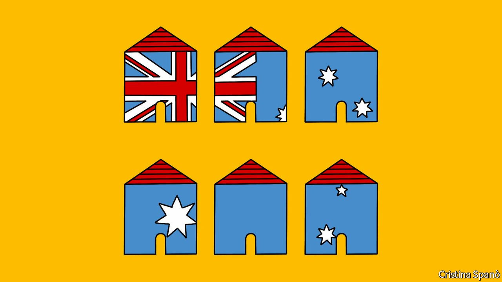

###### Banyan

# Australia’s states are asserting themselves 

##### Bungling in Canberra opened the door for purpose in Perth 

 

> Sep 18th 2021 

ACROSS MUCH of Asia, the pandemic has given national leaders an excuse to unleash authoritarian instincts—think Thailand, the Philippines or India. Australia, though, provides a stark contrast. There, authority has conspicuously ebbed away from the federal government and to the vast country’s six states.

The shift is clearest in the way states have imposed their own quarantine rules. Australia closed to the outside world at the outset of the pandemic. But individual state governments also saw out-of-state Australians as a peril. Backed by state police and pursuing a zero-covid policy, they slammed their borders shut. They have since opened and closed them on states’ individual whims, depending on the perceived threat of infections from other states.


No more striking exercise of state power has occurred since the Spanish flu pandemic in 1919, when states last closed themselves off from each other. But then the Commonwealth of Australia was not even 20 years old. Regional identities were stronger than national ones. Canberra was not yet then the federal capital. And the role of the prime minister of the federation had not yet been properly construed: the premiers of New South Wales and Victoria, the most populous states, wielded more power.

This time the federal government is stronger. But it has also bungled. The prime minister, Scott Morrison, looked witless early on by insisting he would attend a rugby match. His government joined a suit brought by a mining tycoon challenging Western Australia’s popular decision to close its borders. More recently Canberra insisted on overseeing Australia’s vaccine rollout but failed to lay on sufficient supplies. It struggled to get what jabs it had into arms after blocking state health authorities from taking the lead. These have since stepped in, with mass-vaccination clinics, but the political harm has been done. Mr Morrison’s ratings languish. In contrast, the premiers of the two most isolationist states, Western Australia and Queensland, have won landslide re-elections.

The pandemic has given people “a lesson in how real the states’ sovereignty is”, says Frank Bongiorno, a historian at the Australian National University. A sense of state identity has re-emerged among citizens. Australians tune in to state leaders’ daily press briefings on the pandemic. A new “national cabinet” that includes state premiers has been formed to co-ordinate the response. Greg Melleuish of the University of Wollongong says these days they enjoy “the limelight they don’t normally get”. Perhaps for the first time, Australians are familiar with premiers of other states.

Much of the ground for states’ re-emergence, argues Geoff Gallop, a former premier of Western Australia, had already been laid. Once home to corrupt political machines, reformed state capitals have in recent decades earned a better reputation. More sleaze attaches to governments in Canberra. States have taken the lead in areas that the federal government has wilfully neglected, Aboriginal affairs and climate change above all.

Yet does this all amount to a permanent shift in relative power? Perhaps not. Who holds the purse strings still counts. The government in Canberra began accruing power after the second world war with the introduction of a federal income tax. Closing borders and imposing lockdowns is an easier call with the federal government’s promise of massive support for state economies.

Nor is a permanent shift away from federal authority always desirable. Take climate: Australia’s international commitments to cut carbon emissions can only be made in Canberra, not state capitals. As for the new national cabinet, it does not behave as a cabinet should, by assuming collective responsibility. Rather, individual premiers like to grab the microphone. Besides, its importance will fade with the pandemic.

Right now, the federal government must push more forcefully for reopening, not just between states but to the outside world, too. Michael Fullilove of the Lowy Institute, a think-tank in Sydney, warns that inter-state rivalry risks curdling national unity. As it is, isolation has caused Australia to turn inward. It is shut off from its huge diaspora and it has halted the immigration on which the country was built. A “fortress Australia”, anxious about the world and inclined to throw up barriers against it, is, as Mr Fullilove warns, a smaller Australia. If ever the federal government had a case to make against the states’ perspective, it is that one.

