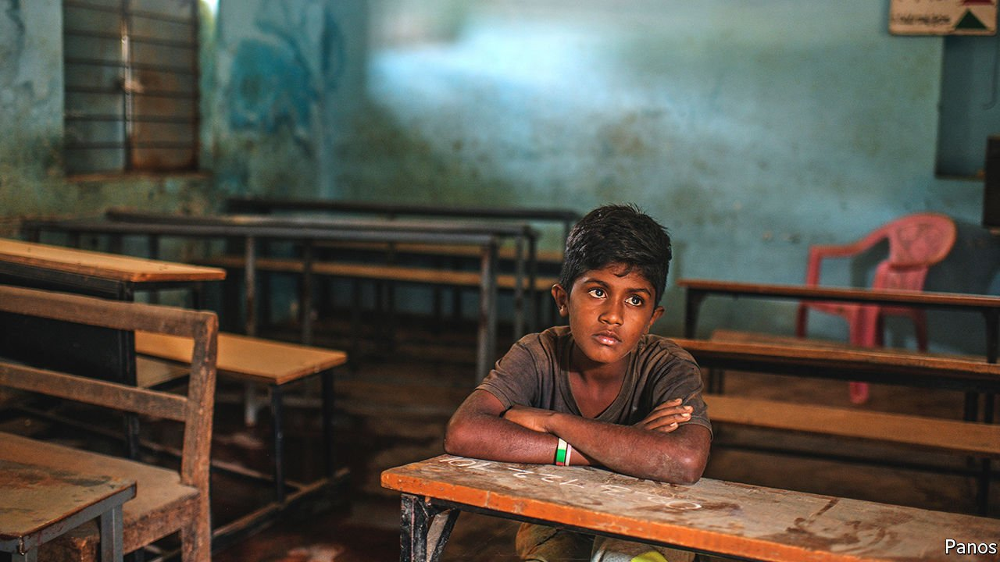

###### Remotely learning

# India’s pupils have been hard hit by extended school closures 

##### Poverty, undernourishment and poor pedagogy make a bad situation worse 

 

> Sep 18th 2021 

AS COVID-19 MEASURES relax across the world, nothing brings quite so much relief as the reopening of schools. For India’s 320m schoolchildren, its 8.5m teachers and for parents, too, the relief is particularly acute. Not only have Indian schools suffered some of the world’s longest closures—an average of 69 weeks. For reasons peculiar to India, its shutdowns have also been especially disruptive. And they have exacerbated the awful learning outcomes from the vast lower tier of schools.

For some, the switch from in-class to online learning started well enough. A teacher in one private school in Delhi, the capital, recalls how she stopped worrying about tele-teaching on the very first day, after finding that every student on her screen had respectfully donned the school uniform for the occasion. But for others the switch never happened. A survey in Kolkata last year found that two-fifths of pupils enrolled in state primary schools had no way to follow online materials. Another in Chennai, India’s sixth-biggest city, found that one in five children were in schools that offered no online instruction, and a fifth of the rest did not attend remote classes anyway.


Matters have been bad for the poor, and worse still in rural India. A more recent study, conducted in August among low-income households across 15 states, found that only 24% of the children interviewed in urban slums said they “regularly” followed online lessons. The proportion in villages was a dismal 8%. Some 37% of rural children said they had done no studying at all during the school closures. Many cited lack of a computer or smartphone as the reason. Erratic power and internet access, or a lack of online material in their language, also played a part.

K. Mahalakshmi, who teaches among tribal peoples in the Jawadhu Hills region of Tamil Nadu, a southern state, says the two pandemic years have derailed ten years of work to raise enrolment, especially of girls, in her school. She recalls meeting by chance, during India’s devastating second wave this spring, a student she had noted as particularly bright, but this time in a maternity ward. “Girls like her would have at least finished high school before marriage,” says Ms Mahalakshmi, adding that boys have been sent out to work to help tide families over.

Those who have stayed in school have fared less well than they should, too. “The knowledge does not reach their heads at all,” is how Amol Ahire, a 38-year-old father of two in Thane, a suburb of Mumbai, puts it. He says that before the pandemic his eight-year-old son used to write numbers and the alphabet, but now he stumbles.

The boy is not alone. In the study of poor communities, fewer than one in 20 parents said that their children’s skills improved during school closures. Preliminary findings from a respected periodical survey of learning in rural schools, the Annual Status of Education Report (ASER), corroborate the decline. Released this month, it found that among 18,000 children in the state of Karnataka, the proportion of third-graders who could read a grade-two-level test had halved, from nearly 20% to just under 10%.

Years of ASER data have underlined a more general failing of Indian education. Because students are promoted regardless of achievement, and because teachers then favour only those students they see as likely to pass high-school exams, many leave education without ever acquiring basic skills. To correct this, the government last year launched an ambitious drive to bolster early learning. But now, having lost more than 14 months of schooling, Indian students are instead entering higher grades with even more of a handicap.

Many will also be less well-fed. Over the past 25 years a programme that serves a simple, hot midday meal to some 100m students in state schools has markedly reduced rates of stunting and malnutrition. A recent study suggests these benefits extend to the next generation, too. During the closures many Indian states tried to compensate for lost school meals with direct food aid, with varying degrees of success. With online learning, unlike in-person schooling, there is rarely such a thing as a free lunch. ■

Dig deeper

All our stories relating to the pandemic and the vaccines can be found on our . You can also find trackers showing ,  and the virus’s spread across .

