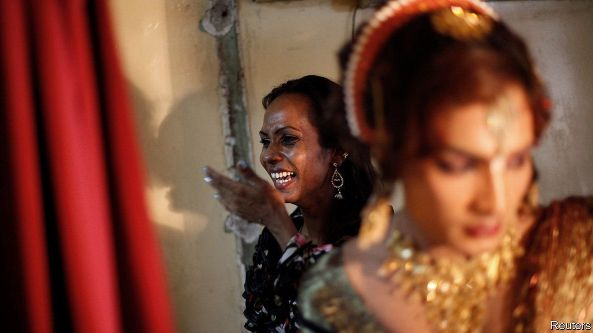

###### Name dropping

# South Asia’s non-binary communities worry about losing their identity 

##### Government efforts and foreign ideas both help and hinder progress 

 

> Sep 18th 2021 

IN MARCH, WHEN Tashnuva Anan Shishir appeared on Bangladeshi television screens, she created history as the country’s first transgender news anchor. A few weeks later a madrassa exclusively for khwaja saras opened in Pakistan. In India “Phirki”, a television show that ran for 225 episodes last year, portrayed in unprecedented detail the lives of hijras.

South Asia has a plethora of terms for people who identify neither as male nor female. Apart from hijra (which is the best known) and khwaja sara (which is mostly used in Pakistan), they include aravani, kinnar, kothi and shiv-shakthi. Many advocacy groups and NGOs favour “transgender”, while governments prefer “third gender”. Estimates of the number of non-binary people in Bangladesh, India and Pakistan run from 500,000 to several million.


Since 2014 all three countries have recognised third gender as a legal category. In 2016 a small group of Muslim clerics in Pakistan set a precedent by ruling that hijras can marry and be buried with other Muslims. By 2019 India and Pakistan had both passed transgender protection acts. Bangladesh introduced a scheme to hire hijras for government jobs in 2015, and earlier this year started offering generous tax breaks to companies that employ them.

The creative and legislative energy has, however, also highlighted the problems inherent in naming and defining gender identities. Many of the people who ought to benefit from the new laws are riled by what they see as lawmakers’ perpetuation of long-held misconceptions, such as the idea that hijras are intersex (of indeterminate gender). Most hijras are deemed male at birth but feel female, and are usually attracted to men. Other critics find modern gender discourse troublesome. They object to the idea that “hijra” and “transgender” are synonymous, and worry that the foreign import risks lowering hijras’ status.

South Asia has a long history of gender diversity. Hijras feature in the mythology surrounding Ram, an important Hindu deity, who is said to have rewarded their devotion with spiritual gifts. Records from the 18th century describe effeminate men, dressed as women, who offered blessings at births and marriages in elite society. In some parts of the subcontinent, hijra communities led by gurus were granted rent-free land and the right to collect donations, says Jessica Hinchy of Singapore’s Nanyang Technological University, the author of a book on hijras in colonial India. Belief in their power to impart blessings (and curses) remains part of the culture in India, as well as in Muslim-majority Bangladesh and Pakistan.

In the 19th century, however, British colonial rule reversed their fortunes. Hijras were relabelled eunuchs, a term normally reserved for castrated men. By the 1850s hijras had lost their state patronage. They fell foul of new legislation, including Section 377 of the Indian penal code of 1861, which outlawed homosexuality, and various iterations of the Criminal Tribes Act, which forced “eunuchs”, along with other groups deemed hereditarily criminal, to register themselves. It also made it illegal for them to dance in public, dress in women’s clothes or reside with children.

The declining status of hijras continued well into the 20th century. Growing up in the late 1970s and early 1980s, Faraz Khan was used to seeing khwaja saras invited to offer blessings for marriages and births. Now they would not be welcome at a private party, says Mr Khan, whose investment firm, Seed Ventures, has a special focus on trans-owned businesses. It “wouldn’t be seen as classy enough”.

The region’s governments are keen to defend the rights of hijras, who remain a highly visible minority. It is also a politically palatable way for them to show off their progressive credentials, especially in Bangladesh and Pakistan, where homosexuality remains illegal. Many South Asian Muslims believe that if God made the body a certain way, his followers must accept it. Being born intersex—unlike being gay—therefore breaks no religious codes. Unsurprisingly, some hijras are reluctant to debunk the intersex myth or to associate too closely with gay and lesbian groups. “We talk about LGBTQ,” says Zerine (not her real name), a Bangladeshi lesbian and activist, but the term “doesn’t mean much in reality: the situations of each community are completely separate.”

Steps like tax breaks are welcomed by hijras. Other efforts, however, are hobbled by the drafters’ limited understanding of the people they wish to help. To enjoy the protection offered by the new act, India’s third gender is required to register as trans, a process that, for some, requires medical proof of gender reassignment, which most hijras do not undergo. Bangladesh’s government-jobs scheme failed because hijras had to prove they were intersex.

Attempts to relabel hijras have also proved divisive. “Transgender” arrived in South Asia after the term gained currency globally, especially in recent years. Some local activists and organisations adopted it pragmatically: it was more appealing to international funders. Others have embraced it as a route to progress. Using a global term and being connected to a global movement is “empowering”, says Hochemin Islam, a transgender nurse and activist from Dhaka, Bangladesh’s capital. Governments and the media, keen to be seen as on trend, increasingly use the term, too.

Yet transgender is also used to denote respectability. The “I am not a hijra” campaign, organised by an advocacy group in India in 2016, showed trans Indians holding placards with statements like “I earn a six-figure salary, I am not a hijra”. Whatever the intentions, it ended up stigmatising hijras, says Aniruddha Dutta of the University of Iowa. Adnan Hossain of Utrecht University notes that hijra, unlike “transgender” in the West, is also a class identity.

Many hijras also describe themselves as transgender, such as Saro Imran, who runs a skills-training centre for trans people in Multan, in the Pakistani state of Punjab. Some undergo sex-change operations, or aspire to. But many others, like Srabonti Srabon, a Bangladeshi hijra, shun both. Hijra is an identity unto itself: they come from poor families where they are not understood or accepted, she says. Leaving, or being kicked out, is a vital part of this identity. So is being initiated into a tightly knit clan of hijras and learning its traditions and rituals under the tutelage of aguru. “This culture is 2,000 years old. Trans is a fairly recent phenomenon,” says Ms Srabon. “They cannot be clubbed together.”■

