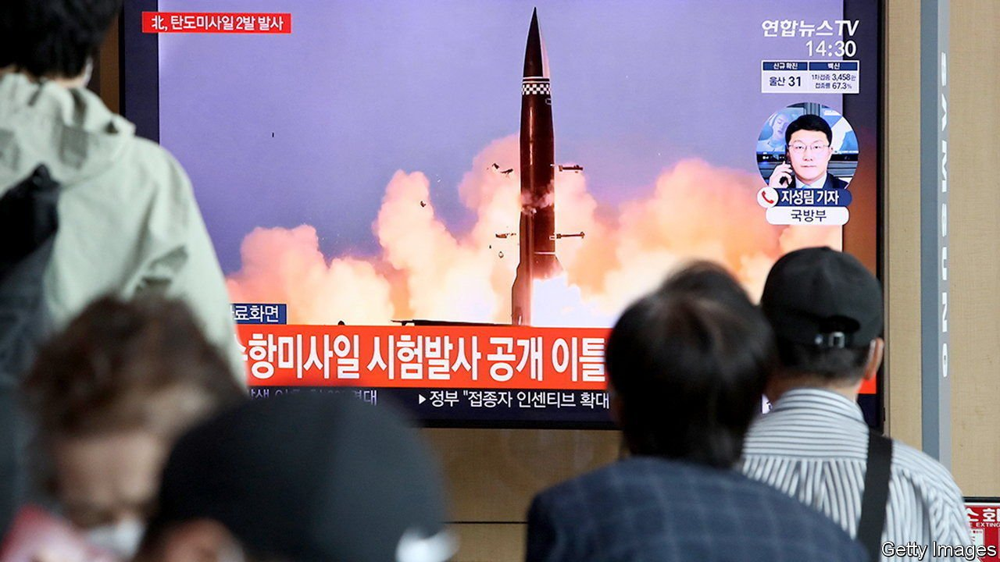

###### Testing times

# The arms race on the Korean peninsula is intensifying 

##### Both the North and South have tested new missiles in recent days 

 

> Sep 16th 2021 

OBSERVERS OF MILITARY developments on the Korean peninsula were given whiplash on September 15th. Around lunchtime in Seoul, news broke that North Korea had fired two ballistic missiles off its east coast. Shortly afterwards the South Korean government announced that Moon Jae-in, the president, had observed the successful test of a submarine-launched ballistic missile, the development of which the armed forces had previously declined to confirm. The parallel tests came hot on the heels of North Korean state-media reports that the country had successfully tested a new class of cruise missile over the weekend. For good measure, South Korea confirmed this week that it had recently developed a new cruise missile, too.

The Korean peninsula is entering a dangerous new phase in its arms race. North Korea, which resumed testing missiles in 2019 after a brief pause the previous year, has since continued to expand both its nuclear and its conventional arsenal, despite UN sanctions that ban it from doing just that. It has focused on new missiles that may be better at evading the South’s detection systems, rather than the intercontinental ballistic sort that could threaten America. Meanwhile the South has been ramping up defence spending and beefing up its own arsenal.


Three generations of North Korean dictators have sought to build ever more fearsome weapons, seeing this as essential for their survival. The South’s build-up has accelerated more recently, spurred by growing concerns about the durability of the alliance with America and the increasing tension between China and America. Donald Trump, America’s previous president, fuelled those concerns with his isolationist rhetoric and his dim view of alliances. So did the perceived lack of support from America when South Korea suffered a painful Chinese boycott after agreeing to host an American anti-missile system in 2017. Since taking office that year, Mr Moon has worked to make South Korea less dependent on America for its defence.

Diplomatic efforts to defuse tensions on the peninsula have been deadlocked since 2019. North Korea has spent the best part of two years entirely closed off from the world in a bid to ward off covid-19. The restoration of a communications link between the two Koreas in June (following the demolition of a joint liaison office by the North a year earlier) did not lead to wider detente. Then the North stopped returning the South’s calls ahead of joint military exercises between the South and America in mid-August.

The exercises, which the North views as practice for an invasion by the South, may be one reason it has resumed testing, reckons Ramon Pacheco Pardo of King’s College in London. “They need to test those new missiles to see if they work, and doing it now allows them to send a message of disapproval at the same time,” he says. There is growing pessimism about the prospect of further talks. The ballistic-missile tests came a day after America’s special representative for North Korea met senior South Korean and Japanese officials in Tokyo to discuss ways to cajole the North back to the table. South Korea’s armed forces, which tend to be cagey about identifying the North’s weapons to avoid raising tensions, this time quickly pointed out that they were sanctions-busting ones.

The timing of the South’s test, too, is hardly diplomatic. The submarine launch coincided with a visit to Seoul by China’s foreign minister, who had met his South Korean counterpart as well as Mr Moon earlier in the day. He was there to discuss not just relations between China and South Korea, but also joint efforts to persuade the North to resume negotiations about its nuclear arsenal. Mr Moon’s speech about the need for missiles on subs to defend against “omnidirectional threats” will not have helped with that. Meanwhile, South Korea’s National Security Council expressed “deep concern” about the North’s “provocation”. As a South Korean saying has it, “What I do is romance; what others do, adultery.”■

An early version of this article was published online on September 15th 2021

