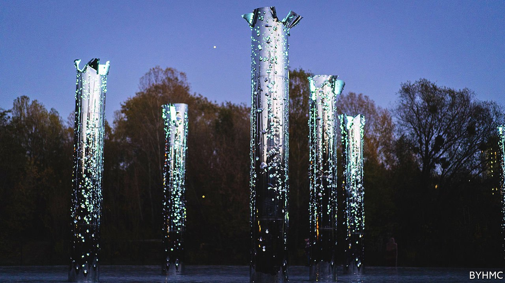
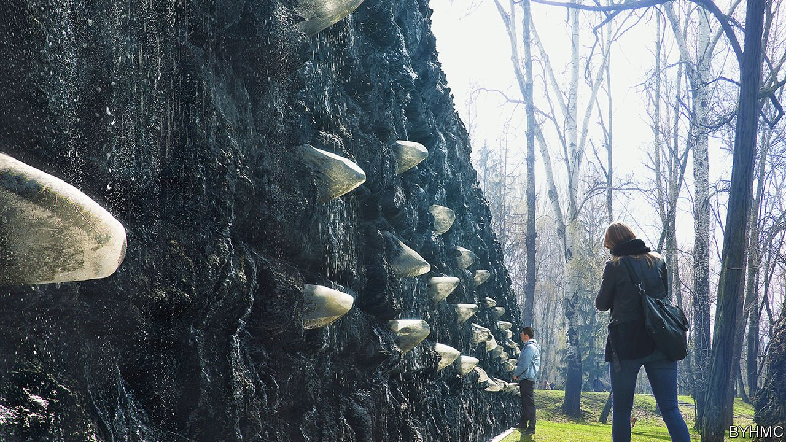

###### Memory and the Holocaust in Ukraine

# A bold, controversial memorial to a wartime massacre in Kyiv 

##### The mix of painful history, Russian involvement and oligarchs is explosive 

 

> Sep 16th 2021 

ON A BALMY September evening locals stroll in a leafy park in Kyiv. Parents push prams. Couples kiss. Young men perch on benches with cans of beer and shawarmas. Among the trees and promenaders stand slabs of granite the height of a person. Implanted in each is a peephole, like the lens of a camera. Peer into one of them, and you see a colour photograph taken on this spot 80 years ago: a ravine, scattered clothes, three German officers looking over the edge. This is Babyn Yar.

The picture was taken at the beginning of October 1941. A few days earlier, on September 29th and 30th, Nazi forces shot 33,771 of the city’s Jews in the ravine (a figure that excludes small children). It was the biggest such massacre of the second world war. Over the next two years, perhaps 100,000 more people were killed, dumped and burned in the same place, including Roma, communists, Ukrainian resistance fighters and patients of a nearby psychiatric hospital. But the slaughter in Nazi-occupied Kyiv began with Ukraine’s Jews; 1.5m had perished by 1945, a quarter of all victims of the Holocaust.


The tragedy of Babyn Yar was never forgotten. Yet as both a topographical feature and a site of mourning, it all but vanished from the map after the war. Now, an international team of artists, scholars, architects and philanthropists is transforming the landscape again, physically and emotionally. The photographs are a small part of a vast project that involves museums, art installations, books, education initiatives and films. Endorsed by Volodymyr Zelensky, the country’s president, it is funded by businessmen including Mikhail Fridman, a Ukrainian-born Russian tycoon, his associate German Khan, and Viktor Pinchuk, a Ukrainian oligarch.

The mix of painful history, Russian involvement and oligarchs is explosive in today’s Ukraine.But the memorial’s ramifications go wider. Many countries have mass graves, “but nobody wants to remember [the victims]”, says Patrick Desbois, a Roman Catholic priest and adviser to the project who spent years documenting the “Holocaust by bullets”. The new memorial, he says, is a message to mass-murderers everywhere: “We always come back.”

For decades Babyn Yar was a place not only of murder but of the physical suppression of memory, first by the retreating Nazis, who scrambled to conceal their crimes, then by the Soviets. Josef Stalin wanted to celebrate his triumph, not mourn tragedy; after the war he launched a new anti-Semitic campaign of his own. Official historiography depersonalised the victims of Nazism as undifferentiated Soviet citizens.

Babyn Yar was levelled. In 1952 some of its cavities were flooded with pulp from a brick factory. There were plans to build a football stadium and entertainment park on top of it. The ravine did not go quietly: in 1961 a dam securing the pulp gave way and a mudslide carrying human remains hit a residential neighbourhood. Hundreds died (the exact toll was hushed up).

Later in the 1960s Viktor Nekrasov, a Kyiv-born Russian writer who had fought at Stalingrad and wrote about it movingly, spoke up about Babyn Yar. To him, covering up the Nazi genocide made the Soviet government complicit. Of the murder and “the subsequent attempt to forget about this murder, to eradicate the very memory of it”, he wrote in 1966, “the first is more tragic. The second is more shameful.”

Nekrasov led one of the first big commemorations of the massacre. Mourners, many of whom had known the victims, gathered at the edge of a Jewish cemetery that had been vandalised by both the Nazis and the Soviets. They held flowers and cried. The KGB cringed. The crowd was quickly dispersed; Nekrasov was expelled from the Communist Party and forced to emigrate. Then, in the early 1970s, Babyn Yar became a rallying point for Jewish dissidents. The Soviet authorities finally put up a monument near the site of the ravine, dedicated “to the Soviet citizens, prisoners and officers executed by the German occupiers”. There was no mention of Jews.

Murder and memory

If Soviet ideology had little room for the Holocaust, it has been a sensitive subject for some Ukrainians for other reasons. Millions of them fought in the Red Army; millions died, in and out of uniform. But in some places the Nazi slaughter was abetted by Ukrainian auxiliary policemen. In others Jews were slain by nationalist partisans. (In the 1960s Ivan Dziuba, a non-Jewish poet who spoke of his shame over anti-Semitism in Ukraine, was imprisoned.)

After the Soviet Union collapsed in 1991 and Ukraine won independence, the area that had been Babyn Yar became a park. A jumble of plaques and memorials were erected; politicians paid their respects. But the main theme of historical restitution was the Holodomor—the famine Stalin inflicted on Ukraine in the 1930s, killing millions of peasants. As historical trauma often is in new states, the Holodomor became a central plank of national identity.

Five years ago Mr Fridman, the tycoon, saw an opportunity. Born in 1964, he grew up in Lviv, a city in western Ukraine where the large pre-war Jewish population had been all but obliterated. As a student in the 1980s he moved to Moscow and became one of Russia’s richest businessmen. After the revolution that overthrew Ukraine’s Kremlin-backed government in 2014, business and civil society helped fill a void left by the state’s confusion. Having made his fortune in the turbulence that followed the Soviet collapse, Mr Fridman knew that such moments should be seized.

In 2016 he assembled a coalition of businessmen, politicians, activists and intellectuals, both Jewish and gentile, and launched the Babyn Yar Holocaust Memorial Centre. “Private money frees the project from state ideology,” Mr Fridman says.

How to remember the second world war is always a neuralgic subject. In Poland, references to Polish complicity in Nazi atrocities can result in legal action; in Russia, comparison between Stalinism and Nazism is now a crime. And the idea of private cash shaping memory of the conflict, and of the Holocaust, would be jarring anywhere. Given Russia’s annexation of Crimea and the war in the Donbas—not to mention Kremlin propaganda that tars Ukrainians as fascist—the involvement of Russian citizens at Babyn Yar inevitably riled politicians and others. Some feared that the Holodomor would be downplayed. Petro Poroshenko, who as president until 2019 supported the initiative, now worries that representatives of Russia are using history to “discredit the Ukrainian state and Ukrainians”. Some local Jewish activists were irked by the outsiders too.

The appointment in 2019 of Ilya Khrzhanovsky, a Russian film director, as the project’s artistic overseer led to more controversy. His previous work includes a dark film installation exploring coercion and power in a Soviet physics institute, which caused scandals in Ukraine and elsewhere. Mr Fridman has been accused of nefarious meddling; Mr Khrzhanovsky’s initial ideas, such as a suggestion of role-playing by visitors as victims and killers, led to charges that he was planning a sort of Holocaust theme park.

The role-playing was dropped—but Mr Khrzhanovsky is determined to make an emotional impact on an audience for which the war is no longer part of living memory. Anton Drobovych, who left the project and now leads the Ukrainian Institute of National Remembrance, a state body, is sceptical about both the approach and what he sees as the aloof way it has been implemented. “You can’t build a memorial of such national and international significance,” he thinks, “without a proper dialogue and consultation with society.”

The work is ongoing. Four museums, tackling different aspects of Babyn Yar’s history, are still to be built. But Mr Fridman, whose outlook is shaped as much by his Jewish roots and upbringing in Ukraine as by his affiliation to Russia, does not see the memorial as a way to attribute blame; for him it is a means to empower Ukrainian society. “The ability of a country to talk about its past is a sign of maturity,” Mr Fridman says. “People who assume the role of victim can rarely achieve success.”

Sergei Loznitsa, an unflinching Ukrainian film-maker, agrees. “Telling the truth about the Holocaust is intertwined with state-building in Ukraine and the forging of its national identity,” he says. His dispassionate documentary, “Babyn Yar. Context”, which was partly funded by the memorial project, had its premiere at this year’s Cannes film festival, to great acclaim. Based on German and Soviet archive footage, it shows devastated Soviet soldiers surrendering to German troops; Jews being abused by their neighbours in Lviv; jubilant crowds tearing down Stalin’s portraits and cheering the Nazis as liberators, and less jubilant crowds greeting Soviet soldiers a few years later.

The massacre at Babyn Yar was not filmed. Instead viewers see pictures of Kyiv’s Jews and a long, scrolling tribute from “Ukraine without Jews”, an essay by Vasily Grossman, a Soviet war correspondent and author of the epic novel “Life and Fate”, whose mother died in the Holocaust:


Grossman’s essay (translated by Polly Zavadivker) captures the ultimate purpose of the memorial as Mr Khrzhanovsky sees it: to rescue faces and voices from oblivion; to make them real, so they can be remembered, mourned and loved for who they were. “We want it to be a place of living memory and of empathy, where people—whatever their age or nationality—can establish their own emotional connection with those who died here. And you can only feel empathy for concrete people.”

He began by collecting names and scanning archives to construct biographies of victims and perpetrators. A team of forensic architects and historians studied old maps, soil samples, photographs and witness statements to reconstruct the lost topography, and the terrible events that followed the Nazi invasion. The information has been used to produce a3D model depicting scenes, buildings and people, which will be encased in a huge kurgan, or burial mound, erected on what was the edge of the ravine. The more detailed and tangible the story of Babyn Yar, the more universal its meaning is intended to be.

The life that was

Among the first art installations to be unveiled was a “mirror field”, designed by Maksym Demydenko and Denis Shibanov. A large stainless-steel disk covers the ground, from which rise ten vertical columns, shot through with bullets of the same calibre used by the Nazis in 1941 (see lead picture). Visitors see their own reflections in the perforated columns and are immersed in sounds that emanate from below—names, prayers and snippets of everyday life recorded in Kyiv before the war. When night falls, the field becomes a mirage of this extinguished life.

 


A path leads to the “crying wall” (pictured), created by Marina Abramovic, a feted Serbian artist, which will be completed before a state memorial service on October 6th. A 40-metre-long wall, made of Ukrainian coal, is embossed at the level of the head, heart and stomach with quartz crystals, meant to reflect the diversity of victims at Babyn Yar. Water weeps out. Nearby is a symbolic synagogue, designed by Manuel Herz, a Basel-based architect, made from Ukrainian oak and partly open to the elements. Once again, the past is present: the interior is decorated with copies of ornaments from long-gone synagogues in western Ukraine.

“Memory is not the past. It is the consequence of the past, it is what makes present life possible,” says Anna Kamyshan, who grew up in Ukraine and helped develop the project. Some of her forebears died in the Holocaust; others cheered the murderers. What defines her identity, she says, “is not my blood, but this landscape, this environment, this soil. This Babyn Yar.” ■

