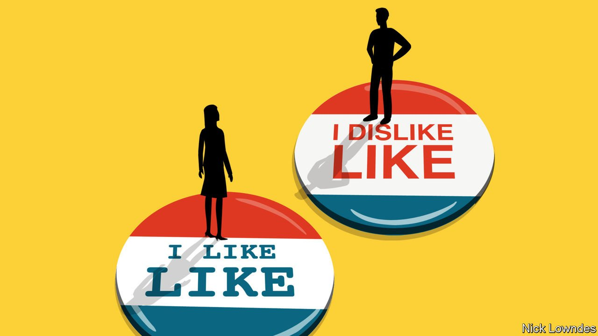

###### Johnson

# If you, like, dislike “like”, maybe, like, think again 

##### In defence of a little word with many critics and lots of uses 

 

> Sep 18th 2021 

NOBODY SEEMS to like like—or nobody with access to a printing press. Letters to newspapers and comment pieces often harrumph about this new, meaningless filler word. Can’t it, they wonder, somehow be eliminated?

But academic linguists, at least, have a soft spot for like. They deal with even more of it than do most people. The average parent might see their children grow out of the like habit, but university lecturers have a constantly refreshed supply of 18-year-olds. Making a virtue of necessity, they have looked at the supposedly vacuous word in depth. Irritating or not, they have concluded, like is not new and is far from meaningless.


As an expression of wonderment, sometimes referred to as “beatnik like”, it is found in decades-old exclamations such as “Like, wow, man.” This is now rare; one scholar even considers it to have been apocryphal, more ascribed to beatniks than actually uttered by them. Another version is “quotative like”: “She was like, ‘You can’t do that’, and I’m like, ‘Yes I can’.” That was already identified in the early 1980s, associated (as so many disparaged trends are) with young women, particularly those in the San Fernando Valley of Los Angeles. This usage won out against she goes (“She goes, ‘You can’t do that’, and I go…”) and is now ubiquitous, and uncomplicated.

More interesting is like’s function as what linguists call a “discourse particle”. In this role, like certainly does what some older grouches bemoan: it lets the speaker avoid committing to a statement. If someone says, “It’s, like, five miles away”, they signal an approximation. If they say, “He’s, like, a consultant”, that shows the speaker may not know the exact word needed. Already in 1983, Lawrence Schourup, a linguist, wrapped these nuances together to suggest drily that “like is used to express a possible unspecified minor nonequivalence of what is said and what is meant.”

But like’s functions go wider than signalling uncertainty; a later analysis by Muffy Siegel, now of the University of Pennsylvania, noted that only in some cases can “about” or “approximately” be swapped in for “like”. In “She’s, like, about to break up with him”, it indicates a hesitancy to impart sensitive information. And in “Can I borrow like $50?” it softens a painful request. Introducing a whole sentence with “It’s like” puts extra emphasis on it: “My roommates play music all the time. It’s like I can’t even concentrate enough to do my homework.”

So the grousing about like (that it shows uncertainty or fear of commitment) misses the breadth of this supple word’s uses. The point of a discourse particle is to give the listener some idea of the speaker’s attitude about what they are saying. It provides a valuable second channel of information, overlaying the basic proposition of a sentence. Speakers who use like are not generally stupid or thoughtless. Research suggests that they employ it more with friends and in settings where they feel comfortable, indicating that they hope this second channel will be picked up by a sympathetic audience. They reduce its use in more formal settings—perhaps well aware how older, more powerful adults feel about it.

All this analysis might seem to be giving like too much dignity. Why don’t people just clearly say what they mean? Yet consider that it belongs to a class of words that has other, more respectable members. So and right have joined like as much-criticised discourse markers, but they are beloved of some of the most influential people on the planet. For instance, both are typical of the speech of Mark Zuckerberg, Facebook’s boss.

And if those are not classy enough, remember that words such as well, now and indeed often seem to do little more than buy the speaker a few more moments to think, much as like can. Or recall as it were and so to speak, which, like like, can signal uncertainty or approximation, but do not mark their users out as simpletons.

In the end, the strikes against like fall into two categories, one more legitimate than the other. The bad reason to dislike like is its association with the usual suspects who are supposedly destroying the English language: the young (women and girls in particular) and Americans (especially Californians).

The better gripe is that some people really do use like every fourth word. No word or phrase—not like, not in terms of—can bear that kind of repetition without annoying people. So if you’re a like enthusiast, don’t hang your head in shame. But, as with most things, variety is the spice of like.

