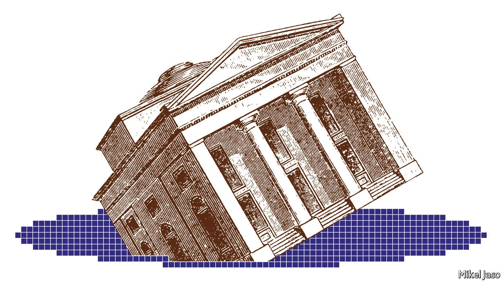
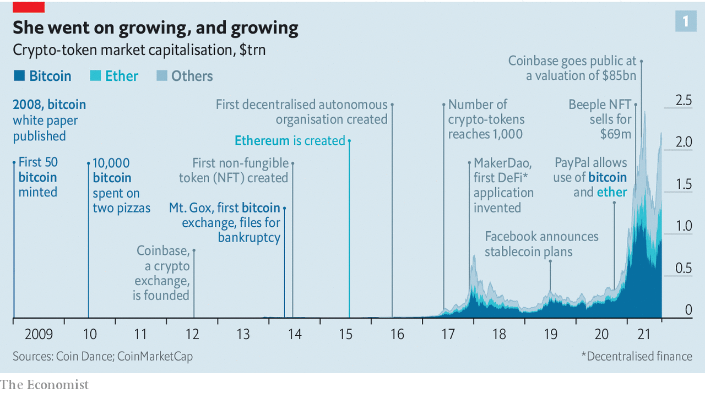
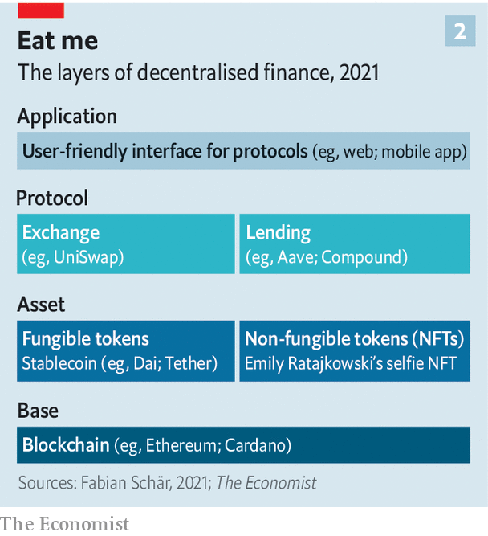

###### Curiouser and curiouser

# Adventures in DeFi-land 

##### Can decentralised finance lay the foundations for an open digital economy? 

 

> Sep 18th 2021 

THE AVATARS are mostly cartoon versions of people. They are all milling around a swimming pool built like a funnel, with virtual water sliding out of sight through its navel. To move, users manipulate keyboard controls familiar to anyone who misspent their youth playing computer games: W, A, S, D to walk forwards, left, backwards and right; space bar to jump. A sign next to the pool reads “diving allowed”. Your correspondent presses W and her flaxen-haired simulated self climbs up and over the edge of the red diving board, plunging into the pool’s centre.

This is what it is like to enter Decentraland, a virtual-reality platform built on the Ethereum blockchain, also known as a “metaverse”, where virtual shops sell digital collectables and tokens. The disorientating “down the rabbit hole” feeling of diving in is all too similar to what you feel when you first hear of developers’ efforts to “decentralise” everything you do online. A growing number of them are seeking to rebuild both the financial system and the internet economy using blockchains—databases distributed over many computers and kept secure by cryptography. The ultimate goal is to replace intermediaries like global banks and tech platforms with software built on top of networks that direct the value they generate back to the users who own and run them.


Of all digital activities, it is efforts towards decentralising finance that are most advanced. Far from the self-aggrandising ambition of Wall Street, decentralised finance (DeFi) instead seeks Utopian-sounding crowdsourced control. Applications and functions are run not by a single centralised entity or company, but by user-operated “decentralised autonomous organisations” (DAOs). “I will be just a regular community member,” says Rune Christensen, the founder of MakerDAO, a DeFi organisation. “In the end, it is mostly about how you contribute, not who you are.”

Talk of blockchains, DAOs and metaverses sounds so utterly bewildering and far-fetched that it might be tempting to give up listening to the DeFi crowd. The success of this nascent technology is, indeed, far from guaranteed. But piece by piece a new kind of economy is being built through applications on various blockchains. Each addition makes it more likely that the whole will amount to something meaningful and powerfully disruptive.


DeFi has grown tremendously in scale and scope in recent years. The Ethereum blockchain, which underpins much of DeFi activity, settled $2.5trn-worth of transactions in the second quarter of 2021, including payments and transactions to facilitate trading and lending. (Visa, a payments giant, settled about the same amount in the same period; Nasdaq, a stock exchange, traded six times as much.) Around $90bn of collateral is being used for various DeFi functions, compared with less than $1bn in early 2018. More than half is held in the five most popular DeFi applications, but developers are working on more than a hundred others, dozens of which are rapidly amassing assets. Innovations, such as automated marketmakers, arbitrage systems and self-stabilising currency regimes, are already pushing the boundaries of financial technology.

The promise of DeFi is that it could lead to a better kind of finance: a system that is quicker, cheaper, more transparent and less reliant on powerful centralised institutions. It could also underpin a digital economy that is less dominated by a handful of tech giants. But there are plenty of pitfalls in the way, not least the huge amount of speculation taking place in the world of DeFi and the risk that it becomes colonised by dirty money or sullied by blockchains’ vast energy use.

DeFi’s opportunity comes about because centralisation brings problems. True, it is cheaper to build a financial-settlement system run by an entity everyone trusts, such as the Federal Reserve, than to get a diffuse group of individuals to verify transactions. But government infrastructure ossifies. Private networks can tend towards monopoly, encouraging anti-competitive behaviour and rent extraction.

The Fed’s adoption of an instant-payments system, for instance, has proceeded at a glacial pace. Card-network operators like Mastercard and Visa make gross profit margins of 60-80%. Tech giants can wield their market power anti-competitively, or in ways their users dislike. Apple changed how its platform worked with third parties to stop Facebook tracking users; Facebook itself alters its content-delivery algorithms as it pleases; YouTube “demonetises” content creators on a whim. Each takes the lion’s share of the profits associated with their networks.

Decentralisation offers an alternative: interoperable, transparent, often efficient systems that, by distributing control over software, guard against the concentration of power. The first instance of such a decentralised system was , a digital-payments network verified by a blockchain, which was created in 2009 with the aim of replacing centrally issued money. But technology has evolved since then, and Bitcoin is now largely a distraction. People “seize on the money part, and either glorify it as a new kind of monetary system…or crucify it as a danger to economic stability,” writes Marc Andreessen of Andreessen Horowitz, a venture-capital firm that has raised some $3bn to invest in crypto-technology. They are missing the point. “Crypto represents an architectural shift in how technology works and therefore how the world works.”

That shift is distributed consensus—the ability for many “decentralised” participants in a network to establish trust. Its potential to facilitate more than payments became clearer with the creation in 2015 of the Ethereum blockchain (see chart 1). This stores and records lines of computer code, including entire programs, which are visible to all. That makes it possible to construct smart contracts—self-executing agreements in which a chain of actions follows when certain conditions are met. These are automatically enforced and cannot be tampered with.

 


The Ethereum blockchain and others designed to store lines of code, like Cardano, also issue and use their own tokens, called “ether” and “ADA”, respectively. To verify a transaction on the Ethereum blockchain you must pay a variable “gas” fee, owed in ether.

The advantage of using a blockchain is that it is like a new sort of computer. A physical computer is a way to store data and process it with a set of instructions, called a program. The Ethereum blockchain, too, is a way to store data and operate on it, like a virtual computer that runs on top of a network of physical computers. The consequence is that it ensures that “the computer will continue to operate as designed”, as Chris Dixon, who launched Andreessen’s crypto fund, has described it.

Every computer, outside a blockchain, is controlled by a person or organisation that can change their mind. This is sometimes true at the physical, hardware level: Apple, in many ways, retains broad control over the devices it sells through its ability to push software updates (the way in which it neutered Facebook’s trackers). More important, this applies across all web pages and applications. Each time someone logs on to Facebook, say, they rely on the servers the company runs to host its website. By controlling the hardware, companies can change the software as they please.

On a blockchain, though, this relationship is inverted: the software governs the hardware, and can make guarantees. Computers that are controlled by blockchain technology are, in Mr Dixon’s words, “computers that can make commitments”.

 


Once a decentralised foundation to store and execute lines of code has been laid, anything can be built on top—assets, say, or applications (see chart 2). The only limit is the developer’s imagination. All kinds of “tokens”, or digital representations of assets, exist. Some resemble financial building-blocks, like shares, bonds and “stablecoins”, which are typically pegged to conventional currencies. Others are governance tokens, which work as votes determining how DAOs are run. And “non-fungible” tokens (NFTs) represent unique assets, like an image or a video. The market for these has boomed over the past year. Some $23bn-worth of NFTs now exist.

Tokens can be swapped or lent out through “protocols”—the rules that govern how transactions take place. These in turn are governed by DAOs and can be altered only by consensus. Users can then buy and swap tokens through a web-browser-based interface that connects them to protocols.

Off with their heads

To enter the decentralised world it is necessary to create a wallet, which stores tokens. One type of wallet is managed by a centralised exchange, like Coinbase. Another, like MetaMask, lets users hold their own private keys. Centralised systems feel familiar: they have usernames and passwords that can be reset. They also hold tokens on users’ behalf, making them a target for attacks. Dishonest or incompetent exchange operators have lost or had customers’ assets stolen from them. Users of MetaMask or a similar wallet, by contrast, have full control over their assets. But if they lose their key, their tokens are lost for ever. MetaMask counts 10m active users, up from about 600,000 a year ago.

Creating a wallet creates a unique online identity, which allows you to interact with any DeFi application, including metaverses like Decentraland. This in turn lets you deposit tokens to earn interest, swap them for other coins, or shop in metaverse malls. Genuine innovation is also taking place in the world of DeFi, which could improve upon real-world finance. Three particularly impressive examples stand out.

One is decentralised exchanges. Given the vulnerability of centralised exchanges to attacks and theft, developers have set about building alternatives on a blockchain. Rather than depositing assets for, say, Coinbase to trade on your behalf, execution is instead carried out through smart contracts. Both sides of the trade are performed in one indivisible transaction. This eliminates the need for intermediaries such as escrow services and central counterparty clearing-houses. UniSwap, one of the largest decentralised exchanges, is especially popular for swapping Ethereum-based tokens. It trades tokens worth around $1bn every day.

The second example relates to the difficulty of issuing a reliable stablecoin. Stable assets are useful: tokens pegged to the dollar or other currencies facilitate transactions between other tokens and provide the basis for financial contracts. Early solutions relied on centralised control, which makes it hard to know for sure that they are fully collateralised. The two biggest stablecoins, Tether and USD Coin, have together issued around $100bn in tokens. The collateral for these, a mix of cash and short-term corporate debt, is held not on a blockchain, but in bank or brokerage accounts. Both firms decide how to back their stablecoins and when to publish their accounts. In March New York’s attorney-general found that Tether was not fully collateralised for periods in 2017 and 2018, and fined it $18.5m. (Tether denied wrongdoing.)

One way of knowing for sure that a stablecoin is fully backed is by keeping the collateral on an open blockchain, which is transparent, and storing it in a smart contract. The problem is that the collateral must be held in an asset native to a blockchain, like bitcoin or ether, which fluctuates wildly. There is, however, a clever workaround. The biggest “on-chain” stablecoin is dai, run by Mr Christensen’s MakerDAO. Anyone can create new dai tokens, as long as they lock up enough collateral, usually ether, in a smart contract.

Because ether is volatile, the protocol requires users to over-collateralise the tokens they create. If the value of a user’s collateral falls below 150% of the value of the outstanding dai, the smart contract automatically auctions off the collateral to cancel the debt in dai. To reclaim collateral the dai must be returned, plus a small variable “stability” fee (paid in dai) which tends to climb with volatility in collateral.

Dai is remarkably stable against the dollar. Only once, when ether dropped sharply in 2020, did the peg break, with dai falling by around 10% in 12 hours. This occurred in part because developers had fixed a maximum stability fee into the protocol. To replenish funds and restore the peg new governance tokens were issued, diluting the current owners. The coding problem was solved over the following months by a consensus of those holding the governance tokens. In 2021, when ether crashed again, dai remained stable. Around $6.5bn in dai currently exists.

A third example of innovation is lending protocols. Because users can remain unknown, in order to borrow from a lender they must first deposit some tokens, like dai, as collateral. Users can then borrow against that collateral in a different token. But developers have come up with a way to avoid such deposits for “flash loans”, which are instantly issued and settled.

Transactions on blockchains are finalised only when a new bundle of transactions, called a block, is accepted by the network. Adding blocks takes time, around ten minutes on Bitcoin and 13 seconds on Ethereum. For a flash loan on Ethereum a borrower requests and repays the funds, plus a 0.09% fee, within the same block. If the borrower fails to repay, the entire transaction is cancelled, so that no funds were ever borrowed. The lender takes no risk at all. These loans are mostly used for arbitrage opportunities between token-trading platforms. Since their creation, says Fabian Schär of the University of Basel, the markets for most tokens have become more efficient. Two of the biggest lending protocols on the Ethereum blockchain that offer flash loans are Aave and Compound. They have lent out some $16bn and $11bn in tokens, respectively.

All these services are efficient and creative solutions to financial problems. Automated exchanges, like those built through UniSwap, and flash loans, which make seamless arbitrage possible, enhance the efficiency of financial plumbing. The automatic stabilisers built into dai are a clever fix for a difficult problem. And DAOs are fascinating experiments in the democratic governance of entities that oversee billions of dollars in trading and lending. The problem is that, so far, they are all being used to facilitate an incorporeal casino. Most of these applications are used to speculate on unstable tokens, including bitcoin and ether.

If DeFi is to go beyond speculation, one of two scenarios must come to pass. The first is expansion into the realms of conventional finance. Much of the energy in DeFi is spent on enabling finance for a universe that is “on chain”. That is understandable: those that bridge the gap with the real world, like centralised exchanges and stablecoin issuers, have been the source of hacks and fraud. But to be useful for everyday finance—mortgage lending, say—DeFi would have to straddle the virtual and real worlds.

NFTs, for instance, could become more widely used. Today they are digital collectable claims, but in theory they could represent ownership claims on homes. Mortgage creation could then be wrapped into a single, efficient bundle: the owner of the “Red Cottage, Whitburn”NFT would swap it with the buyer, who would deposit it with an automated collateralised-lending platform like Aave or Compound. The buyer would receive tokens in return, which would then be automatically transferred to the seller. To hold the NFT again the buyer would, over time, deposit enough stablecoins with the platform to pay off the loan.

Because tokens can be digital representations of nearly anything, they could be efficient solutions to all sorts of financial problems. Deposit accounts with banks can be expensive; the stock-settlement system is slow. By contrast, stablecoin transactions settle almost instantly, and incur no or low fees. For DeFi to be the answer to real-world problems, though, the legal system must enforce on-chain outcomes in the “off-chain” world, and regulation must guard against fraud and misuse.

It is generally tricky to convert conventional money into tokens without identification checks. Most services that exchange dollars into ether or bitcoin, like Coinbase, conduct “know your customer” checks, intended to deter money-laundering. Yet the fact that, once in the on-chain world, anyone can easily move tokens around, has raised legitimate fears about the ways in which DeFi will be harnessed by criminals to launder and move dirty money.

Regulators want financial intermediaries to be on the lookout for suspicious transactions, but DeFi rejects this role. The attempt to include a vague but seemingly modest provision to regulate the industry in an infrastructure bill in America, for instance, was met with howls of outrage from the DeFi crowd. Fierce resistance to regulation only fuels the perception that it is up to no good, and could strengthen regulators’ desire to clamp down on flows into the on-chain world.

If DeFi does not merge with off-chain finance, it could instead thrive in a distinct world built on blockchains. Science-fiction writers have long explored the idea that people will one day live their lives—go shopping or visit virtual offices—in online metaverses like Decentraland. The parallel virtual world could also develop if the centralised tech platforms are supplanted by decentralised rivals.

The Tea Party

Imagine, for instance, a rival platform to YouTube that awards users various kinds of tokens: those that act as compensation for uploading videos, and can be scaled to reflect how popular uploads are, to attract content creators; or governance tokens, to determine how the platform is run. If the platform caught on, these tokens might rise in value, rewarding early adopters and luring new users. This sort of model is made possible because blockchains hold organisations to their promises about how their platform would work.

You could go on to imagine new models for all kinds of industries. Once an artist sells a work, she has no stake in its value. If she later gains popularity, the gains all go to the buyer. If she sold an NFT image she could retain a stake in future sales of that work, by coding into the smart contract that she will receive, say, 10% of any transaction value. This would have been far too expensive to enforce without a smart contract on a transparent blockchain.

 


Emily Ratajkowski, a model who has written about her inability to retain ownership over her image because photographers own all rights to pictures, has issued a selfie NFT in this way. Musicians are starting to monetise their fan base by issuing albums as NFTs or creating tokens that offer fans exclusive merchandise and front-row seats at gigs, all without intermediaries. If this activity booms, the financial system underpinning it will become critical.

This is not to say that decentralisation is always the answer. “The question to ask is: why can’t I just use a centralised database? It is much simpler and faster than a decentralised system,” says Dan Boneh of Stanford University. But for some problems decentralisation is the way to go. “If there is no single party that everyone trusts, then decentralisation is a good option.” But, he admits, “there is greater complexity as a result.”

The biggest problem is that verification by consensus can slow down systems. Both Bitcoin and Ethereum use a process called “proof of work” to verify transactions, which can consume vast amounts of energy. One way to improve the system is to use other proof mechanisms. Other workarounds exist, too. “Much of the focus today is scalability, which is achieved by touching the blockchain as little as possible,” says Mr Boneh.

The incentive to become more efficient can be self-reinforcing. As DeFi usage grows the demand for verification by the blockchain also climbs, prompting a rise in gas fees. This has led developers to pursue things like “roll-ups”, which group transactions together and verify the bundle via the blockchain, reducing demand and therefore the energy needed to verify transactions.

With such workarounds still being developed and attempts to create platforms in their infancy, it is speculative to think that decentralisation will take off. The problems of DeFi—not just the energy intensity of blockchains but the rampant speculation, the potential to be flooded with dirty money and the apparent resistance to regulation—all stand to deter mass adoption. Yet the potential gains from payment and digital content platforms owned and governed by their users, a more open digital economy and a more efficient financial system are vast. The hope is that it is not all just a dream. ■

For more expert analysis of the biggest stories in economics, business and markets, , our weekly newsletter.

