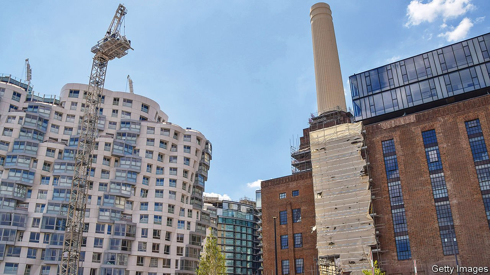

###### Levelling up, and up

# Battersea offers lessons in regeneration 

##### A big development scheme in London suggests how those elsewhere could succeed 

 

> Sep 18th 2021 

FROM OUTSIDE, the towers rise like steeples; inside, the ceiling soars. In the 1930s one wing was decorated with Italian marble. Yet this former power station had lain derelict since 1983, surrounded by post-industrial wasteland. Now workers are swarming around it. From the roof more development is visible. Two new rail stations open on September 20th.

It all sounds like “levelling up”, as touted by the prime minister, Boris Johnson. But this is Battersea, an area of London south of the river, not the northern “red wall” where voters abandoned Labour to sweep Mr Johnson to victory in 2019, and which inspired his as-yet vague promises to spread southern prosperity farther afield. Nine Elms, as the new district is called, and the extension of the Northern line, are Mr Johnson’s most concrete legacy from his stint as London’s mayor between 2008 and 2016. It will eventually provide the capital with 20,000 new homes.


Criticism has been fierce. Most of the housing is high-end, and much has been bought by absentee foreigners. Some consists of crowded, ugly apartment blocks. Yet London desperately needs more housing, and many previous efforts to provide it in volume have failed. This scheme’s success offers lessons for regeneration both in the capital and beyond, including the importance of infrastructure, devolved regulatory and financial powers, and support from central government.

Battersea, like much of south London, has long needed better transport links. Some £270m ($370m) of the £1.1bn spent on the Tube extension has come from levies on housing developers. An “enterprise zone” was declared, loosening planning and fiscal rules, and enabling local authorities to raise the rest by borrowing against the increase in business rates that would follow as residents moved in. A government guarantee helped unlock loans. The redeveloped power station, a listed building, acts as a centrepiece and will provide 1.25m square feet of office space.

More such projects are needed in the capital—and should be possible, according to a study by Aecom, an engineering firm, published in June. It spied potential for 400,000 new homes on brownfield sites, and emphasised the importance of transport links. Battersea shows how to pair the two. A mooted extension of the Bakerloo line, for example, is also intended to serve areas with plentiful brownfield sites.

The government has hinted at some projects elsewhere that combine some of the same elements. They include new “freeports” in deprived areas, with lower payroll taxes to attract jobs, and Treasury North, a civil-service outpost in Darlington, a north-eastern town. It remains to be seen whether they can succeed without the boost to demand provided by London’s pricey housing market. Still, the red wall may get to benefit from lessons the prime minister learned in the city that launched his political career. ■

