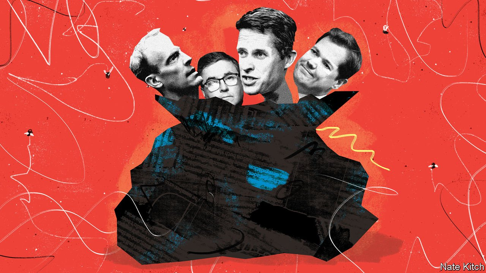

###### Rebooting Johnsonism

# Boris Johnson has stamped his authority on his cabinet 

##### By removing dead wood, the prime minister has increased his chances of getting things done 

 

> Sep 16th 2021 

RESHUFFLES BRIEFLY turn parliamentary systems into autocracies. Prime ministers get to play tyrant for a day. Cabinet ministers are reduced to whimpering poodles. Junior ministers and ministerial bag-carriers throw themselves at the feet of the great man in the hope of preferment. The only answer to the prime-ministerial “jump” becomes “how high?”—which is why Boris Johnson chose to carry out his first big reshuffle while he is pushing through two of his most controversial bits of legislation: raising national insurance, a payroll tax, and cutting universal credit, a handout for the jobless and low-paid.

The prime minister has been relatively sparing with reshuffles, despite constant carping (including from this columnist) that he has surrounded himself with political pygmies. He marked taking office in July 2019 with a spectacular purge, getting rid of almost 20 senior ministers who were deemed unsound on Brexit, but has since largely reacted to events, notably Sajid Javid’s resignation as chancellor and Matt Hancock’s departure from health after breaking lockdown rules to carry on an extramarital affair. On September 15th he took the initiative. He sacked Gavin Williamson, the education secretary; Robert Buckland, the justice secretary; Robert Jenrick, the housing secretary; and Amanda Milling, the party chairman. He demoted the foreign secretary, Dominic Raab, to justice, throwing him a bone in the form of the title of deputy prime minister. He promoted Nadhim Zahawi from vaccines minister to education secretary and Nadine Dorries from a junior job at health to culture secretary. And he moved several people sideways, most notably Michael Gove from the Cabinet Office to housing and Oliver Dowden from culture secretary to party chairman.


The aims were to burnish Mr Johnson’s authority and re-galvanise his government. He has succeeded in the first. Over the summer, there was plenty of talk that he was treading water. One former cabinet minister compared him privately to Henry VIII surrounded by courtiers waving petitions, and incapable of deciding between them. Another senior Tory worried that the departure of Dominic Cummings, the adviser who masterminded Brexit and helped Mr Johnson to power, had excised not just the craziness but the dynamism from the heart of government. There was plenty of speculation that the prime minister was bored by his job and craving the lotus-eating life on the other side of high office. By making the risky decision to raise taxes, and directing ministers up, down and sideways, he has shown who is in charge.


Whether he has re-energised his government is less clear. The criticism of Mr Johnson most often heard is that he rates competence lower than loyalty—both to the Brexit project, and to himself. This reshuffle put paid to that idea. The sacked and demoted included several close allies. Mr Williamson helped run his leadership campaign. Mr Raab was a hard-line Brexiteer and stood in for the prime minister last year when he was incapacitated by covid-19. Mr Jenrick was one of a trio of influential MPs, along with Rishi Sunak, the chancellor, and Mr Dowden, who backed him early in his leadership campaign and helped sell him to Conservatives beyond the Brexit fever swamps. Ms Milling is one of his biggest fans. But all had demonstrated incompetence. Mr Williamson messed up everything he touched. Mr Raab stayed on holiday during the chaotic withdrawal from Afghanistan. Mr Jenrick broke rules over a billion-pound housing development. Mr Buckland and Ms Milling were generally lacklustre.

But getting rid of failures is not the same as promoting stars. Some of Mr Johnson’s decisions are debatable. Liz Truss, who has been promoted from trade to the position of foreign secretary, certainly brims with boosterism—and Mr Raab will not be a hard act to follow. But does she possess the gravitas or diplomatic nous desirable in a foreign secretary? Ms Dorries, a hardened culture warrior, will delight the Conservative base, but possesses neither the technical knowledge required to deal with the tricky regulatory issues that come before the culture department nor the sophistication to sell one of Britain’s most successful industries abroad.

Mr Johnson was on safer ground with education and housing, both essential to “levelling up”—his as-yet amorphous promise to spread prosperity to left-behind places beyond London and the south-east. The education system is badly bruised after two years in which schools have repeatedly closed, tests have been replaced by algorithms and grade inflation has soared. It will benefit from the talent for problem-solving that Mr Zahawi displayed as vaccines minister. The housing department has for too long been in thrall to big developers and NIMBYish lobbies. Mr Gove, who will now lead it, is a reformer with the intellect to think tough problems through, the eloquence to present the case for change even when he is under fire, and the cussedness to shake up Whitehall and take on pressure groups. Crucially, he will add overall responsibility for levelling up to his portfolio.

Moving and shaking

The great question about any reshuffle is whether it is worth the disruption. The mere rumour that one is on the cards paralyses Whitehall. A sudden change of ministers means that neophytes must master complicated briefs in no time: the big spending departments are in the midst of tense negotiations with the Treasury. Disappointed ex-ministers return to the backbenches to brood—a particular danger in the case of Mr Williamson who, as a former chief whip, knows where the bodies are buried.

But on balance, this one was worth it. Mr Johnson has stamped his authority on his party and demonstrated that he will not stand for incompetence in his team. And he has directed some of his best talent at the problems that are likely to define his time in office: fixing education after the pandemic, solving the housing crisis and, more generally, spreading prosperity and revitalising parts of the country that have been too long neglected. ■

