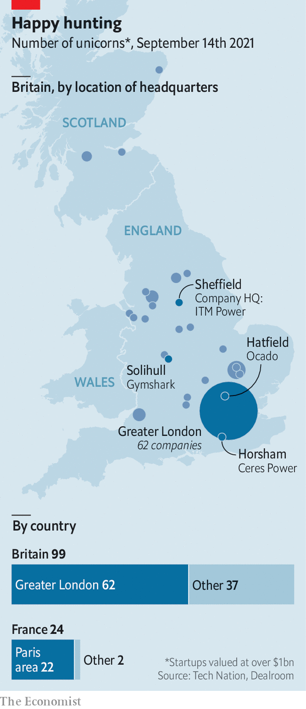

###### The lion and the unicorn

# Britain’s successful startups are surprisingly scattered 

##### And it is better at rearing them than its European neighbours 

 

> Sep 16th 2021 

ONE OF THE highlights of a visit to the royal palace at Stirling Castle is a series of seven tapestries depicting the “Hunt of the Unicorn”, recreated from a set woven in the 16th century. For now, they outnumber modern unicorns—startups worth more than $1bn—born in Scotland. But not, perhaps, for long.

 


Unicorns are now common around the world. Compared with its European neighbours, though, Britain is especially good at rearing them. Since 1989 it has generated more than France, Germany and Sweden combined, according to Tech Nation, a growth platform for British tech firms, and Dealroom, a data provider. And despite the usual weighting towards London, Britain’s 99 unicorns are more scattered, from Horsham and Hatfield to Sheffield and Solihull (see map). Of France’s 24, meanwhile, 22 are based in or around Paris (the remaining pair are in Grenoble and Lille).

Several factors lie behind Britain’s fecundity. Its universities produce the sort of graduates tech firms want to hire, and a smaller set who go on to found new ones. The local language is the lingua franca of the global tech industry, and London is a hub for venture capitalists from across the continent. For a company looking to build brand awareness, Britain’s population also occupies a sweet spot between Estonia’s cosiness and America’s coast-to-coast scale.

To explain the distribution of its mythical beasts, look at the origins of Britain’s tech industry. Firms such as Cisco, Microsoft and IBM chose to base their European operations in Britain in the 1980s and 1990s, often setting up outside London to reduce overheads. Being older than its continental rivals has given the British tech sector more time to spread out. That its trailblazers did not all start in the capital may have given it the inclination to do so.

The government is eager to encourage more unicorns to grow. On September 14th it announced that it had taken equity stakes in 158 startups to tide them over during the pandemic. Its innovation strategy, published in July, seeks to make it even easier for foreign tech types to obtain British visas and immigrate. Future unicorn hunters may not need to search so hard.

