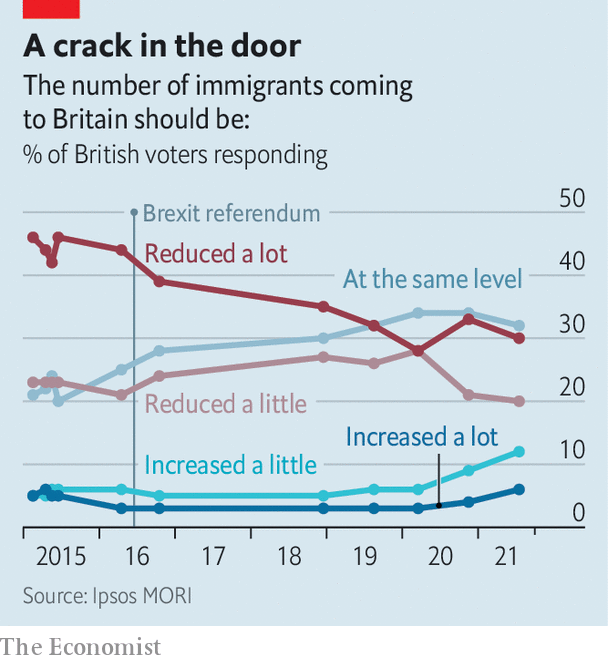

###### Immigration and politics

# British people have become startlingly less xenophobic 

##### Credit the Brexit vote in 2016 

 

> Sep 18th 2021 

IN JUNE 2016 Nigel Farage, then the leader of the UK Independence Party, unveiled a poster showing a line of refugees. “BREAKING POINT”, it screamed, in red letters. “We must break free of the EU and take back control of our borders.” Boris Johnson, a leading light in the main Leave campaign, sniffily described it as “not my politics”. But perhaps it revealed something, he suggested. If Britain left the EU, people might calm down about immigration.

 


He seems to have been right. On September 14th a poll by Ipsos MORI revealed a markedly more relaxed nation. Excluding “don’t knows”, the share who want immigration reduced stands at 50%, down from 69% in early 2015 (see chart). A non-negligible 18% want more of it. Polls by other firms show much the same trend.


Immigration has also become far less salient, which is politically crucial. Robert Ford, a political scientist at the University of Manchester, says that Mr Farage’s star rose in the 2000s not because Britons took a dimmer view of mass immigration (they had long disliked it) but because it was at the front of their minds. Another poll by Ipsos MORI asks people what are the most important issues facing Britain. Immigration has gone from first place in the first half of 2016 to eighth place.

You could ascribe that to the multitude of other issues Britons have to fret about these days. But immigration was becoming less unpopular and less salient even before covid-19. Nor did tempers cool because immigration fell. The Office for National Statistics estimates that the level held steady from 2015 to 2019, at 600,000-700,000 people per year.

Britain is slowly becoming more xenophilic as the number of university graduates and ethnic minorities grows. But the pace of change suggests that the Brexit vote was responsible. Sunder Katwala of British Future, a think-tank, says it had “a cathartic effect”. Immigration sceptics at last felt they were being listened to. They also had to start thinking about what they wanted, as opposed to what they detested (free movement). Other polls suggest that Leave voters, in particular, have come to see immigrants more positively.

Liberals spent many years in denial about the extent, and depth, of immigration scepticism in Britain. Today, though, it is the other side that increasingly looks out of touch. The Conservative government threatens to repel boats full of refugees, and tells businesses that they should stop complaining about immigration restrictions, and hire and train more natives. For the first time since the second world war, says Mr Ford, it is just possible to imagine that immigration could be a vote-winner for the left.■

