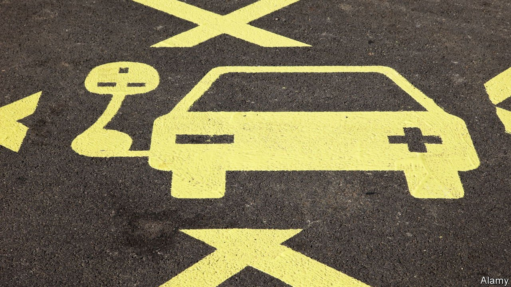
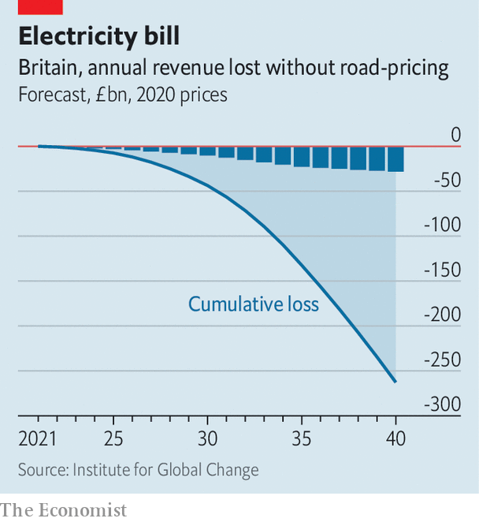

###### Heading for gridlock

# Britons are snapping up electric vehicles 

##### That is good news for the climate—but a problem for the Treasury 

 

> Sep 18th 2021 

THE CARS on Britain’s roads are changing. According to the World Economic Forum, a global think-tank, more than a tenth of new cars sold in 2020 were powered by electricity. That is below the levels seen in some other parts of northern Europe, but four times as high as in America. And the shift from fossil fuels to electricity looks set to accelerate. Government plans to decarbonise the economy will require the number of battery-powered electric vehicles (EVs) on Britain’s roads to rise from around 100,000 currently to 3m by 2025, 10m by 2030 and 25m by 2035.

This rapid shift is necessary if Britain is to meet international obligations to reduce its carbon emissions. But an analysis by the Tony Blair Institute for Global Change, a think-tank, highlights three looming risks: a fiscal hole, increased inequality and more traffic jams. All three result from the way driving is taxed in Britain, namely largely through a levy on fuels. This makes driving an EV far cheaper than alternatives. The median British driver currently spends around £1,100 ($1,520) a year in total on fuel and vehicle excise duty (VED), a tax levied on most personal vehicles, of which around £750 is tax. But the typical owner of a battery-powered EV, which is exempt from VED, spends only £320 a year, of which just £20 is tax.

 


These much lower running costs encourage drivers to make the switch. But as often happens with “sin taxes”, this one is falling victim to its own success. Part of the point of sin taxes is to encourage people to become more virtuous, but the faster this happens, the faster revenues dry up. By 2030 the annual loss in tax revenues from VED and fuel duty is forecast to be around £8bn, or 0.3% of GDP. That is around two-thirds as much as was raised by the politically contentious increase in national insurance, a payroll tax, announced on September 7th. The cumulative cost to public coffers is due to zoom past £50bn around the end of the decade (see chart).


The savings will not be distributed evenly. Since wealthier households tend to have newer cars, it is they who are most likely to own EVs. Without a big overhaul, the coming years will see the burden of motoring taxes fall ever more heavily on less-well-off Britons.

The final problem predicted by the Institute for Global Change is increased congestion. Switching to an EV cuts the effective cost of fuel for driving an additional mile by around 70%, meaning that as EVs become more common, motorists are likely to drive more. The Department for Transport reckons that, unless motoring taxes are reformed, the coming two decades will see a 30% increase in passenger miles driven, and an increase from 7% to 12% in the share spent stuck in congestion.

The Treasury has long plugged the fiscal gap resulting from lower smoking rates by aggressively hiking tobacco duties. But fuel duty is far more politically sensitive. The Conservative Party enjoys higher support among car owners and has frozen the rate for the past decade.

The most obvious solution would be to shift the base upon which driving is taxed, away from fuel and towards road usage. A system of road-pricing would charge the heaviest users the most. It could also allow for variable pricing in congested areas, which would help ease traffic jams. But such proposals are deeply unpopular with car-owning voters. With a general election on the horizon, perhaps as early as 2023, the Conservative government is unlikely to risk upsetting its core voters. Public policy, like Britain’s roads, faces gridlock. ■

For more coverage of climate change, register for The Climate Issue, our fortnightly , or visit our 

