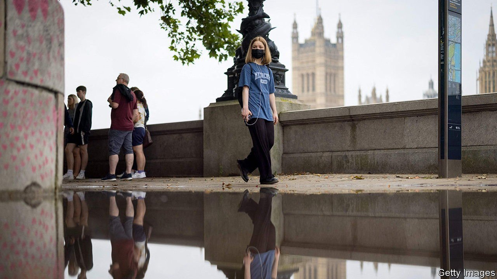
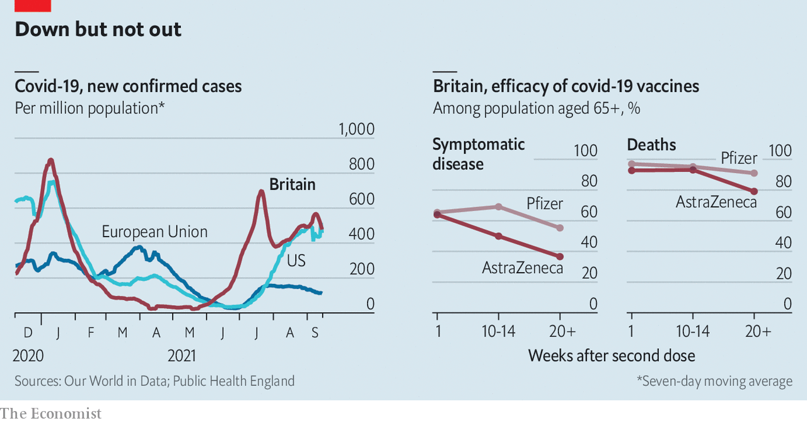

###### Living with it

# How Britain plans to co-exist with covid-19 

##### Vaccine passports, masks and working from home will only be back-up options 

 

> Sep 18th 2021 

ONCE UPON a time, no speech by Boris Johnson was complete without a promise to “defeat the coronavirus”. Yet his address on September 14th setting out his covid-19 plans for the winter ahead was a more modest affair. The best the prime minister could come up with was a vow to “turn jabs, jabs, jabs into jobs, jobs, jobs”.

Britain is no longer at war with the coronavirus. Instead, it is working out how best to manage its presence. Its aim is to keep the economy open while saving hospitals from being overwhelmed, which in recent months has meant accepting a high case rate (see chart).

 


That has been possible only because a quick and well-targeted vaccine roll-out has kept deaths at European rather than American levels, dampening public concern. According to Public Health England, immunisation has prevented nearly 25m infections and more than 110,000 deaths.


Despite the start of the autumn school term, and predictions that children mingling would increase infection, case numbers appear instead to be falling. But the worry is that they will rise once more during winter—just as the health service comes under the most pressure. Thus the government announced tweaks to its vaccination programme: first jabs will be offered to 12- to 15-year-olds, and boosters to the vulnerable and over-50s.

Both calls were made later than in many other rich countries. The government’s advisory committee on vaccination held off on recommending jabs for youngsters, arguing that although the health benefits were marginally greater than the known harms, the uncertainty was unacceptably high. On September 13th Britain’s chief medical officers advised the government to proceed nevertheless, because of covid-19’s impact on children’s education and mental health.

The decision to offer booster shots was made in response to evidence of waning protection, particularly among the elderly and vulnerable. In offering top-ups, Britain joined America, Germany and Israel in ignoring the World Health Organisation, which argues that the jabs would be better used in countries where vaccination rates are low. Early evidence from Israel suggests boosters are at least successful in increasing protection.

The hope is that these decisions will enable Britain to avoid future restrictions on behaviour. Sajid Javid, the secretary of state for health and social care, announced that the government had rethought plans to introduce vaccine passports. The U-turn was not because of changing evidence regarding their effectiveness, but because of party management. One backbencher argued that passports would set a “dangerous precedent for the advance of the bio-security state”. Others are simply tired of covid-19 impositions.

Ministers have, however, kept open the option of requiring passports in nightclubs and crowded stadiums, and of reintroducing compulsory masking and advisory working from home, should cases rise to dangerous levels in winter. These changes could be implemented “at short notice in response to concerning data”. But the government’s plans include no mention of the lockdowns that have plagued the past 18 months. ■

Dig deeper

All our stories relating to the pandemic and the vaccines can be found on our . You can also find trackers showing ,  and the virus’s spread across .

