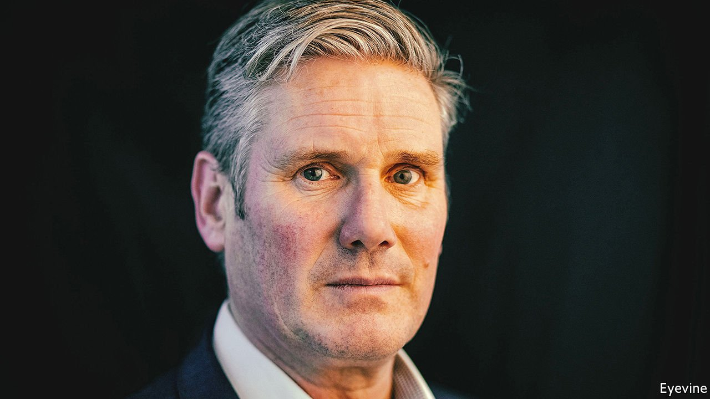
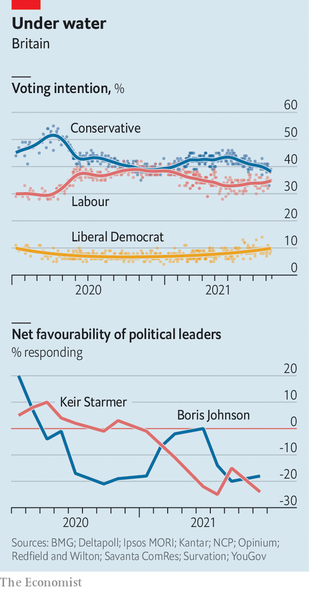

###### Après le déluge, moi

# Keir Starmer, the post-populist 

##### The Labour leader has a vision of Britain after upheaval 

 

> Sep 16th 2021 

IN 2019, WHEN Labour’s vote collapsed, Deborah Mattinson headed north to listen. Throughout the New Labour era she had run focus groups of swing voters. What car would Labour politicians drive? What did they drink and smoke? But she had not tested opinion in “red wall” seats in the Midlands and northern England, home to voters who had been among Labour’s most reliable before Brexit drove them into the arms of the Conservatives.

In a book published last September Ms Mattinson offers detailed studies of new Tory voters in three former Labour seats to help rectify that omission. And she offers some advice for Sir Keir Starmer, who became leader after that drubbing. He must introduce himself clearly, prove Labour’s economic competence and show that his party is serious about the fate of provincial towns. Above all, he must set out a positive, patriotic vision. In the words of Colin, a bricklayer from Stoke-on-Trent whom she interviewed: “Show us the Britain they want to see and the Britain they believe in.”

 


Ms Mattinson is now Sir Keir’s director of strategy. But his supporters worry that Colin has not been answered. Labour’s agenda must be clarified now, says a shadow minister, in order to sell it to constituents before a general election expected as early as 2023. Both Labour’s and Sir Keir’s ratings are poor (see chart). Covid-19 has robbed him of opportunities to campaign and influence the news agenda. A lot rides on his address to the party’s conference in Brighton on September 29th.

Supporters of Jeremy Corbyn, who led Labour into the disastrous 2019 election, see Sir Keir, formerly Britain’s public prosecutor, as an empty suit devoid of ideological conviction. That is unfair. Starmerism is distinctive as an approach to leadership, a political culture and a diagnosis of Britain’s faults. And the man himself is best defined as a post-populist leader.

Sir Keir’s leadership follows two populist revolutions: as Labour voters were repelled by Mr Corbyn’s hard-left populism and lured by Tory Brexiteers, they delivered the party its lowest tally of MPs since 1935. Post-populism is a bet that voters are nauseous after the tumult, and hankering for stability and professionalism. Focus groups suggest that Mr Johnson’s new voters do not dislike him, but doubt his ability for office. Labour’s refrain will be: “Serious times need a serious person.”

Behind the appeal of any populist movement, says a friend of Sir Keir, is the belief that life couldn’t be any worse if everything was thrown up in the air. One task of a post-populist is to pick up the pieces, which requires a “quiet, unflashy decency and competence”. Sir Keir is a defender of institutions such as the civil service and judiciary that are routinely bashed by ministers.

Another is to bury the past. Sir Keir, a leading opponent of Brexit, is now reconciled with leaving the trade bloc, and would seek merely to facilitate the movement of people and goods between it and Britain. He has worked to weed out the far-left fringe groups, and the anti-Semitism, that flourished under Mr Corbyn.

No plain sailing

A third task is to tackle the discontent that fed populism in the first place. Sir Keir sees Britain’s biggest problems as insecure work and the hollowing-out of public services, both of which were cast into sharp relief by covid-19. Rachel Reeves, the shadow chancellor, likens parts of Britain to the flyover states that voted for Donald Trump or the provincial France that produced the gilets jaunes, in part because they had been denuded of skilled jobs by globalisation.

Labour’s plans include stricter employment laws and a higher minimum wage. It seeks to restore pride and dignity to work, Sir Keir told trade-union leaders on September 14th. He is hawkish on crime, particularly on teenage tearaways and sex offenders. This stance combines criticism of the impact of austerity on policing with an appeal to socially conservative voters. Much of his economic agenda is reminiscent of Mr Corbyn’s. (Labour is still committed, in principle, to nationalising utilities.) That it sounds different is down to his director of policy, Claire Ainsley, who argues that left-wing parties need to express their agendas through moral values: family, fairness and hard work.

All these elements of Starmerism can be divined from the speeches and writings of Sir Keir’s inner circle. And he will set them out in finer detail in a 14,000-word essay due to be published before the party conference. What alarms his colleagues is that this philosophy lacks a slogan, or even a policy shortlist. One party official calls it “a jigsaw with many pieces and no picture”. Labour must learn from the Tories, says the shadow minister, and sell its message by repeating a handful of key propositions to the point of exhaustion.

And beyond the philosophy lie two further questions, upon which Sir Keir’s electoral chances depend. The first is whether he has the flair and daring to seize the agenda when opportunity arises, like Tony Blair, Labour’s great election-winner. The second, and larger, is whether the populist moment has passed. Are Britons really yearning for a safe pair of hands? ■

